# Quick Start Guide

*เริ่มต้นใช้งาน SOP-SDLC Documentation อย่างรวดเร็ว*

---

## คุณเป็นใคร? เริ่มอ่านตรงนี้

เลือก Role ของคุณเพื่อดูเอกสารที่เกี่ยวข้อง:

### สมาชิกใหม่ในทีม (New Member)

> เริ่มที่นี่เพื่อทำความรู้จักทีมและเตรียมเครื่องมือ

| ลำดับ | เอกสาร | สิ่งที่จะได้ |
|:-----:|:-------|:------------|
| 1 | [Welcome Guide](documentation/00_ONBOARDING/0.1_Welcome_Guide.md) | ทำความรู้จักทีม วัฒนธรรม และโปรเจค |
| 2 | [Access Request Checklist](documentation/00_ONBOARDING/0.3_Access_Request_Checklist.md) | ขอ Access ให้ครบก่อนเริ่มงาน |
| 3 | [Development Setup](documentation/00_ONBOARDING/0.2_Development_Setup.md) | ติดตั้ง Tools & Environment |
| 4 | [Git Workflow](documentation/07_GIT_WORKFLOW/7.1_Branching_Strategy.md) | เข้าใจวิธีใช้ Git ของทีม |
| 5 | [Code Standard Guide](documentation/04_DEVELOPMENT/Code_Standard_Guide.md) | มาตรฐานการเขียนโค้ด |

---

### Product Owner / Business Analyst

> เอกสารเกี่ยวกับ Requirements และ Design

| ลำดับ | เอกสาร | สิ่งที่จะได้ |
|:-----:|:-------|:------------|
| 1 | [Raw Requirement List (MoSCoW)](documentation/01_REQUIREMENTS/1.1_Raw_Requirement_List_MoSCoW.md) | จัดลำดับความสำคัญของ Requirements |
| 2 | [User Story List](documentation/01_REQUIREMENTS/1.2_User_Story_List.md) | เขียน User Stories |
| 3 | [Acceptance Criteria](documentation/01_REQUIREMENTS/1.3_Acceptance_Criteria.md) | กำหนดเกณฑ์การรับงาน |
| 4 | [Roadmap & Timeline](documentation/01_REQUIREMENTS/1.4_Roadmap_Timeline_Asana_Link.md) | แผนงานและ Timeline |
| 5 | [UAT Scenario Template](documentation/06_TESTING/UAT_Scenario_Template.md) | เตรียม Test สำหรับ UAT |

---

### UX/UI Designer

> เอกสารเกี่ยวกับ Design Process

| ลำดับ | เอกสาร | สิ่งที่จะได้ |
|:-----:|:-------|:------------|
| 1 | [UX Flow Diagram](documentation/02_DESIGN/2.1_UX_Flow_Diagram_FigJam_Link.md) | สร้าง User Flow |
| 2 | [Wireframe Screens](documentation/02_DESIGN/2.2_Wireframe_Screens_Figma_Link.md) | สร้าง Wireframes |
| 3 | [Wireframe with Figma Make](documentation/02_DESIGN/2.5_Wireframe_with_Figma_Make.md) | ใช้ AI ช่วยสร้าง Wireframe |
| 4 | [UI Design with Figma Make](documentation/02_DESIGN/2.6_UI_Design_with_Figma_Make.md) | สร้าง UI Design + Export |
| 5 | [Interactive Prototype](documentation/02_DESIGN/2.3_Interactive_Prototype_Link.md) | สร้าง Prototype สำหรับทดสอบ |

---

### Developer (Frontend / Backend / Full-stack)

> เอกสารสำหรับการพัฒนา

| ลำดับ | เอกสาร | สิ่งที่จะได้ |
|:-----:|:-------|:------------|
| 1 | [Technical Stack](documentation/02_DESIGN/2.4_Technical_Stack.md) | เข้าใจ Tech Stack ของโปรเจค |
| 2 | [Project Initialization](documentation/04_DEVELOPMENT/4.1_Project_Initialization.md) | เริ่มต้นโปรเจค |
| 3 | [Database Design](documentation/04_DEVELOPMENT/4.5_Database_Design.md) | ออกแบบ Database |
| 4 | [Backend Project](documentation/04_DEVELOPMENT/4.6_Backend_Project.md) | พัฒนา Backend |
| 5 | [API Development](documentation/04_DEVELOPMENT/4.7_API_Development.md) | พัฒนา API |
| 6 | [Frontend Integration](documentation/04_DEVELOPMENT/4.8_Frontend_Integration.md) | เชื่อมต่อ Frontend กับ Backend |
| 7 | [Code Standard Guide](documentation/04_DEVELOPMENT/Code_Standard_Guide.md) | มาตรฐานการเขียนโค้ด |

---

### DevOps / Deployment

> เอกสารสำหรับการ Deploy

| ลำดับ | เอกสาร | สิ่งที่จะได้ |
|:-----:|:-------|:------------|
| 1 | [Deploy Overview](documentation/05_DEPLOY/5.1_Deploy_Overview.md) | ภาพรวมระบบ Deploy |
| 2 | [Pre-Deploy Checklist](documentation/05_DEPLOY/5.2_Pre_Deploy_Checklist.md) | เช็คลิสต์ก่อน Deploy |
| 3 | [Environment Variables](documentation/05_DEPLOY/5.3_Environment_Variables.md) | ตั้งค่า Environment |
| 4 | [Deploy Steps](documentation/05_DEPLOY/5.4_Deploy_Steps.md) | ขั้นตอนการ Deploy |
| 5 | [AWS Deploy Guide](documentation/05_DEPLOY/5.7_AWS_Deploy_Guide.md) | Deploy บน AWS |
| 6 | [Post-Deploy Verification](documentation/05_DEPLOY/5.5_Post_Deploy_Verification.md) | ตรวจสอบหลัง Deploy |
| 7 | [Troubleshooting](documentation/05_DEPLOY/5.6_Troubleshooting.md) | แก้ปัญหาที่พบบ่อย |

---

## SDLC Flow Overview

```mermaid
graph LR
    A[0. Onboarding] --> B[1. Requirements]
    B --> C[2. Design]
    C --> D[3. Database]
    D --> E[4. Development]
    E --> F[5. Deploy]
    F --> G[6. Testing]
    G --> H[7. Git Workflow]

    style A fill:#e0f2fe,stroke:#0284c7
    style B fill:#fef3c7,stroke:#d97706
    style C fill:#fce7f3,stroke:#db2777
    style D fill:#e0e7ff,stroke:#4f46e5
    style E fill:#d1fae5,stroke:#059669
    style F fill:#fee2e2,stroke:#dc2626
    style G fill:#f3e8ff,stroke:#7c3aed
    style H fill:#f0fdf4,stroke:#16a34a
```

> **Tip:** Git Workflow (Phase 7) ใช้ได้ตลอดทุก Phase ไม่ต้องรอถึงลำดับสุดท้าย

---

## ลิงก์ด่วน

| ต้องการ | ไปที่ |
|:--------|:------|
| ดูเอกสารทั้งหมด | [README.md](README.md) |
| เพิ่ม/แก้ไขเอกสาร | [CONTRIBUTING.md](CONTRIBUTING.md) |
| มาตรฐาน Git | [Branching Strategy](documentation/07_GIT_WORKFLOW/7.1_Branching_Strategy.md) |
| มาตรฐานโค้ด | [Code Standard Guide](documentation/04_DEVELOPMENT/Code_Standard_Guide.md) |

---

[กลับไปหน้าหลัก (README)](README.md)

