<div align="center">

# 📚 SOP-SDLC Documentation


[](documentation/)
[]()
[]()

*A comprehensive documentation repository covering the full Software Development Life Cycle*

---

[Quick Start](QUICK_START.md) •
[Onboarding](#-0-onboarding) •
[Requirements](#-1-requirements-phase) •
[Design](#-2-design-phase) •
[Database](#%EF%B8%8F-3-database-design) •
[Development](#-4-development-phase) •
[Deploy](#-5-deploy-phase) •
[Testing](#-6-testing-phase) •
[Git Workflow](#-7-git-workflow) •
[Contributing](CONTRIBUTING.md)

---

</div>

## 📖 Overview

This repository stores all documentation related to the **Kaizen Web Application** project, covering the full SDLC lifecycle — from requirements gathering to production delivery.

> **เพิ่งเข้าทีม?** เริ่มที่ [Quick Start Guide](QUICK_START.md) เพื่อดูเอกสารที่เหมาะกับ Role ของคุณ

### SDLC Progress

```mermaid
graph LR
    A["0. Onboarding"] --> B["1. Requirements"]
    B --> C["2. Design"]
    C --> D["3. Database"]
    D --> E["4. Development"]
    E --> F["5. Deploy"]
    F --> G["6. Testing"]

    style A fill:#d1fae5,stroke:#059669,color:#000
    style B fill:#d1fae5,stroke:#059669,color:#000
    style C fill:#d1fae5,stroke:#059669,color:#000
    style D fill:#d1fae5,stroke:#059669,color:#000
    style E fill:#fef3c7,stroke:#d97706,color:#000
    style F fill:#e0e7ff,stroke:#4f46e5,color:#000
    style G fill:#e0e7ff,stroke:#4f46e5,color:#000
```



> 🟢 Completed &nbsp; 🟡 In Progress &nbsp; 🔵 Planned

<br>

## 👋 0. ONBOARDING

> *คู่มือสำหรับสมาชิกใหม่ในทีม — เริ่มต้นที่นี่!* &nbsp; [INDEX](documentation/00_ONBOARDING/INDEX.md)

| Document | Description |
|:---------|:------------|
| 🎉 [Welcome Guide](documentation/00_ONBOARDING/0.1_Welcome_Guide.md) | ภาพรวมทีม วัฒนธรรม และสิ่งที่ควรรู้ |
| 💻 [Development Setup](documentation/00_ONBOARDING/0.2_Development_Setup.md) | วิธีติดตั้ง Tools และ Environment |
| 🔑 [Access Request Checklist](documentation/00_ONBOARDING/0.3_Access_Request_Checklist.md) | รายการ Access ที่ต้องขอ |

<br>

## 🧩 1. REQUIREMENTS PHASE

> *Define what to build and prioritize features* &nbsp; [INDEX](documentation/01_REQUIREMENTS/INDEX.md)

| Document | Description |
|:---------|:------------|
| 📋 [Raw Requirement List (MoSCoW)](documentation/01_REQUIREMENTS/1.1_Raw_Requirement_List_MoSCoW.md) | Raw requirements with MoSCoW prioritization (Must, Should, Could, Won't) |
| 📝 [User Story List](documentation/01_REQUIREMENTS/1.2_User_Story_List.md) | User stories grouped by role and feature |
| ✅ [Acceptance Criteria](documentation/01_REQUIREMENTS/1.3_Acceptance_Criteria.md) | Definition of done for each story |
| 📅 [Roadmap & Timeline](documentation/01_REQUIREMENTS/1.4_Roadmap_Timeline_Asana_Link.md) | Timeline planning with Asana integration |

<br>

## 🎨 2. DESIGN PHASE

> *Create user experience flows and visual designs* &nbsp; [INDEX](documentation/02_DESIGN/INDEX.md)

| Document | Description |
|:---------|:------------|
| 🔀 [UX Flow Diagram](documentation/02_DESIGN/2.1_UX_Flow_Diagram_FigJam_Link.md) | User flow map from FigJam |
| 🖼️ [Wireframe Screens](documentation/02_DESIGN/2.2_Wireframe_Screens_Figma_Link.md) | Wireframes for each page |
| 🎯 [Interactive Prototype](documentation/02_DESIGN/2.3_Interactive_Prototype_Link.md) | Clickable prototype for UAT |
| ⚙️ [Technical Stack](documentation/02_DESIGN/2.4_Technical_Stack.md) | Technical stack documentation |
| 🛠️ [Wireframe with Figma Make](documentation/02_DESIGN/2.5_Wireframe_with_Figma_Make.md) | Wireframe creation with Figma Make |
| 🎨 [UI Design with Figma Make](documentation/02_DESIGN/2.6_UI_Design_with_Figma_Make.md) | UI Design creation and Export to GitHub |

<br>

## 🗄️ 3. DATABASE DESIGN

> *Structure the data layer and relationships* &nbsp; [INDEX](documentation/03_DATABASE/INDEX.md)

| Document | Description |
|:---------|:------------|
| 📊 [ERD Diagram](documentation/03_DATABASE/3.1_ERD_Diagram.md) | Entity Relationship Diagram |
| 📑 [Database Schema](documentation/03_DATABASE/3.2_Database_Schema_Document.md) | Detailed schema (tables, relations, enums, indexes) |
| 🔄 [Database Migration from Figma](documentation/03_DATABASE/3.3_Database_Migration_from_Figma_DataContext.md) | Migration from Figma DataContext to Supabase |

<br>

## 💻 4. DEVELOPMENT PHASE

> *Build the application with best practices* &nbsp; [INDEX](documentation/04_DEVELOPMENT/INDEX.md)

| Document | Description |
|:---------|:------------|
| 🚀 [Project Initialization](documentation/04_DEVELOPMENT/4.1_Project_Initialization.md) | Project setup and initialization |
| 📥 [Import Wireframes](documentation/04_DEVELOPMENT/4.2_Import_Wireframes.md) | Wireframe import documentation |
| 🔍 [Frontend Analysis](documentation/04_DEVELOPMENT/4.3_Frontend_Analyze.md) | Frontend analysis documentation |
| 🎬 [Generate Demo](documentation/04_DEVELOPMENT/4.4_Generate_Demo.md) | Demo generation guide |
| 🗃️ [Database Design](documentation/04_DEVELOPMENT/4.5_Database_Design.md) | Database design documentation |
| ⚡ [Backend Project](documentation/04_DEVELOPMENT/4.6_Backend_Project.md) | Backend project documentation |
| 🔌 [API Development](documentation/04_DEVELOPMENT/4.7_API_Development.md) | API development documentation |
| 🔗 [Frontend Integration](documentation/04_DEVELOPMENT/4.8_Frontend_Integration.md) | Frontend integration documentation |
| 📏 [Code Standard Guide](documentation/04_DEVELOPMENT/Code_Standard_Guide.md) | Coding standards and guidelines |

<br>

## 🚀 5. DEPLOY PHASE

> *Ship to production safely* &nbsp; [INDEX](documentation/05_DEPLOY/INDEX.md)

| Document | Description |
|:---------|:------------|
| 📋 [Deploy Overview](documentation/05_DEPLOY/5.1_Deploy_Overview.md) | Deployment overview |
| ✅ [Pre-Deploy Checklist](documentation/05_DEPLOY/5.2_Pre_Deploy_Checklist.md) | Pre-deployment checklist |
| 🔐 [Environment Variables](documentation/05_DEPLOY/5.3_Environment_Variables.md) | Environment variables configuration |
| 📝 [Deploy Steps](documentation/05_DEPLOY/5.4_Deploy_Steps.md) | Step-by-step deployment guide |
| 🔎 [Post-Deploy Verification](documentation/05_DEPLOY/5.5_Post_Deploy_Verification.md) | Post-deployment verification |
| 🔧 [Troubleshooting](documentation/05_DEPLOY/5.6_Troubleshooting.md) | Troubleshooting guide |
| ☁️ [AWS Deploy Guide](documentation/05_DEPLOY/5.7_AWS_Deploy_Guide.md) | Deploy on AWS (EC2 + RDS + S3 + CloudFront + WAF) |

<br>

## 🧪 6. TESTING PHASE

> *Ensure quality through comprehensive testing* &nbsp; [INDEX](documentation/06_TESTING/INDEX.md)

| Document | Description |
|:---------|:------------|
| 📝 [UAT Scenario Template](documentation/06_TESTING/UAT_Scenario_Template.md) | UAT scenario template |
| 📄 UAT_scenario.docx | UAT scenario document (Word format) |

<br>

## 🔀 7. GIT WORKFLOW

> *มาตรฐานการใช้ Git และกระบวนการทำงานร่วมกัน* &nbsp; [INDEX](documentation/07_GIT_WORKFLOW/INDEX.md)

| Document | Description |
|:---------|:------------|
| 🌿 [Branching Strategy](documentation/07_GIT_WORKFLOW/7.1_Branching_Strategy.md) | กลยุทธ์การจัดการ Branch |
| 💬 [Commit Message Convention](documentation/07_GIT_WORKFLOW/7.2_Commit_Message_Convention.md) | มาตรฐานการเขียน Commit Message |
| 🔃 [Pull Request Process](documentation/07_GIT_WORKFLOW/7.3_Pull_Request_Process.md) | กระบวนการ Pull Request |
| 👀 [Code Review Guidelines](documentation/07_GIT_WORKFLOW/7.4_Code_Review_Guidelines.md) | แนวทางการ Review Code |

<br>

---

## 📁 Project Structure

```
📦 SOP-SDLC-PLAN
 ┣ 📄 QUICK_START.md            → เริ่มต้นที่นี่! (role-based navigation)
 ┣ 📄 CONTRIBUTING.md           → แนวทางการเพิ่ม/แก้ไขเอกสาร
 ┣ 📄 README.md
 ┣ 📂 documentation
 ┃ ┣ 📂 00_ONBOARDING          → Onboarding documents for new members
 ┃ ┣ 📂 01_REQUIREMENTS        → Requirements phase documents
 ┃ ┣ 📂 02_DESIGN              → Design phase documents & images
 ┃ ┣ 📂 03_DATABASE            → Database design documents
 ┃ ┣ 📂 04_DEVELOPMENT         → Development phase documents
 ┃ ┣ 📂 05_DEPLOY              → Deployment documents
 ┃ ┣ 📂 06_TESTING             → Testing documents
 ┃ ┗ 📂 07_GIT_WORKFLOW        → Git workflow standards & guidelines
```

> แต่ละโฟลเดอร์มี `INDEX.md` สำหรับ navigation ภายใน phase นั้นๆ

<br>

---

## 📜 Documentation Policy

| Policy | Description |
|:-------|:------------|
| 📍 **Location** | All documents must be stored under `/documentation/` folder |
| 📝 **Versioning** | Each version update must be recorded in the Change Log below |
| 🔗 **External Links** | FigJam / Figma / Asana links must be publicly viewable |
| 📛 **Naming Convention** | `<phase>.<number>_<Document_Title>.md` |
| 📖 **Contributing** | ดูแนวทางการเพิ่ม/แก้ไขเอกสารที่ [CONTRIBUTING.md](CONTRIBUTING.md) |

> **Example:** `1.1_Raw_Requirement_List_MoSCoW.md`

<br>

---

## 🕒 Change Log

| Date | Version | Author | Changes |
|:-----|:--------|:-------|:--------|
| 2026-03-27 | v1.3 | - | ปรับปรุงโครงสร้าง: เพิ่ม Quick Start, INDEX.md, CONTRIBUTING.md, แก้ไข file numbering |
| 2026-01-29 | v1.2 | - | เพิ่มหมวด 07_GIT_WORKFLOW สำหรับมาตรฐาน Git |
| 2026-01-29 | v1.1 | - | เพิ่มหมวด 00_ONBOARDING สำหรับสมาชิกใหม่ |
| 2025-12-16 | v1.0 | Fahfon | Initial document structure created |

<br>

---

<div align="center">

**Made with by the IT & Datamanagement Team**

</div>
