<div align="center">


<br><br>


<br><br>

<strong>คลังเอกสาร Software Development Life Cycle</strong>
<br>
<em>Kaizen Web Application &mdash; GS Battery</em>

<br><br>

<a href="QUICK_START.md"></a>

<br><br>

<table>
<tr>
<td align="center"><a href="#-chapter-0--onboarding"><strong>Ch.0</strong><br>Onboarding</a></td>
<td align="center"><a href="#-chapter-1--requirements"><strong>Ch.1</strong><br>Requirements</a></td>
<td align="center"><a href="#-chapter-2--design"><strong>Ch.2</strong><br>Design</a></td>
<td align="center"><a href="#%EF%B8%8F-chapter-3--database"><strong>Ch.3</strong><br>Database</a></td>
<td align="center"><a href="#-chapter-4--development"><strong>Ch.4</strong><br>Development</a></td>
<td align="center"><a href="#-chapter-5--deploy"><strong>Ch.5</strong><br>Deploy</a></td>
<td align="center"><a href="#-chapter-6--testing"><strong>Ch.6</strong><br>Testing</a></td>
<td align="center"><a href="#-chapter-7--git-workflow"><strong>Ch.7</strong><br>Git Workflow</a></td>
</tr>
</table>

</div>

<br>

---

<br>

> **เพิ่งเข้าทีม?** เริ่มที่ [Quick Start Guide](QUICK_START.md) เพื่อดูเอกสารที่เหมาะกับ Role ของคุณ
>
> **อยากเพิ่ม/แก้ไขเอกสาร?** อ่าน [Contributing Guide](CONTRIBUTING.md)

<br>

## SDLC Journey

```mermaid
graph LR
    A["📋 0. Onboarding"] --> B["📝 1. Requirements"]
    B --> C["🎨 2. Design"]
    C --> D["🗄️ 3. Database"]
    D --> E["💻 4. Development"]
    E --> F["🚀 5. Deploy"]
    F --> G["🧪 6. Testing"]

    style A fill:#d1fae5,stroke:#059669,color:#000
    style B fill:#d1fae5,stroke:#059669,color:#000
    style C fill:#d1fae5,stroke:#059669,color:#000
    style D fill:#d1fae5,stroke:#059669,color:#000
    style E fill:#fef3c7,stroke:#d97706,color:#000
    style F fill:#e0e7ff,stroke:#4f46e5,color:#000
    style G fill:#e0e7ff,stroke:#4f46e5,color:#000
```



<table>
<tr>
<td>🟢 เสร็จสมบูรณ์</td>
<td>🟡 กำลังดำเนินการ</td>
<td>🔵 วางแผนไว้</td>
</tr>
</table>

<br>

---

<br>

<!-- ============================================ -->
<!-- CHAPTER 0 -->
<!-- ============================================ -->


### 📋 Chapter 0 — Onboarding

> *คู่มือสำหรับสมาชิกใหม่ในทีม — เริ่มต้นที่นี่!*
> &nbsp; [ดูทั้งหมด](documentation/00_ONBOARDING/INDEX.md)

<table>
<thead>
<tr>
<th width="80">📖</th>
<th width="350">เอกสาร</th>
<th>รายละเอียด</th>
</tr>
</thead>
<tbody>
<tr>
<td align="center"><code>0.1</code></td>
<td><a href="documentation/00_ONBOARDING/0.1_Welcome_Guide.md"><strong>Welcome Guide</strong></a></td>
<td>ภาพรวมทีม วัฒนธรรม โครงสร้าง บทบาท Sr./Jr. ตารางงาน Team Rules</td>
</tr>
<tr>
<td align="center"><code>0.2</code></td>
<td><a href="documentation/00_ONBOARDING/0.2_Development_Setup.md"><strong>Development Setup</strong></a></td>
<td>วิธีติดตั้ง Tools และ Environment สำหรับเริ่มงาน</td>
</tr>
<tr>
<td align="center"><code>0.3</code></td>
<td><a href="documentation/00_ONBOARDING/0.3_Access_Request_Checklist.md"><strong>Access Request Checklist</strong></a></td>
<td>รายการ Access ที่ต้องขอก่อนเริ่มงาน</td>
</tr>
</tbody>
</table>

<br>

---

<!-- ============================================ -->
<!-- CHAPTER 1 -->
<!-- ============================================ -->


### 📝 Chapter 1 — Requirements

> *กำหนดสิ่งที่ต้องสร้างและจัดลำดับความสำคัญ*
> &nbsp; [ดูทั้งหมด](documentation/01_REQUIREMENTS/INDEX.md)

<table>
<thead>
<tr>
<th width="80">📖</th>
<th width="350">เอกสาร</th>
<th>รายละเอียด</th>
</tr>
</thead>
<tbody>
<tr>
<td align="center"><code>1.1</code></td>
<td><a href="documentation/01_REQUIREMENTS/1.1_Raw_Requirement_List_MoSCoW.md"><strong>Raw Requirement List (MoSCoW)</strong></a></td>
<td>Requirements พร้อมจัดลำดับ Must / Should / Could / Won't</td>
</tr>
<tr>
<td align="center"><code>1.2</code></td>
<td><a href="documentation/01_REQUIREMENTS/1.2_User_Story_List.md"><strong>User Story List</strong></a></td>
<td>User Stories แยกตาม Role และ Feature</td>
</tr>
<tr>
<td align="center"><code>1.3</code></td>
<td><a href="documentation/01_REQUIREMENTS/1.3_Acceptance_Criteria.md"><strong>Acceptance Criteria</strong></a></td>
<td>เกณฑ์การรับงาน (Definition of Done) แต่ละ Story</td>
</tr>
<tr>
<td align="center"><code>1.4</code></td>
<td><a href="documentation/01_REQUIREMENTS/1.4_Roadmap_Timeline_Asana_Link.md"><strong>Roadmap & Timeline</strong></a></td>
<td>แผนงานและ Timeline พร้อม Asana Integration</td>
</tr>
</tbody>
</table>

<br>

---

<!-- ============================================ -->
<!-- CHAPTER 2 -->
<!-- ============================================ -->


### 🎨 Chapter 2 — Design

> *ออกแบบ UX Flow, Wireframe และ UI Design*
> &nbsp; [ดูทั้งหมด](documentation/02_DESIGN/INDEX.md)

<table>
<thead>
<tr>
<th width="80">📖</th>
<th width="350">เอกสาร</th>
<th>รายละเอียด</th>
</tr>
</thead>
<tbody>
<tr>
<td align="center"><code>2.1</code></td>
<td><a href="documentation/02_DESIGN/2.1_UX_Flow_Diagram_FigJam_Link.md"><strong>UX Flow Diagram</strong></a></td>
<td>User Flow จาก FigJam</td>
</tr>
<tr>
<td align="center"><code>2.2</code></td>
<td><a href="documentation/02_DESIGN/2.2_Wireframe_Screens_Figma_Link.md"><strong>Wireframe Screens</strong></a></td>
<td>Wireframes แต่ละหน้าจอ</td>
</tr>
<tr>
<td align="center"><code>2.3</code></td>
<td><a href="documentation/02_DESIGN/2.3_Interactive_Prototype_Link.md"><strong>Interactive Prototype</strong></a></td>
<td>Clickable Prototype สำหรับ UAT</td>
</tr>
<tr>
<td align="center"><code>2.4</code></td>
<td><a href="documentation/02_DESIGN/2.4_Technical_Stack.md"><strong>Technical Stack</strong></a></td>
<td>React, Node.js, PostgreSQL, Supabase</td>
</tr>
<tr>
<td align="center"><code>2.5</code></td>
<td><a href="documentation/02_DESIGN/2.5_Wireframe_with_Figma_Make.md"><strong>Wireframe with Figma Make</strong></a></td>
<td>สร้าง Wireframe ด้วย Figma Make (AI)</td>
</tr>
<tr>
<td align="center"><code>2.6</code></td>
<td><a href="documentation/02_DESIGN/2.6_UI_Design_with_Figma_Make.md"><strong>UI Design with Figma Make</strong></a></td>
<td>สร้าง UI Design และ Export ไป GitHub</td>
</tr>
</tbody>
</table>

<br>

---

<!-- ============================================ -->
<!-- CHAPTER 3 -->
<!-- ============================================ -->


### 🗄️ Chapter 3 — Database

> *ออกแบบโครงสร้างฐานข้อมูลและความสัมพันธ์*
> &nbsp; [ดูทั้งหมด](documentation/03_DATABASE/INDEX.md)

<table>
<thead>
<tr>
<th width="80">📖</th>
<th width="350">เอกสาร</th>
<th>รายละเอียด</th>
</tr>
</thead>
<tbody>
<tr>
<td align="center"><code>3.1</code></td>
<td><a href="documentation/03_DATABASE/3.1_ERD_Diagram.md"><strong>ERD Diagram</strong></a></td>
<td>Entity Relationship Diagram</td>
</tr>
<tr>
<td align="center"><code>3.2</code></td>
<td><a href="documentation/03_DATABASE/3.2_Database_Schema_Document.md"><strong>Database Schema</strong></a></td>
<td>รายละเอียด Tables, Relations, Enums, Indexes</td>
</tr>
<tr>
<td align="center"><code>3.3</code></td>
<td><a href="documentation/03_DATABASE/3.3_Database_Migration_from_Figma_DataContext.md"><strong>Database Migration</strong></a></td>
<td>Migration จาก Figma DataContext ไป Supabase</td>
</tr>
</tbody>
</table>

<br>

---

<!-- ============================================ -->
<!-- CHAPTER 4 -->
<!-- ============================================ -->


### 💻 Chapter 4 — Development

> *พัฒนาแอปพลิเคชันตามมาตรฐาน*
> &nbsp; [ดูทั้งหมด](documentation/04_DEVELOPMENT/INDEX.md)

<table>
<thead>
<tr>
<th width="80">📖</th>
<th width="350">เอกสาร</th>
<th>รายละเอียด</th>
</tr>
</thead>
<tbody>
<tr>
<td align="center">⭐</td>
<td><a href="documentation/04_DEVELOPMENT/Code_Standard_Guide.md"><strong>Code Standard Guide</strong></a></td>
<td>มาตรฐานการเขียนโค้ด Naming, Structure, Best Practices</td>
</tr>
<tr>
<td align="center"><code>4.1</code></td>
<td><a href="documentation/04_DEVELOPMENT/4.1_Project_Initialization.md"><strong>Project Initialization</strong></a></td>
<td>ตั้งค่าโปรเจกต์เริ่มต้น</td>
</tr>
<tr>
<td align="center"><code>4.2</code></td>
<td><a href="documentation/04_DEVELOPMENT/4.2_Import_Wireframes.md"><strong>Import Wireframes</strong></a></td>
<td>นำเข้า Wireframes จาก Figma</td>
</tr>
<tr>
<td align="center"><code>4.3</code></td>
<td><a href="documentation/04_DEVELOPMENT/4.3_Frontend_Analyze.md"><strong>Frontend Analysis</strong></a></td>
<td>วิเคราะห์โครงสร้าง Frontend</td>
</tr>
<tr>
<td align="center"><code>4.4</code></td>
<td><a href="documentation/04_DEVELOPMENT/4.4_Generate_Demo.md"><strong>Generate Demo</strong></a></td>
<td>สร้าง Demo สำหรับทดสอบ</td>
</tr>
<tr>
<td align="center"><code>4.5</code></td>
<td><a href="documentation/04_DEVELOPMENT/4.5_Database_Design.md"><strong>Database Design</strong></a></td>
<td>ออกแบบฐานข้อมูลในขั้น Development</td>
</tr>
<tr>
<td align="center"><code>4.6</code></td>
<td><a href="documentation/04_DEVELOPMENT/4.6_Backend_Project.md"><strong>Backend Project</strong></a></td>
<td>พัฒนา Backend (Node.js / Express)</td>
</tr>
<tr>
<td align="center"><code>4.7</code></td>
<td><a href="documentation/04_DEVELOPMENT/4.7_API_Development.md"><strong>API Development</strong></a></td>
<td>พัฒนา REST API</td>
</tr>
<tr>
<td align="center"><code>4.8</code></td>
<td><a href="documentation/04_DEVELOPMENT/4.8_Frontend_Integration.md"><strong>Frontend Integration</strong></a></td>
<td>เชื่อมต่อ Frontend กับ Backend API</td>
</tr>
</tbody>
</table>

<br>

---

<!-- ============================================ -->
<!-- CHAPTER 5 -->
<!-- ============================================ -->


### 🚀 Chapter 5 — Deploy

> *นำแอปขึ้น Production อย่างปลอดภัย*
> &nbsp; [ดูทั้งหมด](documentation/05_DEPLOY/INDEX.md)

<table>
<thead>
<tr>
<th width="80">📖</th>
<th width="350">เอกสาร</th>
<th>รายละเอียด</th>
</tr>
</thead>
<tbody>
<tr>
<td align="center"><code>5.1</code></td>
<td><a href="documentation/05_DEPLOY/5.1_Deploy_Overview.md"><strong>Deploy Overview</strong></a></td>
<td>ภาพรวมสถาปัตยกรรมและ Platform (Railway)</td>
</tr>
<tr>
<td align="center"><code>5.2</code></td>
<td><a href="documentation/05_DEPLOY/5.2_Pre_Deploy_Checklist.md"><strong>Pre-Deploy Checklist</strong></a></td>
<td>เช็คลิสต์ก่อน Deploy</td>
</tr>
<tr>
<td align="center"><code>5.3</code></td>
<td><a href="documentation/05_DEPLOY/5.3_Environment_Variables.md"><strong>Environment Variables</strong></a></td>
<td>ตั้งค่า Environment Variables</td>
</tr>
<tr>
<td align="center"><code>5.4</code></td>
<td><a href="documentation/05_DEPLOY/5.4_Deploy_Steps.md"><strong>Deploy Steps</strong></a></td>
<td>ขั้นตอนการ Deploy ทีละขั้น</td>
</tr>
<tr>
<td align="center"><code>5.5</code></td>
<td><a href="documentation/05_DEPLOY/5.5_Post_Deploy_Verification.md"><strong>Post-Deploy Verification</strong></a></td>
<td>ตรวจสอบหลัง Deploy</td>
</tr>
<tr>
<td align="center"><code>5.6</code></td>
<td><a href="documentation/05_DEPLOY/5.6_Troubleshooting.md"><strong>Troubleshooting</strong></a></td>
<td>แก้ไขปัญหาที่พบบ่อย</td>
</tr>
<tr>
<td align="center"><code>5.7</code></td>
<td><a href="documentation/05_DEPLOY/5.7_AWS_Deploy_Guide.md"><strong>AWS Deploy Guide</strong></a></td>
<td>Deploy บน AWS (EC2 + RDS + S3 + CloudFront + WAF)</td>
</tr>
</tbody>
</table>

<br>

---

<!-- ============================================ -->
<!-- CHAPTER 6 -->
<!-- ============================================ -->


### 🧪 Chapter 6 — Testing

> *ตรวจสอบคุณภาพด้วยการทดสอบที่ครอบคลุม*
> &nbsp; [ดูทั้งหมด](documentation/06_TESTING/INDEX.md)

<table>
<thead>
<tr>
<th width="80">📖</th>
<th width="350">เอกสาร</th>
<th>รายละเอียด</th>
</tr>
</thead>
<tbody>
<tr>
<td align="center"><code>6.1</code></td>
<td><a href="documentation/06_TESTING/6.1_Testing_Strategy_Overview.md"><strong>Testing Strategy Overview</strong></a></td>
<td>ภาพรวมกลยุทธ์การทดสอบ, Testing Pyramid</td>
</tr>
<tr>
<td align="center"><code>6.2</code></td>
<td><a href="documentation/06_TESTING/6.2_Unit_Test_Guide.md"><strong>Unit Test Guide</strong></a></td>
<td>Unit Test สำหรับ React + Node.js ด้วย Vitest</td>
</tr>
<tr>
<td align="center"><code>6.3</code></td>
<td><a href="documentation/06_TESTING/6.3_Integration_Test_Guide.md"><strong>Integration Test Guide</strong></a></td>
<td>API Integration Test ด้วย Supertest</td>
</tr>
<tr>
<td align="center"><code>6.4</code></td>
<td><a href="documentation/06_TESTING/6.4_Performance_Test_Guide.md"><strong>Performance Test Guide</strong></a></td>
<td>Load / Stress / Spike Test ด้วย k6</td>
</tr>
<tr>
<td align="center"><code>6.5</code></td>
<td><a href="documentation/06_TESTING/6.5_Security_Test_Guide.md"><strong>Security Test Guide</strong></a></td>
<td>Security Test ตาม OWASP Top 10</td>
</tr>
<tr>
<td align="center"><code>UAT</code></td>
<td><a href="documentation/06_TESTING/UAT_Scenario_Template.md"><strong>UAT Scenario Template</strong></a></td>
<td>Template สำหรับ UAT Scenario</td>
</tr>
</tbody>
</table>

<br>

---

<!-- ============================================ -->
<!-- CHAPTER 7 -->
<!-- ============================================ -->


### 🔀 Chapter 7 — Git Workflow

> *มาตรฐาน Git และกระบวนการทำงานร่วมกัน*
> &nbsp; [ดูทั้งหมด](documentation/07_GIT_WORKFLOW/INDEX.md)

<table>
<thead>
<tr>
<th width="80">📖</th>
<th width="350">เอกสาร</th>
<th>รายละเอียด</th>
</tr>
</thead>
<tbody>
<tr>
<td align="center"><code>7.1</code></td>
<td><a href="documentation/07_GIT_WORKFLOW/7.1_Branching_Strategy.md"><strong>Branching Strategy</strong></a></td>
<td>กลยุทธ์ Branch, Daily Flow, Asana Task ID Naming</td>
</tr>
<tr>
<td align="center"><code>7.2</code></td>
<td><a href="documentation/07_GIT_WORKFLOW/7.2_Commit_Message_Convention.md"><strong>Commit Message Convention</strong></a></td>
<td>Conventional Commits: <code>type(scope): subject</code></td>
</tr>
<tr>
<td align="center"><code>7.3</code></td>
<td><a href="documentation/07_GIT_WORKFLOW/7.3_Pull_Request_Process.md"><strong>Pull Request Process</strong></a></td>
<td>PR Workflow, Checklist, Template, ข้อห้าม</td>
</tr>
<tr>
<td align="center"><code>7.4</code></td>
<td><a href="documentation/07_GIT_WORKFLOW/7.4_Code_Review_Guidelines.md"><strong>Code Review Guidelines</strong></a></td>
<td>4 ระดับ Comment (MUST/SHOULD/NIT/LEARN), Senior Checklist</td>
</tr>
</tbody>
</table>

<br>

---

<br>

## 📁 Project Structure

```
📦 SOP-SDLC-PLAN
 ┣ 📄 README.md                 ← คุณอยู่ที่นี่
 ┣ 📄 QUICK_START.md            → เริ่มต้นที่นี่! (role-based navigation)
 ┣ 📄 CONTRIBUTING.md           → แนวทางการเพิ่ม/แก้ไขเอกสาร
 ┗ 📂 documentation/
    ┣ 📂 00_ONBOARDING          → Ch.0  คู่มือสมาชิกใหม่
    ┣ 📂 01_REQUIREMENTS        → Ch.1  กำหนดความต้องการ
    ┣ 📂 02_DESIGN              → Ch.2  ออกแบบ UX/UI
    ┣ 📂 03_DATABASE            → Ch.3  ออกแบบฐานข้อมูล
    ┣ 📂 04_DEVELOPMENT         → Ch.4  พัฒนาแอปพลิเคชัน
    ┣ 📂 05_DEPLOY              → Ch.5  นำขึ้น Production
    ┣ 📂 06_TESTING             → Ch.6  ทดสอบคุณภาพ
    ┗ 📂 07_GIT_WORKFLOW        → Ch.7  มาตรฐาน Git
```

> แต่ละ Chapter มี `INDEX.md` สำหรับ navigation ภายใน

<br>

---

## 📜 Documentation Policy

| กฎ | รายละเอียด |
|:---|:-----------|
| **Location** | เอกสารทั้งหมดต้องอยู่ใน `/documentation/` |
| **Naming** | `<phase>.<number>_<Document_Title>.md` |
| **Versioning** | ทุกการเปลี่ยนแปลงต้องบันทึกใน Change Log |
| **Links** | Figma / FigJam / Asana ต้องเปิดดูได้ |
| **Contributing** | อ่านแนวทางที่ [CONTRIBUTING.md](CONTRIBUTING.md) |

<br>

---

## 🕒 Change Log

| Date | Version | Changes |
|:-----|:--------|:--------|
| 2026-04-01 | **v1.5** | เพิ่มข้อมูล Team Structure, Code Review 4 ระดับ, Golden Rule, Team Rules, Work Flow, Standard Doc |
| 2026-03-27 | v1.4 | เพิ่มเอกสาร Testing ครบถ้วน: Strategy, Unit, Integration, Performance, Security |
| 2026-03-27 | v1.3 | ปรับปรุงโครงสร้าง: เพิ่ม Quick Start, INDEX.md, CONTRIBUTING.md |
| 2026-01-29 | v1.2 | เพิ่มหมวด 07_GIT_WORKFLOW สำหรับมาตรฐาน Git |
| 2026-01-29 | v1.1 | เพิ่มหมวด 00_ONBOARDING สำหรับสมาชิกใหม่ |
| 2025-12-16 | v1.0 | Initial document structure created |

<br>

---

<div align="center">

<br>


<br><br>

<sub>GS Battery &mdash; Kaizen Web Application &mdash; 2026</sub>

</div>
