<div align="center">

<!-- HERO BANNER -->
<br>

<picture>
  <source media="(prefers-color-scheme: dark)" srcset="https://img.shields.io/badge/%F0%9F%93%9A_SOP--SDLC-Documentation_Hub-0d1117?style=for-the-badge&labelColor=0d1117&logo=data:image/svg+xml;base64,PHN2ZyB4bWxucz0iaHR0cDovL3d3dy53My5vcmcvMjAwMC9zdmciIHZpZXdCb3g9IjAgMCAyNCAyNCIgZmlsbD0id2hpdGUiPjxwYXRoIGQ9Ik0xMiAyTDIgNy4wMDVWMTdsMTAgNSAxMC01VjcuMDA1TDEyIDJ6Ii8+PC9zdmc+">
  
</picture>

<br><br>

<!-- PROJECT BADGES -->
<a href="#-change-log"></a>&nbsp;
&nbsp;
&nbsp;


<br><br>

<!-- TAGLINE -->
<h3>
  <samp>Software Development Life Cycle Documentation</samp>
</h3>

<br>

<!-- CTA BUTTON -->
<a href="QUICK_START.md">
  
</a>
&nbsp;&nbsp;
<a href="CONTRIBUTING.md">
  
</a>

<br><br>

<!-- CHAPTER NAVIGATION -->
<table>
<tr>
<td align="center" width="100"><a href="#-chapter-0--onboarding">📋<br><strong>Ch.0</strong><br><sub>Onboarding</sub></a></td>
<td align="center" width="100"><a href="#-chapter-1--requirements">📝<br><strong>Ch.1</strong><br><sub>Requirements</sub></a></td>
<td align="center" width="100"><a href="#-chapter-2--design">🎨<br><strong>Ch.2</strong><br><sub>Design</sub></a></td>
<td align="center" width="100"><a href="#%EF%B8%8F-chapter-3--database">🗄️<br><strong>Ch.3</strong><br><sub>Database</sub></a></td>
<td align="center" width="100"><a href="#-chapter-4--development">💻<br><strong>Ch.4</strong><br><sub>Development</sub></a></td>
<td align="center" width="100"><a href="#-chapter-5--deploy">🚀<br><strong>Ch.5</strong><br><sub>Deploy</sub></a></td>
<td align="center" width="100"><a href="#-chapter-6--testing">🧪<br><strong>Ch.6</strong><br><sub>Testing</sub></a></td>
<td align="center" width="100"><a href="#-chapter-7--git-workflow">🔀<br><strong>Ch.7</strong><br><sub>Git</sub></a></td>
<td align="center" width="100"><a href="#%EF%B8%8F-chapter-8--aws">☁️<br><strong>Ch.8</strong><br><sub>AWS</sub></a></td>
</tr>
</table>

</div>

<br>

<!-- TECH STACK -->
<details>
<summary><strong>&nbsp;🛠️ Tech Stack</strong></summary>
<br>
<p align="center">


<br>


</p>
</details>

<br>

> [!TIP]
> **เพิ่งเข้าทีม?** เริ่มที่ [Quick Start Guide](QUICK_START.md) เพื่อดูเอกสารที่เหมาะกับ Role ของคุณ

> [!NOTE]
> **อยากเพิ่ม/แก้ไขเอกสาร?** อ่าน [Contributing Guide](CONTRIBUTING.md)

<br>

## 🗺️ SDLC Journey

```mermaid
graph LR
    A["📋 0. Onboarding"] --> B["📝 1. Requirements"]
    B --> C["🎨 2. Design"]
    C --> D["🗄️ 3. Database"]
    D --> E["💻 4. Development"]
    E --> F["🚀 5. Deploy"]
    F --> G["🧪 6. Testing"]

    style A fill:#d1fae5,stroke:#059669,stroke-width:2px,color:#000
    style B fill:#d1fae5,stroke:#059669,stroke-width:2px,color:#000
    style C fill:#d1fae5,stroke:#059669,stroke-width:2px,color:#000
    style D fill:#d1fae5,stroke:#059669,stroke-width:2px,color:#000
    style E fill:#fef3c7,stroke:#d97706,stroke-width:2px,color:#000
    style F fill:#e0e7ff,stroke:#4f46e5,stroke-width:2px,color:#000
    style G fill:#e0e7ff,stroke:#4f46e5,stroke-width:2px,color:#000
```



<table>
<tr>
<td>🟢 <strong>เสร็จสมบูรณ์</strong></td>
<td>🟡 <strong>กำลังดำเนินการ</strong></td>
<td>🔵 <strong>วางแผนไว้</strong></td>
</tr>
</table>

<br>

---

<br>

<!-- ============================================ -->
<!-- CHAPTER 0 -->
<!-- ============================================ -->

<table><tr><td>

</td></tr></table>

### 📋 Chapter 0 — Onboarding

> *คู่มือสำหรับสมาชิกใหม่ในทีม — เริ่มต้นที่นี่!*
> &nbsp; [📂 ดูทั้งหมด](documentation/00_ONBOARDING/INDEX.md)

| # | เอกสาร | รายละเอียด |
|:---:|:---|:---|
| `0.1` | [**Welcome Guide**](documentation/00_ONBOARDING/0.1_Welcome_Guide.md) | ภาพรวมทีม วัฒนธรรม โครงสร้าง บทบาท Sr./Jr. ตารางงาน Team Rules |
| `0.2` | [**Development Setup**](documentation/00_ONBOARDING/0.2_Development_Setup.md) | วิธีติดตั้ง Tools และ Environment สำหรับเริ่มงาน |
| `0.3` | [**Access Request Checklist**](documentation/00_ONBOARDING/0.3_Access_Request_Checklist.md) | รายการ Access ที่ต้องขอก่อนเริ่มงาน |

<br>

---

<!-- ============================================ -->
<!-- CHAPTER 1 -->
<!-- ============================================ -->

<table><tr><td>

</td></tr></table>

### 📝 Chapter 1 — Requirements

> *กำหนดสิ่งที่ต้องสร้างและจัดลำดับความสำคัญ*
> &nbsp; [📂 ดูทั้งหมด](documentation/01_REQUIREMENTS/INDEX.md)

| # | เอกสาร | รายละเอียด |
|:---:|:---|:---|
| `1.1` | [**Raw Requirement List (MoSCoW)**](documentation/01_REQUIREMENTS/1.1_Raw_Requirement_List_MoSCoW.md) | Requirements พร้อมจัดลำดับ Must / Should / Could / Won't |
| `1.2` | [**User Story List**](documentation/01_REQUIREMENTS/1.2_User_Story_List.md) | User Stories แยกตาม Role และ Feature |
| `1.3` | [**Acceptance Criteria**](documentation/01_REQUIREMENTS/1.3_Acceptance_Criteria.md) | เกณฑ์การรับงาน (Definition of Done) แต่ละ Story |
| `1.4` | [**Roadmap & Timeline**](documentation/01_REQUIREMENTS/1.4_Roadmap_Timeline_Asana_Link.md) | แผนงานและ Timeline พร้อม Asana Integration |
| `1.5` | [**Definition of Ready & Done**](documentation/01_REQUIREMENTS/1.5_Definition_of_Ready_Done.md) | DoR/DoD วิธีเขียน พร้อม Template และตัวอย่าง |

<br>

---

<!-- ============================================ -->
<!-- CHAPTER 2 -->
<!-- ============================================ -->

<table><tr><td>

</td></tr></table>

### 🎨 Chapter 2 — Design

> *สร้าง Wireframe และ UI Design ด้วย Figma Make (AI)*
> &nbsp; [📂 ดูทั้งหมด](documentation/02_DESIGN/INDEX.md)

| # | เอกสาร | รายละเอียด |
|:---:|:---|:---|
| `2.1` | [**Wireframe with Figma Make**](documentation/02_DESIGN/2.1_Wireframe_with_Figma_Make.md) | สร้าง Wireframe ด้วย Figma Make (AI) พร้อมตัวอย่าง Prompt |
| `2.2` | [**UI Design with Figma Make**](documentation/02_DESIGN/2.2_UI_Design_with_Figma_Make.md) | สร้าง UI Design พร้อม Brand Guideline และ Export ไป GitHub |

<br>

---

<!-- ============================================ -->
<!-- CHAPTER 3 -->
<!-- ============================================ -->

<table><tr><td>

</td></tr></table>

### 🗄️ Chapter 3 — Database

> *ออกแบบโครงสร้างฐานข้อมูลและความสัมพันธ์*
> &nbsp; [📂 ดูทั้งหมด](documentation/03_DATABASE/INDEX.md)

| # | เอกสาร | รายละเอียด |
|:---:|:---|:---|
| `3.1` | [**ERD Diagram**](documentation/03_DATABASE/3.1_ERD_Diagram.md) | Entity Relationship Diagram |
| `3.2` | [**Database Schema**](documentation/03_DATABASE/3.2_Database_Schema_Document.md) | รายละเอียด Tables, Relations, Enums, Indexes |
| `3.3` | [**Database Migration**](documentation/03_DATABASE/3.3_Database_Migration_from_Figma_DataContext.md) | Migration จาก Figma DataContext ไป Supabase |

<br>

---

<!-- ============================================ -->
<!-- CHAPTER 4 -->
<!-- ============================================ -->

<table><tr><td>

</td></tr></table>

### 💻 Chapter 4 — Development

> *พัฒนาแอปพลิเคชันด้วย Figma Make + Claude Code*
> &nbsp; [📂 ดูทั้งหมด](documentation/04_DEVELOPMENT/INDEX.md)

| # | เอกสาร | รายละเอียด |
|:---:|:---|:---|
| ⭐ | [**Code Standard Guide**](documentation/04_DEVELOPMENT/Code_Standard_Guide.md) | มาตรฐานการเขียนโค้ด Naming, Structure, Best Practices |
| `4.1` | [**Project Initialization**](documentation/04_DEVELOPMENT/4.1_Project_Initialization.md) | ตั้งค่า Repository และ Environment |
| `4.1.1` | [**Dependencies Checklist**](documentation/04_DEVELOPMENT/4.1.1_Dependencies_Checklist.md) | รายการ dependency แบบแบ่ง Tier ตามชนิดแอป + Security Checklist |
| `4.1.2` | [**Internal NPM Packages**](documentation/04_DEVELOPMENT/4.1.2_Internal_NPM_Packages.md) | Shared configs ของทีม (`@siam-gs-battery/*`) ผ่าน GitHub Packages |
| `4.2` | [**Import UI from Figma Make**](documentation/04_DEVELOPMENT/4.2_Import_Wireframes.md) | นำเข้า Code จาก Figma Make ที่สร้างจาก AC |
| `4.3` | [**Database from DataContext**](documentation/04_DEVELOPMENT/4.3_Database_Design.md) | Claude อ่าน DataContext จาก Figma Make → สร้าง SQL Schema |
| `4.4` | [**Backend Development**](documentation/04_DEVELOPMENT/4.4_Backend_Project.md) | สร้าง Backend API ด้วย Claude Code |
| `4.5` | [**Frontend Integration**](documentation/04_DEVELOPMENT/4.5_Frontend_Integration.md) | Claude Code เชื่อม Frontend จาก Mockup ไป Backend จริง |

<br>

---

<!-- ============================================ -->
<!-- CHAPTER 5 -->
<!-- ============================================ -->

<table><tr><td>

</td></tr></table>

### 🚀 Chapter 5 — Deploy

> *นำแอปขึ้น Production อย่างปลอดภัย*
> &nbsp; [📂 ดูทั้งหมด](documentation/05_DEPLOY/INDEX.md)

| # | เอกสาร | รายละเอียด |
|:---:|:---|:---|
| `5.1` | [**Deploy Overview**](documentation/05_DEPLOY/5.1_Deploy_Overview.md) | ภาพรวมสถาปัตยกรรมและ Platform (Railway) |
| `5.2` | [**Pre-Deploy Checklist**](documentation/05_DEPLOY/5.2_Pre_Deploy_Checklist.md) | เช็คลิสต์ก่อน Deploy |
| `5.3` | [**Environment Variables**](documentation/05_DEPLOY/5.3_Environment_Variables.md) | ตั้งค่า Environment Variables |
| `5.4` | [**Deploy Steps**](documentation/05_DEPLOY/5.4_Deploy_Steps.md) | ขั้นตอนการ Deploy ทีละขั้น |
| `5.5` | [**Post-Deploy Verification**](documentation/05_DEPLOY/5.5_Post_Deploy_Verification.md) | ตรวจสอบหลัง Deploy |
| `5.6` | [**Troubleshooting**](documentation/05_DEPLOY/5.6_Troubleshooting.md) | แก้ไขปัญหาที่พบบ่อย |

<br>

---

<!-- ============================================ -->
<!-- CHAPTER 6 -->
<!-- ============================================ -->

<table><tr><td>

</td></tr></table>

### 🧪 Chapter 6 — Testing

> *ตรวจสอบคุณภาพด้วยการทดสอบที่ครอบคลุม*
> &nbsp; [📂 ดูทั้งหมด](documentation/06_TESTING/INDEX.md)

| # | เอกสาร | รายละเอียด |
|:---:|:---|:---|
| `6.1` | [**Testing Strategy Overview**](documentation/06_TESTING/6.1_Testing_Strategy_Overview.md) | ภาพรวมกลยุทธ์การทดสอบ, Testing Pyramid |
| `6.2` | [**Unit Test Guide**](documentation/06_TESTING/6.2_Unit_Test_Guide.md) | Unit Test สำหรับ React + Node.js ด้วย Vitest |
| `6.3` | [**Integration Test Guide**](documentation/06_TESTING/6.3_Integration_Test_Guide.md) | API Integration Test ด้วย Supertest |
| `6.4` | [**Performance Test Guide**](documentation/06_TESTING/6.4_Performance_Test_Guide.md) | Load / Stress / Spike Test ด้วย k6 |
| `6.5` | [**Security Test Guide**](documentation/06_TESTING/6.5_Security_Test_Guide.md) | Security Test ตาม OWASP Top 10 |
| `UAT` | [**UAT Scenario Template**](documentation/06_TESTING/UAT_Scenario_Template.md) | Template สำหรับ UAT Scenario |

<br>

---

<!-- ============================================ -->
<!-- CHAPTER 7 -->
<!-- ============================================ -->

<table><tr><td>

</td></tr></table>

### 🔀 Chapter 7 — Git Workflow

> *มาตรฐาน Git และกระบวนการทำงานร่วมกัน*
> &nbsp; [📂 ดูทั้งหมด](documentation/07_GIT_WORKFLOW/INDEX.md)

| # | เอกสาร | รายละเอียด |
|:---:|:---|:---|
| `7.1` | [**Branching Strategy**](documentation/07_GIT_WORKFLOW/7.1_Branching_Strategy.md) | กลยุทธ์ Branch, Daily Flow, Asana Task ID Naming |
| `7.2` | [**Commit Message Convention**](documentation/07_GIT_WORKFLOW/7.2_Commit_Message_Convention.md) | Conventional Commits: `type(scope): subject` |
| `7.3` | [**Pull Request Process**](documentation/07_GIT_WORKFLOW/7.3_Pull_Request_Process.md) | PR Workflow, Checklist, Template, ข้อห้าม |
| `7.4` | [**Code Review Guidelines**](documentation/07_GIT_WORKFLOW/7.4_Code_Review_Guidelines.md) | 4 ระดับ Comment (MUST/SHOULD/NIT/LEARN), Senior Checklist |
| `7.5` | [**GitHub Actions CI Template**](documentation/07_GIT_WORKFLOW/7.5_GitHub_Actions_CI_Template.md) | Template CI + Auto-assign Senior + Approval Gate |

<br>

---

<!-- ============================================ -->
<!-- CHAPTER 8 -->
<!-- ============================================ -->

<table><tr><td>

</td></tr></table>

### ☁️ Chapter 8 — AWS

> *คู่มือ Deploy บน AWS — EC2 + RDS + S3 + CloudFront + WAF*
> &nbsp; [📂 ดูทั้งหมด](documentation/08_AWS/INDEX.md)

| # | เอกสาร | รายละเอียด |
|:---:|:---|:---|
| `8.0` | [**ภาพรวมและ Prerequisites**](documentation/08_AWS/8.0_Overview_and_Prerequisites.md) | สถาปัตยกรรม, สิ่งที่ต้องเตรียม, ค่าใช้จ่าย, Naming Convention |
| `8.1` | [**VPC และเครือข่าย**](documentation/08_AWS/8.1_VPC_and_Networking.md) | สร้าง VPC, Subnets, Security Groups |
| `8.2` | [**EC2 Instance**](documentation/08_AWS/8.2_EC2_Instance.md) | สร้างเซิร์ฟเวอร์, ติดตั้ง Node.js + Nginx + PM2 |
| `8.3` | [**RDS Database**](documentation/08_AWS/8.3_RDS_Database.md) | สร้าง PostgreSQL, Private Access, Encryption |
| `8.4` | [**S3 Storage**](documentation/08_AWS/8.4_S3_Storage.md) | สร้าง Buckets, Policy, Blue-Green |
| `8.5` | [**CloudFront และ WAF**](documentation/08_AWS/8.5_CloudFront_and_WAF.md) | CDN, SSL, Firewall Rules (OWASP, Rate Limiting) |
| `8.6` | [**Security**](documentation/08_AWS/8.6_Security.md) | Secrets Manager, KMS, SSL/TLS, CloudWatch |
| `8.7` | [**CI/CD Pipeline**](documentation/08_AWS/8.7_CICD_Pipeline.md) | GitHub Actions, SSM, Blue-Green Deployment |
| `8.8` | [**Go-Live Checklist**](documentation/08_AWS/8.8_Go_Live_Checklist.md) | Checklist ก่อนเปิดให้ผู้ใช้จริง |

<br>

---

<br>

## 📁 Project Structure

```
📦 SOP-SDLC-PLAN
 ┣ 📄 README.md                 ← คุณอยู่ที่นี่
 ┣ 📄 QUICK_START.md            → เริ่มต้นที่นี่! (role-based navigation)
 ┣ 📄 CONTRIBUTING.md           → แนวทางการเพิ่ม/แก้ไขเอกสาร
 ┣ 📂 packages/                 → Internal NPM packages (@siam-gs-battery/*)
 ┃  ┣ 📂 eslint-config/         → Shared ESLint config (base/react/node)
 ┃  ┣ 📂 prettier-config/       → Shared Prettier config
 ┃  ┗ 📂 tsconfig/              → Shared TypeScript base configs
 ┗ 📂 documentation/
    ┣ 📂 00_ONBOARDING          → Ch.0  คู่มือสมาชิกใหม่
    ┣ 📂 01_REQUIREMENTS        → Ch.1  กำหนดความต้องการ
    ┣ 📂 02_DESIGN              → Ch.2  ออกแบบ UX/UI
    ┣ 📂 03_DATABASE            → Ch.3  ออกแบบฐานข้อมูล
    ┣ 📂 04_DEVELOPMENT         → Ch.4  พัฒนาแอปพลิเคชัน
    ┣ 📂 05_DEPLOY              → Ch.5  นำขึ้น Production
    ┣ 📂 06_TESTING             → Ch.6  ทดสอบคุณภาพ
    ┣ 📂 07_GIT_WORKFLOW        → Ch.7  มาตรฐาน Git
    ┗ 📂 08_AWS                 → Ch.8  คู่มือ Deploy บน AWS
```

> แต่ละ Chapter มี `INDEX.md` สำหรับ navigation ภายใน

<br>

---

## 📜 Documentation Policy

| กฎ | รายละเอียด |
|:---|:-----------|
| **Location** | เอกสารทั้งหมดต้องอยู่ใน `/documentation/` |
| **Naming** | `<phase>.<number>_<Document_Title>.md` |
| **Versioning** | ทุกการเปลี่ยนแปลงต้องบันทึกใน Change Log |
| **Links** | Figma / FigJam / Asana ต้องเปิดดูได้ |
| **Contributing** | อ่านแนวทางที่ [CONTRIBUTING.md](CONTRIBUTING.md) |

<br>

---

## 🕒 Change Log

| Date | Version | Changes |
|:-----|:--------|:--------|
| 2026-05-19 | **v1.6** | เพิ่ม `packages/` (internal NPM monorepo) — eslint-config / prettier-config / tsconfig publish ไป GitHub Packages พร้อมเอกสาร 4.1.2 |
| 2026-04-01 | v1.5 | เพิ่มข้อมูล Team Structure, Code Review 4 ระดับ, Golden Rule, Team Rules, Work Flow, Standard Doc |
| 2026-03-27 | v1.4 | เพิ่มเอกสาร Testing ครบถ้วน: Strategy, Unit, Integration, Performance, Security |
| 2026-03-27 | v1.3 | ปรับปรุงโครงสร้าง: เพิ่ม Quick Start, INDEX.md, CONTRIBUTING.md |
| 2026-01-29 | v1.2 | เพิ่มหมวด 07_GIT_WORKFLOW สำหรับมาตรฐาน Git |
| 2026-01-29 | v1.1 | เพิ่มหมวด 00_ONBOARDING สำหรับสมาชิกใหม่ |
| 2025-12-16 | v1.0 | Initial document structure created |

<br>

---

<div align="center">

<br>


<br><br>

<sub>GS Battery &mdash; 2026</sub>

<br><br>

</div>
