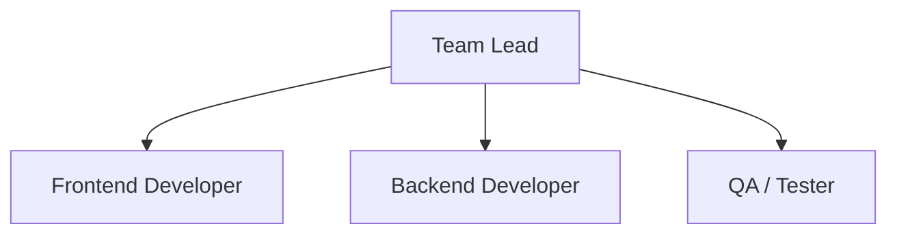
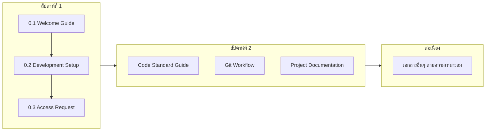
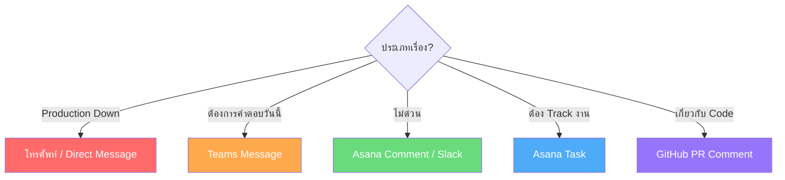

# 0.1 Welcome Guide - คู่มือต้อนรับสมาชิกใหม่

## ยินดีต้อนรับสู่ทีม Software Development! 🎉

เอกสารนี้จะช่วยให้คุณทำความเข้าใจภาพรวมของทีม วัฒนธรรมการทำงาน และสิ่งที่ควรรู้เพื่อเริ่มต้นการทำงานได้อย่างราบรื่น

---

## 📋 สารบัญ

1. [เกี่ยวกับทีม](#เกี่ยวกับทีม)
2. [โครงสร้างทีม](#โครงสร้างทีม)
3. [เอกสารที่ต้องอ่าน](#เอกสารที่ต้องอ่าน)
4. [ช่องทางการติดต่อ](#ช่องทางการติดต่อ)
5. [คำถามที่พบบ่อย](#คำถามที่พบบ่อย)

---

## เกี่ยวกับทีม

### โปรเจคที่รับผิดชอบ
<!-- ระบุโปรเจคหลักของทีม -->

| โปรเจค | คำอธิบาย | Tech Stack |
|--------|----------|------------|
| **Kaizen Webapplication** | เว็บแอปส่งโครงการ | React, Node.js, PostgreSQL |
| **FixAsset** | เว็บแอปตรวจนับทรัพย์สินองค์กร | React, Node.js, PostgreSQL |

---

## โครงสร้างทีม

### Organization Chart

### บุคลากรสำคัญที่ควรรู้จัก

| บทบาท | ชื่อ | ติดต่อ | หน้าที่ |
|-------|------|--------|---------|
| **Team Lead** | Nisarat S. | nisarat.h@gsbattery.co.th | ตัดสินใจด้านเทคนิค, ทิศทางโปรเจกต์ |
| **Project Management** | Ratchanok R. | ratchanok.r@gsbattery.co.th | จัดการ Timeline, Stakeholder |
| **Software Engineer** | Pantira S. | pantira.s@gsbattery.co.th | ดูแลเกี่ยวกับ Software Development |
| **Ai Engineer** | Burased B. | burased.b@gsbattery.co.th | ดูแลเกี่ยวกับ AI Development |

---

### บทบาทและความรับผิดชอบ

#### Sr. Software Engineer — Strategy

| ความรับผิดชอบ |
|--------------|
| กำหนด Architecture, Tech Stack, Design Pattern |
| Code Review ทุก PR ก่อน merge พร้อม feedback ที่มีประโยชน์ |
| Break down task ใหญ่ให้ Junior ทำได้ใน 1–3 วัน |
| Unblock เมื่อน้องติดปัญหาเกิน 30 นาที |
| กำหนด Coding Standard และ Convention ของทีม |
| Mentor ช่วยให้ Junior เติบโต |

#### Jr. Software Engineer — Action

| ความรับผิดชอบ |
|--------------|
| Implement feature ตาม spec และ Acceptance Criteria |
| เขียน Unit Test สำหรับ code ที่ตัวเองเขียน |
| Document งานที่ทำไว้ใน ticket และ code comment |
| Report blocker ภายใน 30 นาที ไม่ช่อนปัญหา |
| ทำ PR Checklist ให้ครบก่อน Request Review ทุกครั้ง |

---

### ตารางการทำงานประจำสัปดาห์

#### ภาพรวมรายสัปดาห์

| กิจกรรม | วัน/เวลา | ผู้เข้าร่วม | ระยะเวลา |
|---------|----------|-------------|----------|
| **Sprint Planning** | จันทร์เช้า | Senior + Junior | 30 นาที |
| **Daily Standup** | ทุกเช้า | Senior + Junior | 10 นาที |
| **Review PR** | ทุกวัน | Senior | ภายใน 24 ชม. |
| **IT Meeting** | ทุกต้นเดือน | ทุกคน | 1-3 ชม. |
| **DM Weekly Meeting** | ทุกวันพฤ | ทุกคน | 1-2 ชม. |

#### Daily Standup — 3 คำถาม

| ลำดับ | คำถาม |
|-------|-------|
| 1 | เมื่อวานทำอะไรเสร็จ? |
| 2 | วันนี้จะทำอะไร? |
| 3 | มี Blocker ไหม? |

> **กฎสำคัญ:** ไม่ใช่ที่แก้ปัญหา ถ้ามีเรื่องต้องคุยยาว ให้คุยต่อหลังจบ Standup

---

### วิธีมอบหมายงาน (Task Assignment Protocol)

#### Output ที่ชัดเจน

| | ตัวอย่าง |
|---|----------|
| **Don't** ❌ | "ทำ login feature" |
| **Do** ✅ | "ทำ login feature" พร้อมระบุ Acceptance Criteria ชัดเจน เช่น login สำเร็จ → คืน 200 + JWT token, password ผิด → คืน 401 + error message |

#### Time Estimate

- ประเมินเวลาร่วมกัน ไม่ใช่ Senior กำหนดฝ่ายเดียว
- ถ้าน้องรู้สึกว่านานกว่า → คุยและปรับด้วยกัน

#### กฎเพิ่มเติม

- Junior ไม่ควรมี In Progress เกิน **2 ticket** พร้อมกัน
- Task ที่ใหญ่กว่า **3 วัน** → Senior ต้อง break down ก่อนเสมอ

### เวลาทำงาน

- **Core Hours**: 7:30 - 16:30 น. (ต้องอยู่ในช่วงนี้)
- **Flexible Hours**: สามารถยืดหยุ่นได้นอก Core Hours

## เอกสารที่ต้องอ่าน

### ลำดับการอ่านที่แนะนำ

### เอกสารสำคัญ

| เอกสาร | ตำแหน่ง | ความสำคัญ |
|--------|---------|-----------|
| Code Standard Guide | `documentation/04_DEVELOPMENT/Code_Standard_Guide.md` | ต้องอ่าน |
| Technical Stack | `documentation/02_DESIGN/2.4_Technical_Stack.md` | ต้องอ่าน |
| Database Schema | `documentation/03_DATABASE/` | แนะนำ |
| Deploy Process | `documentation/05_DEPLOY/` | แนะนำ |

---

## ช่องทางการติดต่อ

### เครื่องมือสื่อสาร

| เครื่องมือ | ใช้สำหรับ | Link |
|------------|----------|------|
| **Microsoft Teams** | สื่อสารรายวัน, ถามคำถาม | [Link] |
| **Outlook** | เรื่องทางการ, External | [Email Domain] |
| **Asana** | จัดการงาน, Task Tracking | [Link] |
| **GitHub** | Source Code, PR Review | [Link] |
| **Figma** | Design Files, Wireframes | [Link] |

### Channel สำคัญ (Slack/Teams)

| Channel | วัตถุประสงค์ |
|---------|--------------|
| `#general` | ประกาศทั่วไป |
| `#dev-team` | พูดคุยเรื่องงาน Development |
| `#code-review` | แจ้ง PR ที่ต้องการ Review |
| `#deployment` | แจ้งการ Deploy |
| `#random` | คุยเล่น, Social |

### เมื่อไหร่ควรใช้ช่องทางไหน?

---

## คำถามที่พบบ่อย

### Q: ต้องการเข้าถึง Repository ทำอย่างไร?
**A:** ดูเอกสาร [0.3_Access_Request_Checklist.md](0.3_Access_Request_Checklist.md) และขอ Access จาก Team Lead

### Q: ถ้าไม่เข้าใจ Requirement ควรทำอย่างไร?
**A:** ถาม PM หรือ Team Lead ก่อนเริ่มงานเสมอ การถามคำถามคือสิ่งที่ดี

### Q: Code Review ใช้เวลานานแค่ไหน?
**A:** ปกติ 1-2 วันทำการ ถ้าด่วนให้แจ้งใน `#Team`

---

## Checklist ก่อนเริ่มงาน

- [ ] อ่าน Welcome Guide จบแล้ว
- [ ] เข้าร่วม Channel สำคัญแล้ว
- [ ] เข้าใจการทำงานของทีม
- [ ] ทราบตารางประชุมประจำ
- [ ] อ่านเอกสาร 0.2, 0.3 ต่อ

---

*อัปเดตล่าสุด: 1 เมษายน 2026*
