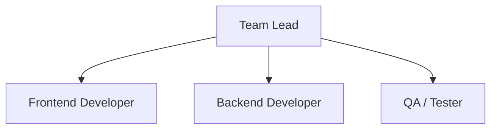
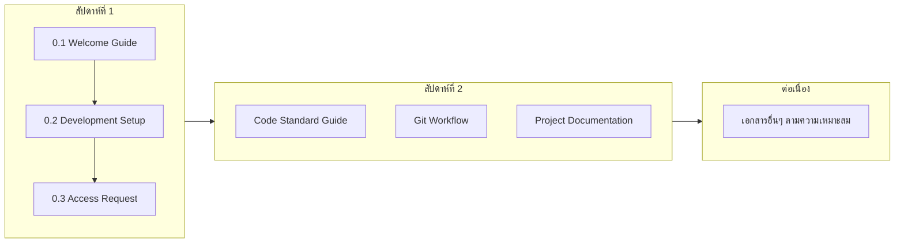
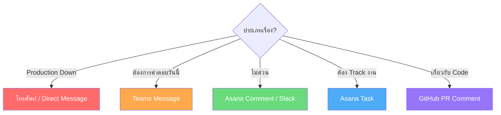

# 0.1 Welcome Guide - คู่มือต้อนรับสมาชิกใหม่

## ยินดีต้อนรับสู่ทีม Software Development! 🎉

เอกสารนี้จะช่วยให้คุณทำความเข้าใจภาพรวมของทีม วัฒนธรรมการทำงาน และสิ่งที่ควรรู้เพื่อเริ่มต้นการทำงานได้อย่างราบรื่น

---

## 📋 สารบัญ

1. [เกี่ยวกับทีม](#เกี่ยวกับทีม)
2. [โครงสร้างทีม](#โครงสร้างทีม)
3. [เอกสารที่ต้องอ่าน](#เอกสารที่ต้องอ่าน)
4. [ช่องทางการติดต่อ](#ช่องทางการติดต่อ)
5. [คำถามที่พบบ่อย](#คำถามที่พบบ่อย)

---

## เกี่ยวกับทีม

### โปรเจคที่รับผิดชอบ
<!-- ระบุโปรเจคหลักของทีม -->

| โปรเจค | คำอธิบาย | Tech Stack |
|--------|----------|------------|
| **Kaizen Webapplication** | เว็บแอปส่งโครงการ | React, Node.js, PostgreSQL |
| **FixAsset** | เว็บแอปตรวจนับทรัพย์สินองค์กร | React, Node.js, PostgreSQL |

---

## โครงสร้างทีม

### Organization Chart

### บุคลากรสำคัญที่ควรรู้จัก

| บทบาท | ชื่อ | ติดต่อ | หน้าที่ |
|-------|------|--------|---------|
| **Team Lead** | Nisarat S. | nisarat.h@gsbattery.co.th | ตัดสินใจด้านเทคนิค, ทิศทางโปรเจกต์ |
| **Project Managent** | Ratchanok R. | ratchanok.r@gsbattery.co.th | จัดการ Timeline, Stakeholder |
| **Software Engineer** | Pantira S. | pantira.s@gsbattery.co.th | ดูแลเกี่ยวกับ Software Development |
| **Ai Engineer** | Burased B. | burased.b@gsbattery.co.th | ดูแลเกี่ยวกับ AI Development |

---

### การประชุมประจำ

| ประชุม | วัน/เวลา | รูปแบบ | วัตถุประสงค์ |
|--------|----------|--------|--------------|
| **StandUp Meeting** | ทุกวัน 08:45 น. | 15 นาที | อัปเดตงาน |
| **IT Meeting** | ทุกต้นเดือน | 1-3 ชม. | อัปเดตงาน |
| **DM Weekly Meeting** | ทุกวันพฤ | 1-2 ชม. | อัปเดตงาน |

### เวลาทำงาน

- **Core Hours**: 7:30 - 16:30 น. (ต้องอยู่ในช่วงนี้)
- **Flexible Hours**: สามารถยืดหยุ่นได้นอก Core Hours
- **Work From Home**: [ระบุนโยบาย WFH]

## เอกสารที่ต้องอ่าน

### ลำดับการอ่านที่แนะนำ

### เอกสารสำคัญ

| เอกสาร | ตำแหน่ง | ความสำคัญ |
|--------|---------|-----------|
| Code Standard Guide | `documentation/04_DEVELOPMENT/Code_Standard_Guide.md` | ต้องอ่าน |
| Technical Stack | `documentation/02_DESIGN/2.4_Technical_Stack.md` | ต้องอ่าน |
| Database Schema | `documentation/03_DATABASE/` | แนะนำ |
| Deploy Process | `documentation/05_DEPLOY/` | แนะนำ |

---

## ช่องทางการติดต่อ

### เครื่องมือสื่อสาร

| เครื่องมือ | ใช้สำหรับ | Link |
|------------|----------|------|
| **Microsoft Teams** | สื่อสารรายวัน, ถามคำถาม | [Link] |
| **Outlook** | เรื่องทางการ, External | [Email Domain] |
| **Asana** | จัดการงาน, Task Tracking | [Link] |
| **GitHub** | Source Code, PR Review | [Link] |
| **Figma** | Design Files, Wireframes | [Link] |

### Channel สำคัญ (Slack/Teams)

| Channel | วัตถุประสงค์ |
|---------|--------------|
| `#general` | ประกาศทั่วไป |
| `#dev-team` | พูดคุยเรื่องงาน Development |
| `#code-review` | แจ้ง PR ที่ต้องการ Review |
| `#deployment` | แจ้งการ Deploy |
| `#random` | คุยเล่น, Social |

### เมื่อไหร่ควรใช้ช่องทางไหน?

---

## คำถามที่พบบ่อย

### Q: ต้องการเข้าถึง Repository ทำอย่างไร?
**A:** ดูเอกสาร [0.3_Access_Request_Checklist.md](0.3_Access_Request_Checklist.md) และขอ Access จาก Tech Lead

### Q: ถ้าไม่เข้าใจ Requirement ควรทำอย่างไร?
**A:** ถาม PM หรือ Team Lead ก่อนเริ่มงานเสมอ การถามคำถามคือสิ่งที่ดี

### Q: Code Review ใช้เวลานานแค่ไหน?
**A:** ปกติ 1-2 วันทำการ ถ้าด่วนให้แจ้งใน `#Team`

---

## Checklist ก่อนเริ่มงาน

- [ ] อ่าน Welcome Guide จบแล้ว
- [ ] เข้าร่วม Channel สำคัญแล้ว
- [ ] เข้าใจการทำงานของทีม
- [ ] ทราบตารางประชุมประจำ
- [ ] อ่านเอกสาร 0.2, 0.3 ต่อ

---

*อัปเดตล่าสุด: 29 มกราคม 2026*
