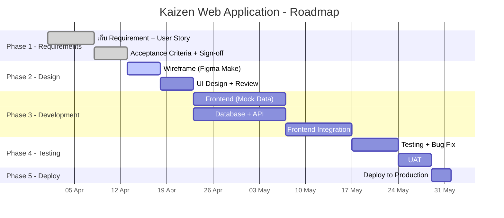

# 1.4 Roadmap, Timeline & Asana

## ภาพรวม

เอกสารนี้อธิบายวิธีสร้าง **Project Roadmap** และ **Timeline** สำหรับโปรเจกต์ 1 ตัว โดยใช้ Asana เป็นเครื่องมือจัดการ เพื่อให้ทีมเห็นภาพรวมว่าต้องทำอะไร เมื่อไหร่ ใครรับผิดชอบ

---

## Project Information

| Field | Value |
|---|---|
| **Project Name** | Kaizen Web Application |
| **SDLC Model** | Agile (Scrum) |
| **Sprint Duration** | 2 สัปดาห์ |
| **Project Management Tool** | Asana |
| **Source Code** | GitHub (Siam-GS-Battery) |
| **Hosting** | Railway.app |
| **Database** | Supabase (PostgreSQL) |

---

## วิธีสร้าง Project Roadmap

### ขั้นตอนที่ 1: แบ่งโปรเจกต์เป็น Phase

ใช้ SDLC Phase เป็นโครงหลัก แล้วกำหนด Duration ตามขนาดโปรเจกต์:

| Phase | กิจกรรมหลัก | Duration แนะนำ |
|:------|:-----------|:---------------|
| **Phase 1 — Requirements** | เก็บ Requirement, เขียน User Story, กำหนด AC | 1–2 สัปดาห์ |
| **Phase 2 — Design** | สร้าง Wireframe, UI Design ด้วย Figma Make | 1–2 สัปดาห์ |
| **Phase 3 — Development** | พัฒนา Frontend, Backend, API, เชื่อมต่อ DB | 4–8 สัปดาห์ |
| **Phase 4 — Testing** | Unit Test, Integration Test, UAT | 1–2 สัปดาห์ |
| **Phase 5 — Deploy** | Deploy to Staging → Production | 1 สัปดาห์ |
| **Phase 6 — Maintain** | Bug Fix, Feedback, Enhancement | ต่อเนื่อง |

### ขั้นตอนที่ 2: กำหนด Milestone

Milestone คือจุดสำคัญที่ต้อง "เสร็จ" ก่อนไปต่อ:

**ตัวอย่าง Kaizen Web Application:**

| Milestone | เงื่อนไขผ่าน | Phase |
|:----------|:-----------|:------|
| Requirements Sign-off | PM + Stakeholder อนุมัติ User Stories + AC | Phase 1 |
| Design Approved | ทีม review Wireframe/UI ผ่าน | Phase 2 |
| Frontend Demo Ready | หน้าเว็บทำงานได้ด้วย mock data | Phase 3 |
| Database + API Ready | CRUD endpoints ทำงานได้จริง | Phase 3 |
| Full-stack Integration | Frontend เชื่อมกับ API สำเร็จ | Phase 3 |
| Testing Passed | ผ่าน Quality Gates ทั้งหมด | Phase 4 |
| UAT Sign-off | Stakeholder ทดสอบแล้วอนุมัติ | Phase 4 |
| Production Launch | Deploy to Production สำเร็จ | Phase 5 |

### ขั้นตอนที่ 3: จัดเรียง Timeline

วาง Milestone ลงบน Timeline โดยคำนึงถึง Dependencies:



> **Tip:** ใน Asana ใช้ **Timeline View** เพื่อดูภาพแบบ Gantt Chart

---

## การตั้ง Asana สำหรับโปรเจกต์

### Board Structure

สร้าง Asana Project 1 ตัวต่อ 1 โปรเจกต์:

```
📋 Kaizen Web Application (Project)
├── Sections (แบ่งตาม Phase)
│   ├── Phase 1 - Requirements
│   ├── Phase 2 - Design
│   ├── Phase 3 - Development
│   ├── Phase 4 - Testing
│   └── Phase 5 - Deploy
│
├── Views
│   ├── Board View    → ดูสถานะ (To Do / In Progress / Done)
│   ├── Timeline View → ดู Gantt Chart
│   └── List View     → ดูรายการทั้งหมด
│
└── Custom Fields
    ├── Phase          → Phase 1-5
    ├── Priority       → High / Medium / Low
    ├── Sprint         → Sprint 1, 2, 3...
    └── Story Points   → 1, 2, 3, 5, 8, 13
```

### Sprint Board View

นอกจากแบ่งตาม Phase ใช้ **Board View** สำหรับ Sprint ปัจจุบัน:

| Column | ความหมาย |
|:-------|:---------|
| **Backlog** | งานที่ยังไม่ได้จัดเข้า Sprint |
| **To Do** | งานของ Sprint นี้ ยังไม่เริ่ม |
| **In Progress** | กำลังทำอยู่ |
| **In Review** | เปิด PR แล้ว รอ Senior Review |
| **Done** | Merge แล้ว เสร็จสมบูรณ์ |

---

## วิธีใช้ Asana ในแต่ละจังหวะ

### Sprint Planning (ทุกวันจันทร์เช้า)

1. ดู **Timeline View** — Phase นี้ต้องทำ milestone ไหน
2. ดึง Task จาก **Backlog** — เลือก task ที่ตอบโจทย์ milestone
3. ย้ายเข้า **To Do** — กำหนด Sprint tag
4. **Assign + Estimate** — กำหนดคนรับผิดชอบ + ประเมินเวลาร่วมกัน

### Daily Flow

```
ทุกเช้า: ดึง code ล่าสุดจาก staging
→ เปิด Asana ดู task ของตัวเอง
→ ย้าย task เป็น "In Progress"
→ สร้าง branch ตาม Asana Task ID
→ ทำงาน + commit ทุก 1-2 ชม.
→ เสร็จ → เปิด PR ลิงก์ Asana Task
→ ย้าย task เป็น "In Review"
```

### Sprint Review (ทุก 2 สัปดาห์)

1. **Demo** สิ่งที่ทำเสร็จใน Sprint
2. **เทียบกับ Milestone** — ใกล้ถึง milestone ไหนแล้ว
3. **ปรับแผน** — ถ้า milestone เลื่อนให้ปรับ priority ใน Sprint ถัดไป

---

## Naming Convention ใน Asana

### Task Title

```
[Type] ชื่อ task สั้นกระชับ
```

**ตัวอย่าง:**
- `[Feature] สร้างหน้า Login`
- `[Feature] CRUD API สำหรับ Users`
- `[Bug] แก้ปัญหา null response ใน payment API`
- `[Chore] ตั้งค่า CI pipeline`
- `[Docs] เขียน API Documentation`

### Task Description Template

```markdown
## สิ่งที่ต้องทำ
- รายละเอียดงาน

## Acceptance Criteria
- [ ] เงื่อนไขที่ต้องผ่าน

## Reference
- Figma: [ลิงก์ ถ้ามี]
- API Spec: [ลิงก์ ถ้ามี]
```

> ดูรายละเอียดเรื่อง DoR ของ Task ที่ [1.5 Definition of Ready & Done](1.5_Definition_of_Ready_Done.md)

---

## การติดตามความคืบหน้า

### Weekly Check (ทุกวันศุกร์)

| สิ่งที่ดู | ดูที่ไหน |
|:---------|:---------|
| Task ที่ค้าง In Progress นานเกินไป | Asana Board View |
| PR ที่รอ review เกิน 24 ชม. | GitHub Pull Requests |
| Milestone ถัดไปคืบหน้าแค่ไหน | Asana Timeline View |

### Milestone Review (เมื่อถึง Milestone)

1. ตรวจสอบว่าผ่านเงื่อนไข Milestone หรือไม่
2. ถ้าผ่าน → ไป Phase ถัดไป
3. ถ้ายังไม่ผ่าน → ระบุสิ่งที่ค้าง ปรับแผน Sprint ถัดไป

---

## ตัวอย่าง: Roadmap ของ Kaizen Web Application

| Sprint | สัปดาห์ | Phase | งานหลัก | Milestone |
|:-------|:--------|:------|:--------|:----------|
| Sprint 1 | W1-W2 | Requirements | เก็บ Requirement, เขียน User Story, AC | Requirements Sign-off |
| Sprint 2 | W3-W4 | Design | Wireframe + UI Design ด้วย Figma Make | Design Approved |
| Sprint 3 | W5-W6 | Development | Frontend (Mock), Database + API | Frontend Demo Ready |
| Sprint 4 | W7-W8 | Development | API Development, Frontend Integration | Database + API Ready |
| Sprint 5 | W9-W10 | Development | Integration, Bug Fix | Full-stack Integration |
| Sprint 6 | W11-W12 | Testing + Deploy | Testing, UAT, Deploy | Production Launch |

> นี่คือตัวอย่าง ปรับ Sprint/Duration ตามขนาดและความซับซ้อนของโปรเจกต์จริง

---

## เอกสารที่เกี่ยวข้อง

| เอกสาร | ความเกี่ยวข้อง |
|--------|---------------|
| [1.1 Raw Requirement List](1.1_Raw_Requirement_List_MoSCoW.md) | Requirement ที่ต้องจัดเข้า Roadmap |
| [1.2 User Story List](1.2_User_Story_List.md) | User Stories ที่แปลงเป็น Task ใน Asana |
| [1.5 Definition of Ready & Done](1.5_Definition_of_Ready_Done.md) | DoR/DoD สำหรับ Task ใน Asana |
| [7.1 Branching Strategy](../07_GIT_WORKFLOW/7.1_Branching_Strategy.md) | ตั้งชื่อ Branch ตาม Asana Task ID |
| [7.3 PR Process](../07_GIT_WORKFLOW/7.3_Pull_Request_Process.md) | ลิงก์ Asana Task ใน PR Description |

---

*อัปเดตล่าสุด: 1 เมษายน 2026*
