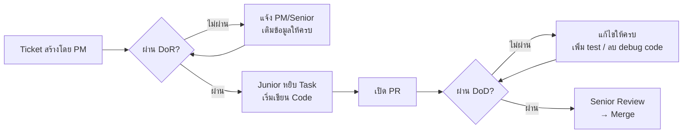

# 1.5 Definition of Ready & Definition of Done

## ภาพรวม

DoR และ DoD เป็นข้อตกลงของทีมที่กำหนดว่า "พร้อมเริ่มทำ" และ "เสร็จจริง" หมายความว่าอย่างไร เพื่อลดความเข้าใจผิดระหว่าง PM, Senior และ Junior

```
DoR                          DoD
"Ticket พร้อมหยิบทำหรือยัง?"  "งานเสร็จจริงพร้อม merge หรือยัง?"
─────────────────────────────────────────────────────────────────
  ก่อนเริ่ม Code         →         ก่อน Merge PR
```

---

## Definition of Ready (DoR)

### DoR คืออะไร

DoR คือเงื่อนไขขั้นต่ำที่ **Ticket/Task ต้องมีครบ** ก่อนที่ Developer จะหยิบมาทำ ถ้าไม่ผ่าน DoR ห้ามเริ่มเขียน code

### ทำไมต้องมี DoR

- Junior ไม่ต้องเดาว่าต้องทำอะไร
- ลดเวลาที่เสียไปกับการถามไปถามมา
- Senior มั่นใจว่า break down task ครบก่อนส่งงาน
- PM มั่นใจว่า requirement ชัดเจนพอ

---

### DoR Checklist — ใช้ได้ทุกประเภท Task

| # | เงื่อนไข | ใครรับผิดชอบ |
|---|:---------|:------------|
| 1 | มี **Task Description** อธิบายว่าต้องทำอะไร | PM / Senior |
| 2 | มี **Acceptance Criteria** อย่างน้อย 1 ข้อ | PM / Senior |
| 3 | Task ขนาด **ทำเสร็จได้ใน 1–3 วัน** (ถ้าใหญ่กว่านี้ต้อง break down) | Senior |
| 4 | มี **Story Points / Time Estimate** ที่ประเมินร่วมกัน | Senior + Junior |
| 5 | ไม่มี **Blocker** ที่ยังแก้ไม่ได้ | ทุกคน |

### DoR เพิ่มเติมตามประเภทงาน

#### งาน UI / Frontend

| # | เงื่อนไขเพิ่มเติม |
|---|:-----------------|
| 6 | มี **Figma / Wireframe** ลิงก์ที่ทำเสร็จแล้ว |
| 7 | ระบุ **Responsive** ที่ต้องรองรับ (Desktop / Mobile / ทั้งคู่) |

#### งาน API / Backend

| # | เงื่อนไขเพิ่มเติม |
|---|:-----------------|
| 6 | มี **API Spec** (endpoint, method, request/response format) |
| 7 | มี **DB Schema** ที่เกี่ยวข้อง (ถ้ามี table ใหม่) |

#### งาน Bug Fix

| # | เงื่อนไขเพิ่มเติม |
|---|:-----------------|
| 6 | มี **Steps to Reproduce** ที่ทำซ้ำได้ |
| 7 | มี **Expected vs Actual** behavior |

---

### วิธีเขียน DoR ใน Asana Task

ใช้ Template นี้ใน Task Description:

```markdown
## Task Description
[อธิบายสิ่งที่ต้องทำ 1-3 ประโยค]

## Acceptance Criteria
- [ ] [เงื่อนไขที่ 1]
- [ ] [เงื่อนไขที่ 2]
- [ ] [เงื่อนไขที่ 3]

## Reference
- Figma: [ลิงก์]
- API Spec: [ลิงก์ หรือเขียนสั้นๆ]

## DoR Checklist
- [ ] Description ชัดเจน
- [ ] AC ครบ
- [ ] ขนาดไม่เกิน 3 วัน
- [ ] Estimate แล้ว
- [ ] ไม่มี blocker
```

---

### ตัวอย่าง: Task ที่ผ่าน DoR vs ไม่ผ่าน

#### ไม่ผ่าน DoR ❌

```
Title: ทำหน้า Login
Description: (ว่าง)
```

ปัญหา: ไม่มี AC, ไม่มี Figma, ไม่มี API spec → Junior ต้องเดาเอง

#### ผ่าน DoR ✅

```
Title: [Feature] สร้างหน้า Login

## Task Description
สร้างหน้า Login ให้ user กรอก email + password แล้วเข้าสู่ระบบได้
ใช้ Supabase Auth สำหรับ authentication

## Acceptance Criteria
- [ ] มี input field: email, password
- [ ] กด Login → เรียก Supabase signInWithPassword
- [ ] login สำเร็จ → redirect ไปหน้า Dashboard
- [ ] login ไม่สำเร็จ → แสดง error message
- [ ] มี link "ลืมรหัสผ่าน" (navigate ไป /forgot-password)
- [ ] Responsive: Desktop + Mobile

## Reference
- Figma: https://figma.com/file/xxx/login
- API: ใช้ Supabase Auth (signInWithPassword)

## DoR Checklist
- [x] Description ชัดเจน
- [x] AC ครบ
- [x] ขนาดไม่เกิน 3 วัน (ประเมิน 2 วัน)
- [x] Estimate แล้ว (5 Story Points)
- [x] ไม่มี blocker
```

---

## Definition of Done (DoD)

### DoD คืออะไร

DoD คือเงื่อนไขที่ **งานต้องผ่านทุกข้อ** ก่อนถือว่า "เสร็จ" และพร้อม merge เข้า staging ถ้าไม่ผ่าน DoD ห้าม merge

### ทำไมต้องมี DoD

- ป้องกัน code ที่ไม่มี test หลุดเข้า staging
- ทุกคนเข้าใจตรงกันว่า "เสร็จ" = ผ่านทุกข้อ ไม่ใช่แค่ "code เสร็จ"
- Senior review ได้เร็วขึ้นเพราะ Junior เตรียมมาครบ

---

### DoD Checklist — ใช้ได้ทุกประเภท Task

| # | เงื่อนไข | ใครตรวจ |
|---|:---------|:-------|
| 1 | Code ทำงานตาม **Acceptance Criteria** ครบทุกข้อ | Junior (self-check) |
| 2 | เขียน **Unit Test** สำหรับ logic ใหม่ | Junior |
| 3 | **CI ผ่าน** — Lint, Type-check, Tests ไม่มี error | CI อัตโนมัติ |
| 4 | ไม่มี `console.log` / debug code / hardcode ค้าง | Junior (self-review) |
| 5 | **Senior Review ผ่าน** — ไม่มี MUST comment ค้าง | Senior |
| 6 | **Asana Task** ลิงก์อยู่ใน PR Description | Junior |
| 7 | **Documentation** อัปเดตแล้ว (ถ้ามี API/Flow ใหม่) | Junior |

### DoD เพิ่มเติมตามประเภทงาน

#### งาน UI / Frontend

| # | เงื่อนไขเพิ่มเติม |
|---|:-----------------|
| 8 | หน้าตาตรงกับ **Figma** |
| 9 | **Responsive** ทำงานได้ตาม breakpoints ที่กำหนด |

#### งาน API / Backend

| # | เงื่อนไขเพิ่มเติม |
|---|:-----------------|
| 8 | **API Response** ตรงตาม spec (status code, format) |
| 9 | **Error handling** ครบ (validation, 4xx, 5xx) |

#### งาน Bug Fix

| # | เงื่อนไขเพิ่มเติม |
|---|:-----------------|
| 8 | Bug **ทำซ้ำไม่ได้แล้ว** ตาม Steps to Reproduce |
| 9 | เพิ่ม **test case** สำหรับ bug นี้ (ป้องกัน regression) |

---

### วิธีใช้ DoD กับ PR

เมื่อเปิด PR ให้ใช้ DoD เป็น checklist ใน PR Description:

```markdown
## DoD Checklist
- [ ] AC ครบทุกข้อ
- [ ] Unit Test เขียนแล้ว
- [ ] CI ผ่าน
- [ ] ไม่มี console.log / hardcode
- [ ] Asana Task ลิงก์แล้ว
- [ ] Docs อัปเดตแล้ว (ถ้ามี)
```

> Junior ต้องติ๊กให้ครบก่อน Request Review
> Senior ตรวจ DoD ก่อนกด Approve

---

### ตัวอย่าง: PR ที่ผ่าน DoD vs ไม่ผ่าน

#### ไม่ผ่าน DoD ❌

```
PR Title: feat(auth): add login page
Description: "ทำหน้า login เสร็จแล้วครับ"
- ❌ ไม่มี Asana link
- ❌ ไม่มี unit test
- ❌ CI fail (lint error)
- ❌ มี console.log ค้าง
```

Senior จะ **Request Changes** ทันที ไม่ต้อง review code

#### ผ่าน DoD ✅

```
PR Title: feat(auth): add login page [#1234567890]

## Summary
- สร้างหน้า Login ด้วย email + password
- เชื่อมต่อ Supabase signInWithPassword
- Redirect ไป Dashboard เมื่อ login สำเร็จ

## Asana Task
- https://app.asana.com/0/xxx/1234567890

## DoD Checklist
- [x] AC ครบทุกข้อ (6/6)
- [x] Unit Test: LoginForm.test.tsx (3 cases)
- [x] CI ผ่าน
- [x] ไม่มี console.log / hardcode
- [x] Asana Task ลิงก์แล้ว
- [x] ไม่มี docs ที่ต้องอัปเดต
```

Senior เริ่ม review code ได้เลย

---

## สรุป: DoR vs DoD

| | DoR | DoD |
|---|:---|:---|
| **ใช้เมื่อ** | ก่อนเริ่ม code | ก่อน merge PR |
| **ตรวจโดย** | Junior ตรวจ ticket ว่าพร้อมหรือยัง | Junior self-check + Senior review |
| **ถ้าไม่ผ่าน** | ห้ามเริ่ม code → แจ้ง PM/Senior | ห้าม merge → แก้ให้ครบก่อน |
| **เป้าหมาย** | ลดเวลาเสียจากข้อมูลไม่ครบ | ลด bug ที่หลุดเข้า staging |



---

## เอกสารที่เกี่ยวข้อง

- [1.3 Acceptance Criteria](1.3_Acceptance_Criteria.md) — วิธีเขียน AC (ใช้ใน DoR)
- [7.3 Pull Request Process](../07_GIT_WORKFLOW/7.3_Pull_Request_Process.md) — DoR/DoD ใช้ตรงไหนใน PR workflow
- [7.4 Code Review Guidelines](../07_GIT_WORKFLOW/7.4_Code_Review_Guidelines.md) — Senior ตรวจอะไรบ้าง

---

*อัปเดตล่าสุด: 1 เมษายน 2026*
