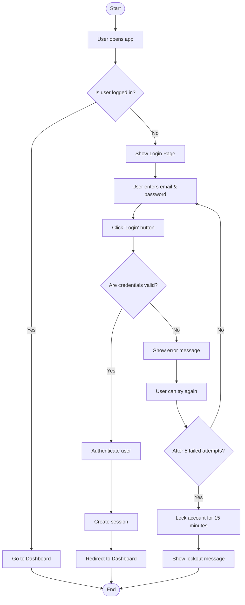
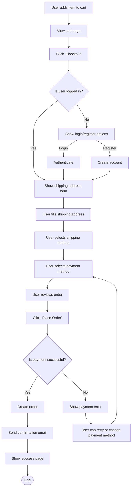
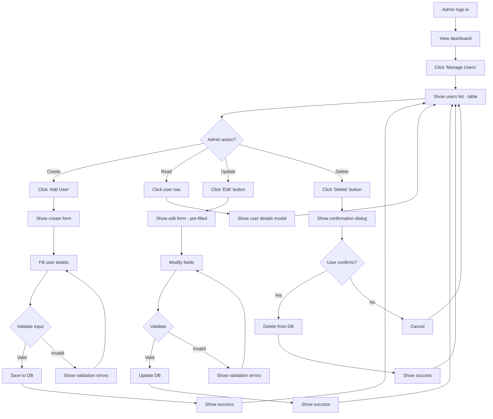

# 2.1 UX Flow Diagram (FigJam/Miro Link)

## วิธีการเขียน
UX Flow Diagram คือแผนภาพที่แสดง User Journey และการไหลของข้อมูลในระบบ เพื่อให้เห็นภาพรวมว่าผู้ใช้จะโต้ตอบกับระบบอย่างไร

---

## วัตถุประสงค์

UX Flow Diagram ช่วยให้:
1. **เข้าใจ User Behavior** - รู้ว่าผู้ใช้จะทำอะไรบ้างในระบบ
2. **ระบุ Pain Points** - เห็นจุดที่ผู้ใช้อาจสับสนหรือติดขัด
3. **วางแผน UI/UX** - ออกแบบหน้าจอและ navigation ให้เหมาะสม
4. **Communicate กับทีม** - ให้ทุกคนเข้าใจ flow เดียวกัน
5. **Validate กับ Stakeholders** - ยืนยันว่า flow ตอบโจทย์ business

---

## ตัวอย่าง UX Flow Diagram

### Example: User Login Flow



---

## องค์ประกอบของ UX Flow Diagram

### 1. **Entry Points** (จุดเริ่มต้น)
- ผู้ใช้เข้ามาจากไหน? (App launch, Link, Notification, etc.)
- Example: "User clicks link from email"

### 2. **User Actions** (การกระทำของผู้ใช้)
- สิ่งที่ผู้ใช้ทำ (Click, Type, Swipe, Upload, etc.)
- Example: "User enters email", "User clicks Submit"

### 3. **Decision Points** (จุดตัดสินใจ)
- เงื่อนไข if/else (Yes/No, Valid/Invalid, etc.)
- Example: "Is email valid?", "Is user authenticated?"

### 4. **System Actions** (การทำงานของระบบ)
- สิ่งที่ระบบทำอัตโนมัติ (Validate, Save, Send email, etc.)
- Example: "System validates input", "System sends notification"

### 5. **Screens/Pages** (หน้าจอ)
- หน้าจอที่ผู้ใช้จะเห็น
- Example: "Login Page", "Dashboard", "Error Page"

### 6. **Exit Points** (จุดสิ้นสุด)
- ผู้ใช้จบ flow ที่ไหน (Success, Error, Cancel, Logout)
- Example: "User successfully logged in", "User canceled operation"

---

## Symbols & Notations (สัญลักษณ์ที่ใช้)

### Standard Flowchart Symbols (ISO 5807):

| Symbol | Name | ความหมาย |
|---|---|---|
| 🟦 Rectangle | Process | กระบวนการ/การทำงาน |
| 🔷 Diamond | Decision | จุดตัดสินใจ (Yes/No) |
| 🟩 Rounded Rectangle | Start/End | จุดเริ่มต้น/สิ้นสุด |
| ➡️ Arrow | Flow | ทิศทางการไหล |
| 📄 Document | Page/Screen | หน้าจอ/หน้าเว็บ |
| 💾 Cylinder | Database | ฐานข้อมูล |
| ☁️ Cloud | External System | ระบบภายนอก (API, Service) |

### Nielsen Norman Group Conventions:
- **Blue boxes**: User actions
- **Yellow boxes**: System actions
- **Red boxes**: Error states
- **Green boxes**: Success states

---

## วิธีการสร้าง UX Flow Diagram

### ขั้นตอนที่ 1: เตรียมข้อมูล
1. **รวบรวม User Stories** - จาก `1.2_User_Story_List.xlsx`
2. **ทบทวน Requirements** - จาก `1.1_Raw_Requirement_List_MoSCoW.xlsx`
3. **ระบุ User Personas** - ผู้ใช้แต่ละประเภทมี flow ต่างกันหรือไม่?
4. **กำหนด Entry & Exit Points** - ผู้ใช้เริ่มและจบที่ไหน

### ขั้นตอนที่ 2: สร้าง Flow ใน FigJam/Miro
1. **เปิด FigJam หรือ Miro**
   - FigJam: [figma.com/figjam](https://www.figma.com/figjam/)
   - Miro: [miro.com](https://miro.com/)

2. **สร้าง Board ใหม่**
   - ตั้งชื่อ: "[Project Name] - UX Flow Diagram"
   - แชร์กับทีม (View/Edit access)

3. **วาง Main Flow ก่อน (Happy Path)**
   - เริ่มจาก Entry Point → Actions → Success
   - ใช้ sticky notes หรือ shapes

4. **เพิ่ม Decision Points**
   - ใช้ Diamond shape สำหรับ if/else
   - แยก path: Yes/No, Valid/Invalid

5. **เพิ่ม Alternative Flows (Error Cases)**
   - กรณีผู้ใช้กรอกข้อมูลผิด
   - กรณี server error
   - กรณี network timeout

6. **เพิ่ม Edge Cases**
   - กรณีพิเศษ (Empty state, First-time user, etc.)

7. **ใส่สี และ Annotations**
   - ใช้สีแยก User actions, System actions, Errors
   - เพิ่มหมายเหตุสำคัญ

8. **Link ไปยังหน้าจอ/Wireframes**
   - ถ้ามี wireframes แล้ว ให้ link ไปด้วย

### ขั้นตอนที่ 3: Review กับทีม
1. **Present ให้ทีมดู** - Product Owner, Developers, Designers
2. **รับ Feedback** - มี flow ที่ขาดหรือไม่ชัดเจนหรือไม่?
3. **ปรับปรุง** - แก้ไขตาม feedback
4. **Get Approval** - ให้ stakeholders approve

### ขั้นตอนที่ 4: Export & Document
1. **Export เป็นรูปภาพ**
   - PNG (สำหรับเอกสาร)
   - PDF (สำหรับ presentation)
   - SVG (สำหรับแก้ไขต่อ)

2. **เก็บ Link**
   - Copy link จาก FigJam/Miro
   - เก็บในไฟล์นี้และ Project Management Tool

3. **Version Control**
   - ตั้งชื่อเวอร์ชัน: `UX_Flow_v1.0`, `UX_Flow_v1.1`
   - บันทึก changelog เมื่อมีการแก้ไข

---

## ตัวอย่าง Use Cases

### Use Case 1: E-Commerce Checkout Flow



### Use Case 2: Admin CRUD Operation Flow



---

## Tools สำหรับสร้าง UX Flow

| Tool | Best For | Price | Link |
|---|---|---|---|
| **FigJam** | Collaborative whiteboard (Figma ecosystem) | Free - $15/editor/mo | figma.com/figjam |
| **Miro** | Unlimited canvas, templates | Free - $10/member/mo | miro.com |

---

## Best Practices

### ✓ DO:
1. **Start with Happy Path** - วาด flow หลักที่สำเร็จก่อน
2. **Include Decision Points** - ระบุเงื่อนไข if/else ชัดเจน
3. **Show Error Handling** - ต้องมี error cases ด้วย
4. **Use Consistent Symbols** - ใช้สัญลักษณ์เดียวกันทั้ง diagram
5. **Label Everything** - ใส่ชื่อหน้าจอ, actions ทุกอัน
6. **Keep It Simple** - อย่าซับซ้อนจนอ่านไม่ออก (แยกเป็นหลาย diagrams ถ้าจำเป็น)
7. **Use Swimlanes** (Optional) - แยก flow ตาม user role หรือ system
8. **Add Annotations** - ใส่หมายเหตุสำหรับจุดสำคัญ
9. **Link to Wireframes** - เชื่อมไปยัง wireframes ถ้ามี
10. **Version Control** - เก็บเวอร์ชันเก่าไว้ด้วย

### ✗ DON'T:
1. **Don't Skip Error Cases** - ต้องมี error handling
2. **Don't Make It Too Complex** - ถ้ายาวเกินไป ให้แยก diagram
3. **Don't Use Unclear Labels** - ชื่อต้องชัดเจน เข้าใจง่าย
4. **Don't Forget Decision Points** - ทุกเงื่อนไขต้องมี diamond shape
5. **Don't Mix Multiple Flows** - แยก flow ของแต่ละ feature
6. **Don't Work Alone** - ต้อง collaborate กับ team

---

## UX Flow Diagram Checklist

ก่อน finalize UX Flow ให้ตรวจสอบว่า:

### Content Checklist:
- [ ] มี Entry Point ชัดเจน (ผู้ใช้เข้ามาจากไหน?)
- [ ] มี Exit Point ชัดเจน (Success, Error, Cancel)
- [ ] มี Happy Path (กรณีปกติที่สำเร็จ)
- [ ] มี Error Cases (กรณีผิดพลาด)
- [ ] มี Edge Cases (กรณีพิเศษ)
- [ ] มี Decision Points ทุกจุดที่มีเงื่อนไข
- [ ] ทุก Action มี label ชัดเจน
- [ ] ทุก Screen มีชื่อ

### Design Checklist:
- [ ] ใช้สัญลักษณ์มาตรฐาน (Flowchart symbols)
- [ ] ใช้สีสม่ำเสมอ (User actions, System actions, Errors)
- [ ] มี Legend อธิบายสี/สัญลักษณ์
- [ ] อ่านง่าย ไม่ซับซ้อนเกินไป
- [ ] มี annotations สำหรับจุดสำคัญ

### Collaboration Checklist:
- [ ] Review กับ Product Owner
- [ ] Review กับ Developers
- [ ] Review กับ Designers
- [ ] Review กับ QA/Testers
- [ ] ได้รับ approval จาก stakeholders
- [ ] เก็บ link ใน project management tool
- [ ] Export เป็นรูปภาพสำหรับเอกสาร

---

## Template Structure

### FigJam/Miro Board Structure:

```
┌─────────────────────────────────────────────────┐
│  [Project Name] - UX Flow Diagram               │
│  Version: 1.0                                   │
│  Last Updated: [Date]                           │
│  Owner: [Name]                                  │
├─────────────────────────────────────────────────┤
│                                                 │
│  Legend:                                        │
│  🔵 User Action                                 │
│  🟡 System Action                               │
│  🔴 Error State                                 │
│  🟢 Success State                               │
│  ◇ Decision Point                               │
│                                                 │
├─────────────────────────────────────────────────┤
│                                                 │
│  Main Flow (Happy Path):                       │
│  [Draw main user flow here]                    │
│                                                 │
├─────────────────────────────────────────────────┤
│                                                 │
│  Alternative Flows (Error Cases):              │
│  [Draw error handling flows here]              │
│                                                 │
├─────────────────────────────────────────────────┤
│                                                 │
│  Edge Cases:                                    │
│  [Draw special cases here]                     │
│                                                 │
└─────────────────────────────────────────────────┘
```

---

## Deliverable

เมื่อเสร็จแล้วต้องมี:

1. **FigJam/Miro Link**:
   - Example: `https://www.figma.com/board/abc123/ProjectName-UX-Flow`
   - ตั้งค่า sharing: View access สำหรับ stakeholders, Edit access สำหรับทีม

2. **Exported Images**:
   - `2.1_UX_Flow_Main.png` - Main flow (Happy path)
   - `2.1_UX_Flow_Errors.png` - Error handling flows
   - `2.1_UX_Flow_Full.pdf` - Full diagram

3. **Documentation**:
   - เก็บ link ในไฟล์นี้
   - อัปเดต Project Management Tool (Asana/Jira)
   - เก็บใน Google Drive/Confluence

