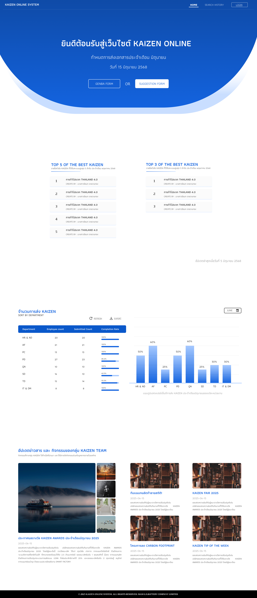
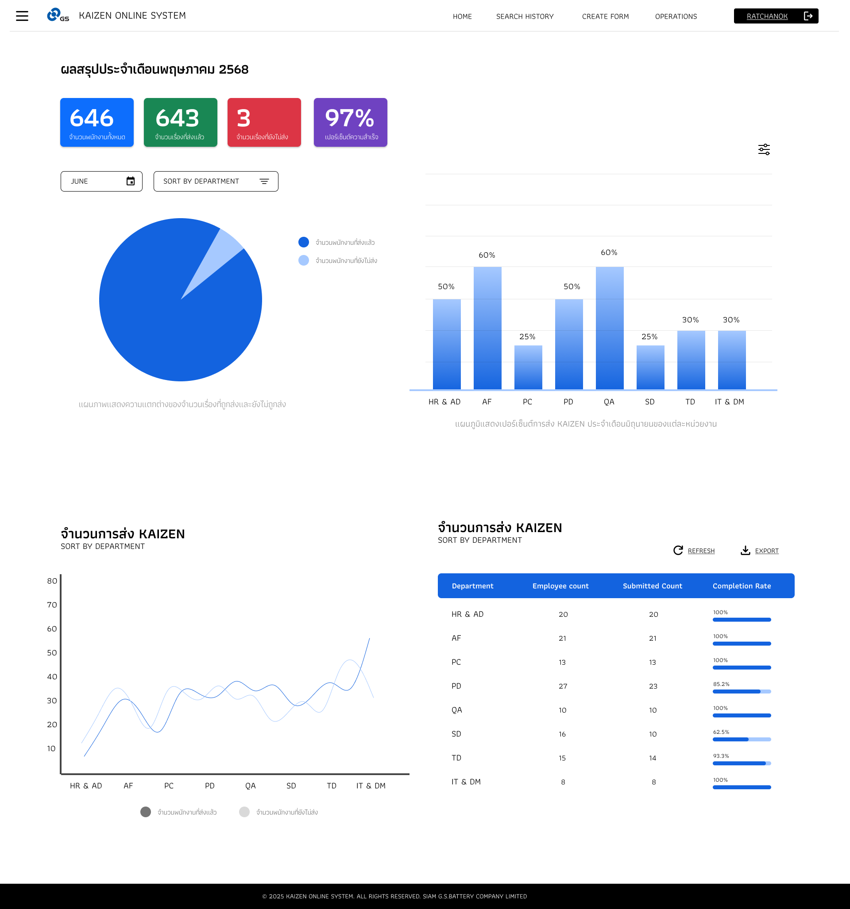

# 2.2 Wireframe Screens (Figma Link)

## วิธีการเขียน
Wireframe คือโครงร่างหน้าจอแบบ Low-Fidelity (ความละเอียดต่ำ) ที่แสดงโครงสร้าง layout และ content zones โดยไม่เน้นสี รูปแบบ หรือเนื้อหาจริง

---

## วัตถุประสงค์

Wireframes ช่วยให้:
1. **Focus on Structure** - มุ่งเน้นโครงสร้างก่อนสี/ตกแต่ง
2. **Quick Iterations** - แก้ไขได้เร็ว ไม่ต้องใช้เวลามาก
3. **Early Feedback** - รับ feedback ก่อนเริ่มออกแบบจริง
4. **Align Team Vision** - ทีมเห็นภาพเดียวกัน
5. **Save Development Time** - ลด rework ตอน coding
6. **Cost-Effective** - ถูกกว่าการแก้ไข mockup สีจริง

---

## ระดับของ Wireframes (Fidelity Levels)

### 1. **Low-Fidelity (Lo-Fi)**
- **ลักษณะ**: Sketch, ขาวดำ/grayscale, placeholder text
- **ใช้เมื่อ**: Early design phase, brainstorming
- **Tools**: กระดาษ, whiteboard, Balsamiq, hand-drawn
- **เวลา**: นาที - ชั่วโมง

### 2. **Mid-Fidelity (Mid-Fi)** ← ส่วนใหญ่ใช้ระดับนี้
- **ลักษณะ**: Grayscale, real content structure, some spacing
- **ใช้เมื่อ**: Client review, developer handoff
- **Tools**: Figma, Sketch, Adobe XD
- **เวลา**: ชั่วโมง - วัน

### 3. **High-Fidelity (Hi-Fi)**
- **ลักษณะ**: มีสี, fonts, images, icons จริง
- **ใช้เมื่อ**: Final design, marketing materials
- **Tools**: Figma, Sketch, Adobe XD
- **เวลา**: วัน - สัปดาห์

**✅ สำหรับ Phase 2 เราใช้ Mid-Fidelity (Grayscale Wireframes)**

---

## องค์ประกอบของ Wireframe

### 1. **Layout Structure** (โครงสร้าง)
- Header, Navigation, Content Area, Sidebar, Footer
- Grid system (12-column, 8-point grid)

### 2. **Content Zones** (โซนเนื้อหา)
- Logo area
- Menu/Navigation
- Hero section
- Content blocks
- Call-to-action (CTA) buttons
- Forms
- Footer links

### 3. **UI Elements** (Grayscale)
- Buttons: Rectangles with labels
- Text: Lorem ipsum or real labels
- Images: Gray boxes with "X" or "Image"
- Icons: Simple shapes (circle, square)
- Input fields: Rectangles with placeholder text
- Checkboxes, Radio buttons
- Dropdowns, Tabs, Modals

### 4. **Annotations** (หมายเหตุ)
- Explain functionality
- Note interactions
- Specify states (hover, active, disabled)

---

## ตัวอย่าง Wireframe

### Example 1: Home Page Wireframe



### Example 2: Report Page Wireframe



---

## วิธีการสร้าง Wireframe ใน Figma

### ขั้นตอนที่ 1: Setup Figma File

1. **สร้าง Figma File ใหม่**
   - ตั้งชื่อ: `[Project Name] - Wireframes`
   - เปิดใน Figma Design (ไม่ใช่ FigJam)

2. **สร้าง Pages**
   - Page 1: "Cover Page" (โครงสร้าง project)
   - Page 2: "Mobile Wireframes" (375px width)
   - Page 3: "Desktop Wireframes" (1440px width)
   - Page 4: "Components" (Reusable elements)

3. **Setup Frames**
   - Desktop: 1440 x 1024px (หรือตาม requirement)
   - Mobile: 375 x 812px (iPhone 13)
   - Tablet: 768 x 1024px (iPad) - ถ้าต้องการ

---

### ขั้นตอนที่ 2: สร้าง Design System (Grayscale)

**Color Palette (Grayscale):**
```
Background:  #FFFFFF (White)
Surface:     #F5F5F5 (Light Gray)
Border:      #E0E0E0 (Gray 300)
Text:        #212121 (Dark Gray)
Placeholder: #9E9E9E (Gray 500)
Disabled:    #BDBDBD (Gray 400)
```

**Typography:**

**Font Family:**
- **Primary**: IBM Plex Sans Thai (รองรับภาษาไทย)
- **Fallback**: -apple-system, BlinkMacSystemFont, 'Segoe UI', sans-serif

**Font Sizes & Weights:**
```
Heading 1:   32px, Bold (700)     - IBM Plex Sans Thai
Heading 2:   24px, Bold (700)     - IBM Plex Sans Thai
Heading 3:   20px, Semi-Bold (600) - IBM Plex Sans Thai
Body:        16px, Regular (400)  - IBM Plex Sans Thai
Caption:     14px, Regular (400)  - IBM Plex Sans Thai
Small:       12px, Regular (400)  - IBM Plex Sans Thai
```

**Line Height:**
```
Heading 1-3: 1.2 (120%)
Body Text:   1.5 (150%)
Caption:     1.4 (140%)
```

**วิธีติดตั้ง IBM Plex Sans Thai ใน Figma:**
1. ดาวน์โหลดจาก [Google Fonts](https://fonts.google.com/specimen/IBM+Plex+Sans+Thai)
2. ติดตั้งใน system fonts
3. Restart Figma
4. เลือก font: "IBM Plex Sans Thai"

**Spacing (8-point grid):**
```
xs:  4px
sm:  8px
md:  16px
lg:  24px
xl:  32px
xxl: 48px
```

**Components สำหรับ Wireframe:**
- Button (Primary, Secondary, Text)
- Input Field (Text, Email, Password, Search)
- Checkbox, Radio button
- Dropdown, Select
- Card, Modal, Alert
- Navigation bar, Breadcrumb
- Table, List
- Icon placeholders

---

### ขั้นตอนที่ 3: วาด Wireframe แต่ละหน้า

**จาก UX Flow Diagram → Wireframes:**

1. **ดู UX Flow** จาก `2.1_UX_Flow_Diagram`
   - แต่ละ screen ใน flow = 1 wireframe

2. **เริ่มจาก Main Screens:**
   - Homepage / Landing page
   - Login / Register
   - Dashboard / Main view
   - List view / Table view
   - Detail view / Single item
   - Form / Create-Edit
   - Settings / Profile

3. **สำหรับแต่ละหน้าจอ:**
   - วาง Header (Logo, Navigation)
   - วาง Content Area (Main content)
   - วาง Sidebar (ถ้ามี)
   - วาง Footer
   - ใส่ Annotations (หมายเหตุ)

4. **ใช้ Real Content (ถ้าเป็นไปได้):**
   - แทน "Lorem ipsum" ด้วย label จริง
   - ใช้ data ตัวอย่างที่เป็นจริง
   - ชื่อ button, menu ใช้ภาษาจริง

---

### ขั้นตอนที่ 4: Add Interactions (Optional)

ใน Figma สามารถเพิ่ม interactions แบบง่ายๆ:
- **Click** → Go to another frame
- **Hover** → Show/hide elements
- **Scroll** → Scroll to section

**ยังไม่ต้องทำ interactions ซับซ้อน** - เก็บไว้ทำใน Phase 2.3 (Prototype)

---

### ขั้นตอนที่ 5: Review & Iterate

1. **Self Review**:
   - ครบทุกหน้าจอจาก UX Flow หรือไม่?
   - Layout สมเหตุสมผลหรือไม่?
   - Content hierarchy ชัดเจนหรือไม่?

2. **Team Review**:
   - แชร์ Figma link กับทีม
   - Present หน้าจอทีละหน้า
   - รับ feedback และจดไว้

3. **Client Review**:
   - นำเสนอให้ client/stakeholders
   - อธิบายว่ายังเป็น grayscale (ยังไม่มีสีจริง)
   - รับ feedback และแก้ไข

4. **Iterate**:
   - แก้ไขตาม feedback
   - Update version number (v1.0 → v1.1)

---

### ขั้นตอนที่ 6: Export & Handoff

1. **Export Wireframes**:
   - เลือก frames → Right click → Export
   - Format: PNG (2x สำหรับ retina display)
   - หรือ PDF (สำหรับเอกสาร)

2. **Organize ไฟล์**:
   ```
   /frontend/picture/wireframes/
   ├── mobile/
   │   ├── 01_login.png
   │   ├── 02_dashboard.png
   │   └── ...
   ├── desktop/
   │   ├── 01_login.png
   │   ├── 02_dashboard.png
   │   └── ...
   └── wireframes_all.pdf
   ```

3. **Share Figma Link**:
   - Copy link: "Copy link to file"
   - Set permissions: "Anyone with link can view"
   - เก็บ link ในไฟล์นี้

4. **Handoff to Developers**:
   - ใช้ Figma Dev Mode (F key)
   - Developers สามารถดู spacing, fonts, sizes
   - Export assets (icons, images)

---

## Wireframe Checklist

### Content Checklist:
- [ ] ครอบคลุมทุกหน้าจอจาก UX Flow
- [ ] มี responsive versions (Mobile + Desktop)
- [ ] Layout มี grid system ชัดเจน
- [ ] Content hierarchy เห็นชัดเจน (Heading, Body, Caption)
- [ ] CTA buttons โดดเด่น
- [ ] Navigation ชัดเจน (ไปหน้าไหนได้บ้าง)
- [ ] Forms มี labels และ placeholders
- [ ] Error states / Empty states ครบ

### Design Checklist:
- [ ] ใช้ Grayscale เท่านั้น (ยังไม่มีสี)
- [ ] ใช้ 8-point grid spacing
- [ ] Typography consistent (Heading, Body, Caption)
- [ ] Placeholder สำหรับ images/icons
- [ ] Button states: Default, Hover, Active, Disabled
- [ ] Input states: Empty, Filled, Focus, Error
- [ ] Responsive: Mobile-first approach

### Figma Best Practices:
- [ ] ใช้ Auto Layout (Figma's responsive feature)
- [ ] สร้าง Components สำหรับ reusable elements
- [ ] ใช้ Variants สำหรับ states (Hover, Active, etc.)
- [ ] ตั้งชื่อ Layers ให้ชัดเจน
- [ ] จัดกลุ่ม Frames ตาม flow
- [ ] เพิ่ม Annotations (notes)

---

## Tools สำหรับสร้าง Wireframes

| Tool | Best For | Price | Link |
|---|---|---|---|
| **Figma** | Collaborative, full-featured | Free - $15/editor/mo | figma.com |
| **Sketch** | Mac users, plugins | $10/editor/mo | sketch.com |
| **Adobe XD** | Adobe ecosystem | Free - $9.99/mo | adobe.com/xd |
| **Balsamiq** | Quick low-fi wireframes | $9/user/mo | balsamiq.com |
| **Axure RP** | Complex interactions | $29/user/mo | axure.com |
| **Wireframe.cc** | Simple, fast wireframes | Free | wireframe.cc |
| **MockFlow** | Quick prototyping | $14/user/mo | mockflow.com |

**แนะนำ: Figma** - ใช้ฟรี, collaborative, เหมาะกับทีม

---

## Best Practices

### ✓ DO:
1. **Mobile First** - ออกแบบ mobile ก่อน แล้วค่อย scale ขึ้น desktop
2. **Use Real Content** - ใช้ label/text จริง แทน Lorem Ipsum
3. **Keep It Grayscale** - อย่าใส่สีจริง (เก็บไว้ทำ Hi-Fi mockup ทีหลัง)
4. **Follow Grid System** - ใช้ 8-point grid หรือ 12-column grid
5. **Show All States** - Default, Hover, Active, Disabled, Error, Empty
6. **Add Annotations** - ใส่หมายเหตุสำหรับ interactions
7. **Use Components** - สร้าง reusable components (Button, Input, Card)
8. **Version Control** - เก็บเวอร์ชันเก่าไว้ (v1.0, v1.1, v1.2)
9. **Get Feedback Early** - อย่ารอให้เสร็จหมดค่อยขอ feedback
10. **Think Responsive** - ออกแบบให้รองรับหลายขนาดหน้าจอ

### ✗ DON'T:
1. **Don't Add Colors Yet** - เก็บไว้ทำ Hi-Fi mockup ภายหลัง
2. **Don't Overdesign** - Wireframe เน้นโครงสร้าง ไม่ใช่ความสวยงาม
3. **Don't Use Stock Photos** - ใช้ gray box with "Image" เท่านั้น
4. **Don't Skip Mobile** - ต้องมี mobile wireframes ด้วย
5. **Don't Forget States** - Hover, Active, Error states สำคัญ
6. **Don't Work in Isolation** - ต้อง sync กับทีม
7. **Don't Use Too Many Fonts** - 1-2 font families พอ
8. **Don't Make It Pixel-Perfect** - ยังไม่ต้องละเอียดมาก (เก็บไว้ Hi-Fi)

---

## Atomic Design Methodology (Brad Frost, 2013)

สร้าง Design System แบบ Atomic Design:

### 1. **Atoms** (องค์ประกอบพื้นฐาน)
- Button, Input, Label, Icon, Typography

### 2. **Molecules** (รวม Atoms)
- Search bar (Input + Button)
- Form field (Label + Input + Error message)
- Card header (Icon + Title + Action button)

### 3. **Organisms** (รวม Molecules)
- Navigation bar (Logo + Menu + Search + Profile)
- Form (Multiple form fields + Submit button)
- Product card (Image + Title + Price + Button)

### 4. **Templates** (Layout)
- Homepage template
- Dashboard template
- Form template

### 5. **Pages** (Final screens)
- Homepage with real content
- Dashboard with real data
- Login form with real labels

---

## Responsive Design (Breakpoints)

### Standard Breakpoints:
```
Mobile:      < 768px   (375px - 767px)
Tablet:      768px     (768px - 1023px)
Desktop:     1024px+   (1024px - 1439px)
Large:       1440px+   (1440px+)
```

### Design for:
- **Mobile First**: Start from 375px (iPhone SE)
- **Desktop**: Scale up to 1440px
- **Tablet** (Optional): 768px (iPad)

---

## Deliverable

เมื่อเสร็จแล้วต้องมี:

1. **Figma Link**:
   - Example: `https://www.figma.com/design/abc123/ProjectName-Wireframes`
   - Set permissions: View access for stakeholders, Edit for designers

2. **Exported Files**:
   ```
   /frontend/picture/wireframes/
   ├── mobile/
   │   ├── 01_login.png
   │   ├── 02_register.png
   │   ├── 03_dashboard.png
   │   ├── 04_user_list.png
   │   └── ...
   ├── desktop/
   │   ├── 01_login.png
   │   ├── 02_register.png
   │   ├── 03_dashboard.png
   │   ├── 04_user_list.png
   │   └── ...
   └── wireframes_complete.pdf
   ```

3. **Documentation**:
   - Screen list with descriptions
   - Annotations document
   - Design system documentation

