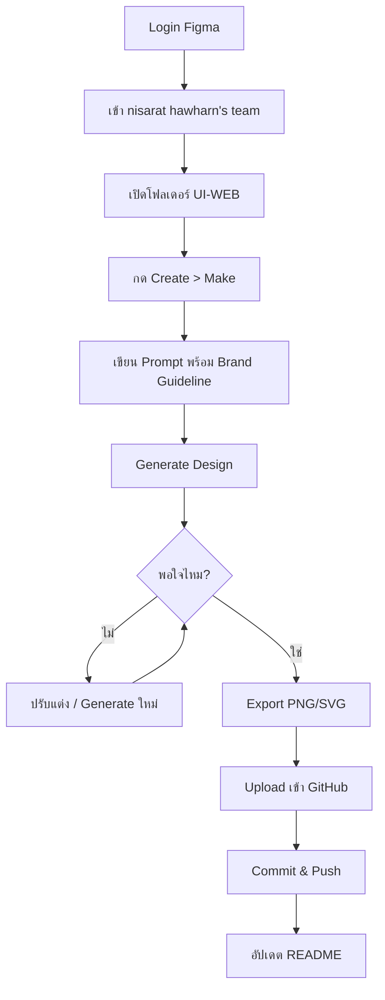

# 2.6 การสร้าง UI ด้วย Figma Make 

## ภาพรวม

เอกสารนี้อธิบายขั้นตอนการใช้ Figma Make (AI) ในการสร้าง UI Design ตั้งแต่การเข้าสู่ระบบ การใช้งาน Make การกำหนด Guideline สีและ Font จนถึงการ Export เข้า GitHub Organization

---

## ขั้นตอนที่ 1: เข้าสู่ระบบ Figma

### 1.1 Login เข้า Figma

1. เปิดเว็บไซต์ [figma.com](https://www.figma.com)
2. คลิก **Log in** (มุมขวาบน)
3. เข้าสู่ระบบด้วย:
   - Email และ Password
   - หรือ Login ด้วย Google Account

### 1.2 เข้าสู่ Team Project

1. หลัง Login สำเร็จ จะเข้าสู่หน้า **Home**
2. ที่ sidebar ด้านซ้าย เลือก **nisarat hawharn's team**
3. คลิกเข้า **ALL Project**
4. เลือกโฟลเดอร์ **UI-WEB**

```
Figma Home
└── nisarat hawharn's team
    └── ALL Project
        └── UI-WEB  ← เลือกโฟลเดอร์นี้
```

---

## ขั้นตอนที่ 2: สร้าง UI ด้วย Figma Make

### 2.1 เปิด Figma Make

1. อยู่ในโฟลเดอร์ **UI-WEB**
2. คลิกปุ่ม **Create** (สีน้ำเงิน)
3. เลือก **Make** จากเมนู

> **Make** คือ AI ของ Figma ที่ช่วยสร้าง UI Design จาก prompt ที่เราป้อน

### 2.2 หน้าต่าง Make Interface

เมื่อเปิด Make จะเห็น:
- **Prompt Input**: ช่องสำหรับพิมพ์คำสั่ง
- **Generate Button**: ปุ่มสร้าง design
- **Preview Area**: แสดง preview ของ design ที่สร้าง

---

## ขั้นตอนที่ 3: การเขียน Prompt ที่มีประสิทธิภาพ

### 3.1 โครงสร้าง Prompt พื้นฐาน

```
สร้าง [ประเภทหน้า] ที่ประกอบด้วย:
- [Element 1]
- [Element 2]
- [Element 3]
สไตล์: [รูปแบบที่ต้องการ]
ขนาด: [ความกว้าง x ความสูง]
```

### 3.2 ตัวอย่าง Prompt พื้นฐาน

**หน้า Login:**
```
Create a login page with:
- Company logo at top center
- Email input field with icon
- Password input field with show/hide toggle
- Remember me checkbox
- Login button (primary color)
- Forgot password link
- Sign up link at bottom
Desktop size: 1440x900
```

**หน้า Dashboard:**
```
Create a dashboard page with:
- Top navigation bar with logo, search, notifications, user avatar
- Left sidebar with menu items (Dashboard, Users, Reports, Settings)
- Main content area with 4 stat cards in a row
- Data table below with pagination
- Clean modern style
Desktop: 1440x900
```

**หน้า Form:**
```
Create a user registration form with:
- Page title "Create New User"
- Form fields: First name, Last name, Email, Phone, Department dropdown, Role dropdown
- Upload profile picture section
- Cancel and Submit buttons
- Card layout with shadow
Desktop: 1440x900
```

---

## ขั้นตอนที่ 4: การกำหนด Brand Guideline ใน Prompt

### 4.1 การกำหนดสีของบริษัท (Color Guideline)

**ตัวอย่าง Prompt พร้อม Color Guideline:**

```
Create a dashboard page using these brand colors:

=== PRIMARY COLORS ===
- Primary: #2563EB (blue-600) - main buttons, links
- Primary Hover: #1D4ED8 (blue-700) - hover states
- Primary Active: #1E40AF (blue-800) - active states

=== STATUS COLORS ===
- Success: #10B981 (emerald-500)
- Warning: #F59E0B (amber-500)
- Error: #EF4444 (red-500)
- Info: #3B82F6 (blue-500)

=== NEUTRAL COLORS ===
- Background: #F8FAFC (gray-50)
- Card Background: #FFFFFF (white)
- Text Primary: #111827 (gray-900)
- Text Secondary: #6B7280 (gray-500)
- Text Muted: #9CA3AF (gray-400)
- Border: #E5E7EB (gray-200)

Apply these colors to:
- Navigation bar: White with subtle shadow
- Primary buttons: Primary color with white text
- Cards: White background with border or shadow
- Status badges: Use corresponding status colors
```

### 4.2 การกำหนด Font (Typography Guideline)

**ตัวอย่าง Prompt พร้อม Typography:**

```
Create a settings page using this typography:

Font Family: IBM Plex Sans (English) / IBM Plex Sans Thai (ภาษาไทย)

Typography Scale:
- H1: 32px, Bold (700), line-height 40px - Page titles
- H2: 24px, SemiBold (600), line-height 32px - Section headers
- H3: 20px, SemiBold (600), line-height 28px - Card titles
- H4: 16px, SemiBold (600), line-height 24px - Sub-sections
- Body: 14px, Regular (400), line-height 20px - Content text
- Small: 12px, Regular (400), line-height 16px - Labels, captions
- Caption: 11px, Medium (500), line-height 14px - Helper text

Text Colors:
- Primary text: text-gray-900 (#111827)
- Secondary text: text-gray-500 (#6B7280)
- Muted text: text-gray-400 (#9CA3AF)

Apply:
- Page title: H1, text-gray-900
- Section headers: H2
- Card titles: H3
- Form labels: Small, SemiBold
- Input text: Body
- Helper text: Caption, text-gray-500
```

### 4.3 Prompt รวม Brand Guideline ทั้งหมด

**ตัวอย่าง Complete Brand Prompt:**

```
Create a [page name] page following our brand guidelines:

=== COLORS ===
Primary: #2563EB (blue-600)
Primary Hover: #1D4ED8 (blue-700)
Success: #10B981
Warning: #F59E0B
Error: #EF4444
Background: #F8FAFC (gray-50)
Card: #FFFFFF
Text Primary: #111827 (gray-900)
Text Secondary: #6B7280 (gray-500)
Border: #E5E7EB (gray-200)

=== TYPOGRAPHY ===
Font: IBM Plex Sans / IBM Plex Sans Thai
- Page Title: 24px Bold
- Section Title: 18px SemiBold
- Card Title: 16px SemiBold
- Body Text: 14px Regular
- Labels: 12px Medium
- Button Text: 14px SemiBold

=== SPACING ===
Card Padding:
- Small cards/filters: 16px
- Main cards: 24px

Section Gap:
- Between sections: 24px
- Grid items: 16px
- Small elements: 12px

Element Gap:
- Icon with text: 8px
- Elements in card: 12px
- Buttons, forms: 16px

Border Radius:
- Cards, buttons: 8px
- Large cards: 12px
- Modals: 16px

=== LAYOUT ===
Top Navigation:
- Height: 64px
- Background: white with shadow or blur
- Sticky positioning

Content Padding (Responsive):
- Desktop: 32px
- Tablet: 24px
- Mobile: 16px
- Max width: 1280px

=== RESPONSIVE ===
Desktop (1440px+): Full layout, 32px padding
Tablet (768px-1024px): Adjusted layout, 24px padding
Mobile (<768px): Single column, hamburger menu, 16px padding

Size: 1440x900, Desktop view
```

---

## ขั้นตอนที่ 5: การปรับแต่ง Design หลัง Generate

### 5.1 ตรวจสอบและแก้ไข

หลังจาก Make สร้าง design แล้ว:

1. **ตรวจสอบ Layout**
   - Spacing ถูกต้องไหม
   - Alignment เรียบร้อยไหม

2. **ตรวจสอบสี**
   - สีตรงกับ Brand Guideline ไหม
   - ปรับแก้ใน Design panel ถ้าไม่ตรง

3. **ตรวจสอบ Typography**
   - Font ถูกต้องไหม
   - ขนาดตัวอักษรตรงไหม

4. **เพิ่ม/ลบ Elements**
   - เพิ่ม elements ที่ขาด
   - ลบ elements ที่ไม่ต้องการ

### 5.2 สร้าง Components

แปลง elements ที่ใช้ซ้ำเป็น Components:

1. เลือก element (เช่น Button)
2. คลิกขวา > **Create component** (หรือ `Ctrl/Cmd + Alt + K`)
3. ตั้งชื่อให้ชัดเจน เช่น `Button/Primary`, `Input/Default`

---

## ขั้นตอนที่ 6: การ Export Design

### 6.1 Export เป็นรูปภาพ

**Export Single Frame:**

1. เลือก Frame ที่ต้องการ export
2. ที่ panel ขวา ไปที่ **Export** section
3. คลิก **+** เพื่อเพิ่ม export setting
4. ตั้งค่า:
   - Format: **PNG** (สำหรับ UI screenshots)
   - Scale: **2x** (สำหรับ Retina/คมชัด)
5. คลิก **Export [ชื่อ Frame]**

**Export หลาย Frames:**

1. เลือกหลาย Frames (Shift + Click)
2. กด `Ctrl/Cmd + Shift + E`
3. เลือก frames ที่ต้องการ
4. คลิก **Export**

### 6.2 Export Settings ที่แนะนำ

| ประเภท | Format | Scale | ใช้งาน |
|--------|--------|-------|--------|
| UI Screenshots | PNG | 2x | Documentation, README |
| Icons | SVG | 1x | Web development |
| Logos | SVG | 1x | เว็บไซต์, แอป |
| Images | PNG | 2x | Content images |

### 6.3 จัดเก็บไฟล์ Export

สร้างโครงสร้างโฟลเดอร์:

```
/exports
  /screens
    login.png
    dashboard.png
    user-management.png
  /icons
    icon-home.svg
    icon-user.svg
    icon-settings.svg
  /assets
    logo.svg
    logo-white.svg
```

---

## ขั้นตอนที่ 7: Export เข้า GitHub Organization

### 7.1 เตรียม Repository

1. เข้า GitHub Organization ของบริษัท
2. เปิด Repository ที่ต้องการเก็บ design assets
3. สร้างโฟลเดอร์สำหรับเก็บ (ถ้ายังไม่มี):
   ```
   /docs/design
   /assets/images
   ```

### 7.2 วิธี Upload ผ่าน GitHub Web

**วิธีที่ 1: Upload ผ่าน Web Interface**

1. เข้า Repository บน GitHub
2. Navigate ไปยังโฟลเดอร์ที่ต้องการ (เช่น `/docs/design`)
3. คลิก **Add file** > **Upload files**
4. ลากไฟล์ที่ export มาวาง หรือ คลิก **choose your files**
5. เขียน Commit message:
   ```
   Add UI design exports from Figma

   - Login page design
   - Dashboard design
   - User management page design
   ```
6. เลือก **Commit directly to main branch** หรือสร้าง branch ใหม่
7. คลิก **Commit changes**

### 7.3 วิธี Upload ผ่าน Git CLI

**Step 1: Clone หรือ Pull repository**

```bash
# Clone (ถ้ายังไม่มี)
git clone https://github.com/[organization]/[repository].git

# หรือ Pull (ถ้ามีแล้ว)
cd [repository]
git pull origin main
```

**Step 2: เพิ่มไฟล์ที่ export**

```bash
# สร้างโฟลเดอร์ (ถ้ายังไม่มี)
mkdir -p docs/design/screens
mkdir -p docs/design/assets

# Copy ไฟล์ที่ export มาใส่
# (ใช้ File Explorer หรือ cp command)
```

**Step 3: Commit และ Push**

```bash
# ตรวจสอบไฟล์ที่เพิ่ม
git status

# เพิ่มไฟล์
git add docs/design/

# Commit
git commit -m "Add UI design exports from Figma

- Login page (login.png)
- Dashboard (dashboard.png)
- User management (user-management.png)
- Icon assets (SVG)"

# Push
git push origin main
```

### 7.4 วิธี Upload ผ่าน VS Code

1. เปิด Repository ใน VS Code
2. Copy ไฟล์ที่ export ไปยังโฟลเดอร์ที่ต้องการ
3. ไปที่ **Source Control** tab (Ctrl/Cmd + Shift + G)
4. จะเห็นไฟล์ใหม่ใน **Changes**
5. คลิก **+** เพื่อ Stage changes
6. พิมพ์ Commit message
7. คลิก **Commit**
8. คลิก **Sync Changes** เพื่อ Push

### 7.5 โครงสร้างแนะนำบน GitHub

```
repository/
├── docs/
│   └── design/
│       ├── screens/
│       │   ├── 01-login.png
│       │   ├── 02-dashboard.png
│       │   ├── 03-user-management.png
│       │   └── 04-settings.png
│       ├── components/
│       │   ├── buttons.png
│       │   ├── forms.png
│       │   └── cards.png
│       └── README.md  ← อธิบาย design และ Figma link
├── assets/
│   ├── icons/
│   │   └── *.svg
│   └── images/
│       └── *.png
└── README.md
```

### 7.6 สร้าง Design README

สร้างไฟล์ `docs/design/README.md`:

```markdown
# UI Design Documentation

## Figma Link
[View Design in Figma](https://www.figma.com/file/xxxxx/UI-WEB)

## Screens

| หน้า | Preview | สถานะ |
|------|---------|-------|
| Login |  | ✅ Complete |
| Dashboard |  | ✅ Complete |
| [Page Name] |  | 🔄 In Progress |

## Brand Guidelines

### Colors
| ประเภท | Hex Code | ใช้งาน |
|--------|----------|--------|
| Primary | `#2563EB` | Buttons, Links |
| Primary Hover | `#1D4ED8` | Hover states |
| Success | `#10B981` | Success messages |
| Warning | `#F59E0B` | Warning messages |
| Error | `#EF4444` | Error messages |
| Text Primary | `#111827` | Main text |
| Text Secondary | `#6B7280` | Secondary text |
| Border | `#E5E7EB` | Borders, dividers |

### Typography
- Font: IBM Plex Sans / IBM Plex Sans Thai
- Headings: Bold (700)
- Body: Regular (400)

### Spacing & Layout
- Card Padding: 16px / 24px
- Section Gap: 24px
- Border Radius: 8px / 12px / 16px
- Top Nav Height: 64px
- Content Max Width: 1280px

## Last Updated
- Date: [วันที่อัปเดต]
- Designer: [ชื่อ]
```

---

## Appendix: Standard Design Guideline Reference

### 📐 SPACING

| ประเภท | ขนาด | Tailwind Class | ใช้งาน |
|--------|------|----------------|--------|
| **Card Padding** | | | |
| Small | 16px | p-4 | Filter sections, small cards |
| Medium | 24px | p-6 | Main cards, content sections |
| Large | 32px | p-8 | Hero sections |
| **Section Gap** | | | |
| Small | 12px | gap-3 | Small elements |
| Medium | 16px | gap-4 | Grid items, form fields |
| Large | 24px | space-y-6 | ระหว่าง sections หลัก |
| **Element Gap** | | | |
| XS | 8px | gap-2 | Icon กับ text |
| SM | 12px | gap-3 | Elements ใน card |
| MD | 16px | gap-4 | Buttons, form elements |
| **Border Radius** | | | |
| Small | 8px | rounded-lg | Cards, buttons |
| Medium | 12px | rounded-xl | Large cards |
| Large | 16px | rounded-2xl | Modals, dialogs |

### 📏 LAYOUT

| Element | Specs |
|---------|-------|
| **Top Navigation** | Height: 64px, white background, sticky |
| **Content (Desktop)** | Padding: 32px, Max width: 1280px |
| **Content (Tablet)** | Padding: 24px |
| **Content (Mobile)** | Padding: 16px |

### 🎨 COLORS

**Primary Colors**
| Color | Hex | Tailwind | ใช้งาน |
|-------|-----|----------|--------|
| Primary | #2563EB | blue-600 | Buttons, links |
| Hover | #1D4ED8 | blue-700 | Hover states |
| Active | #1E40AF | blue-800 | Active states |

**Status Colors**
| Status | Hex | Tailwind |
|--------|-----|----------|
| Success | #10B981 | emerald-500 |
| Warning | #F59E0B | amber-500 |
| Error | #EF4444 | red-500 |
| Info | #3B82F6 | blue-500 |

**Neutral Colors**
| Color | Hex | Tailwind |
|-------|-----|----------|
| Background | #F8FAFC | gray-50 |
| Card | #FFFFFF | white |
| Text Primary | #111827 | gray-900 |
| Text Secondary | #6B7280 | gray-500 |
| Text Muted | #9CA3AF | gray-400 |
| Border | #E5E7EB | gray-200 |

### 📱 RESPONSIVE BREAKPOINTS

| Breakpoint | Width | Padding | หมายเหตุ |
|------------|-------|---------|----------|
| Desktop | 1440px+ | 32px | Full layout |
| Tablet | 768px - 1024px | 24px | Adjusted layout |
| Mobile | < 768px | 16px | Single column, hamburger menu |

---

## สรุป Workflow ทั้งหมด



---

## Checklist

### ก่อนเริ่มงาน:
- [ ] Login เข้า Figma account
- [ ] เข้าถึง nisarat hawharn's team
- [ ] อยู่ในโฟลเดอร์ UI-WEB

### การสร้าง Design:
- [ ] เตรียม Prompt พร้อม Brand Guideline
- [ ] ใส่ Color codes ที่ถูกต้อง
- [ ] ระบุ Font และ Typography
- [ ] Generate และตรวจสอบผลลัพธ์
- [ ] ปรับแต่ง Design ตามต้องการ

### การ Export:
- [ ] Export screens เป็น PNG @2x
- [ ] Export icons เป็น SVG
- [ ] จัดเก็บไฟล์ในโฟลเดอร์ที่เหมาะสม

### Upload เข้า GitHub:
- [ ] Clone/Pull repository ล่าสุด
- [ ] Copy ไฟล์ไปยังโฟลเดอร์ที่กำหนด
- [ ] เขียน Commit message ที่ชัดเจน
- [ ] Push ขึ้น GitHub
- [ ] อัปเดต README (ถ้าจำเป็น)

---

## Figma Link

> **วาง Figma Link ของโปรเจกต์ที่นี่:**
>
> `https://www.figma.com/file/xxxxx/UI-WEB`
