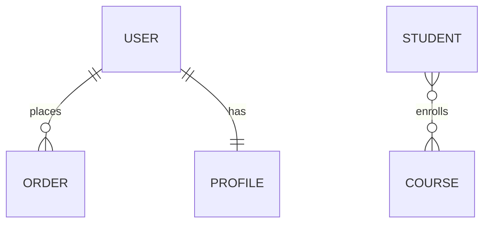
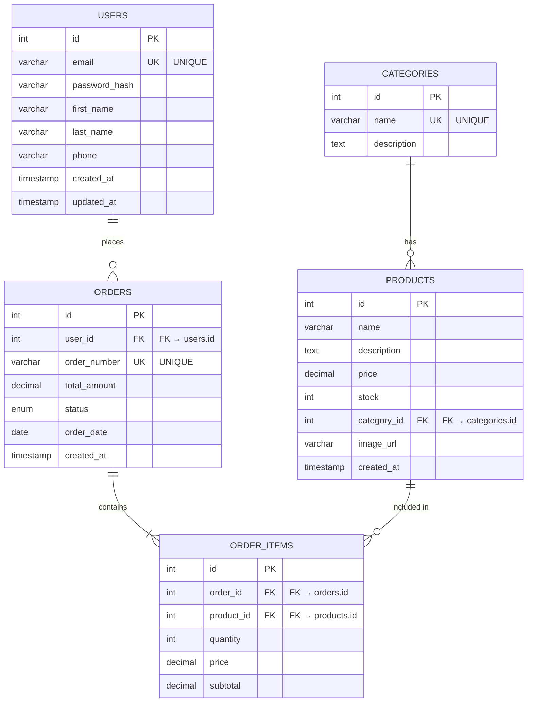
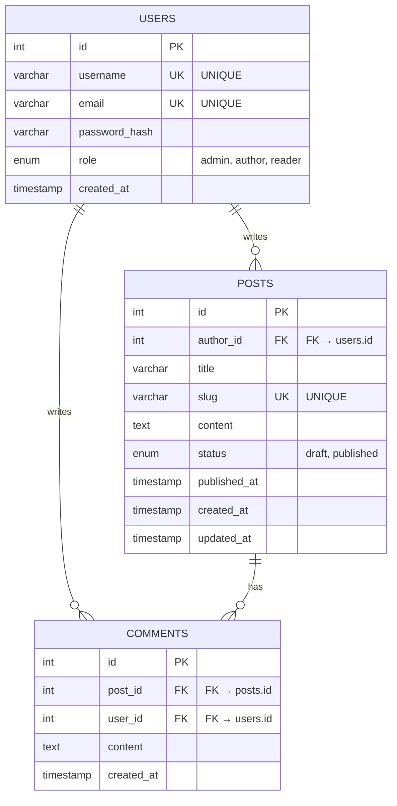
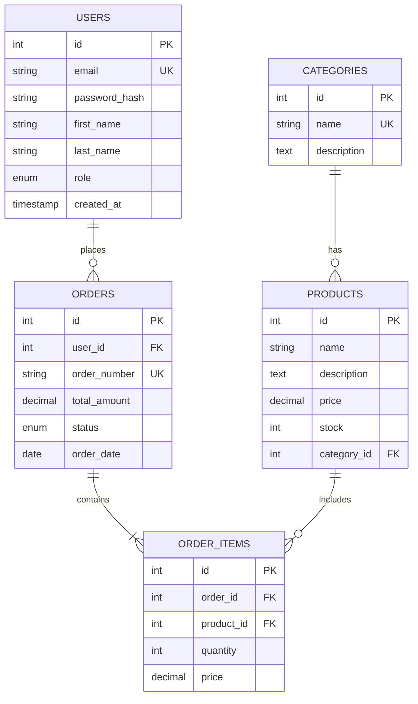
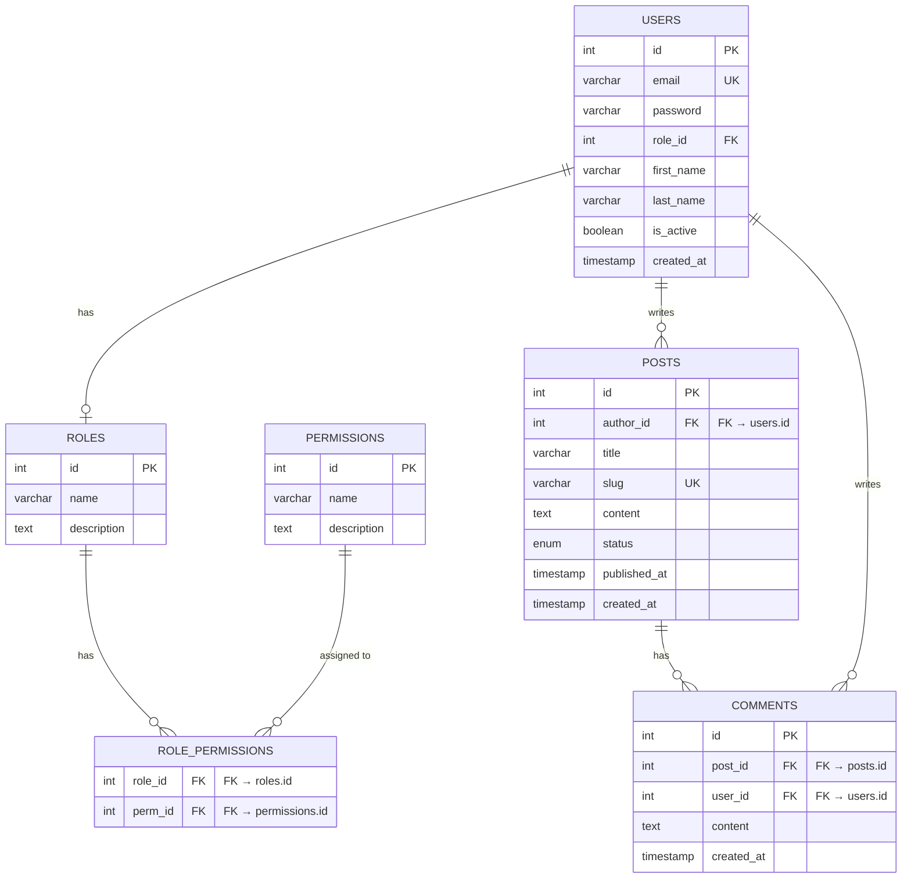

# 3.1 ERD Diagram (Entity-Relationship Diagram)

## วิธีการเขียน
ERD (Entity-Relationship Diagram) คือแผนภาพที่แสดงโครงสร้างฐานข้อมูล ความสัมพันธ์ระหว่างตาราง และ attributes ต่างๆ

---

## วัตถุประสงค์

ERD ช่วยให้:
1. **เห็นภาพรวมฐานข้อมูล** - เข้าใจโครงสร้างทั้งหมดได้อย่างรวดเร็ว
2. **ออกแบบก่อนสร้างจริง** - วางแผนก่อนเขียน SQL
3. **ระบุความสัมพันธ์** - เห็น relationship ระหว่างตาราง (1:1, 1:N, N:M)
4. **Normalize Database** - ออกแบบให้ไม่ redundant
5. **Communicate กับทีม** - ทุกคนเข้าใจโครงสร้างเดียวกัน
6. **Documentation** - เก็บเป็นเอกสารอ้างอิง

---

## องค์ประกอบของ ERD

### 1. **Entity (ตาราง)**
- แทนด้วยสี่เหลี่ยม
- ชื่อเป็น singular หรือ plural (users, products)
- ตัวอย่าง: User, Product, Order

### 2. **Attributes (คอลัมน์)**
- ฟิลด์ในตาราง
- ระบุ data type และ constraints
- ตัวอย่าง: id, email, created_at

### 3. **Primary Key (PK)**
- คีย์หลักของตาราง (unique identifier)
- แทนด้วย 🔑 หรือขีดเส้นใต้
- ตัวอย่าง: id, user_id

### 4. **Foreign Key (FK)**
- คีย์ที่อ้างอิงไปยังตารางอื่น
- แทนด้วย 🔗 หรือ FK
- ตัวอย่าง: user_id (FK → users.id)

### 5. **Relationships (ความสัมพันธ์)**
- **1:1** (One-to-One): User ↔ Profile
- **1:N** (One-to-Many): User → Orders (1 user มีหลาย orders)
- **N:M** (Many-to-Many): Students ↔ Courses (ใช้ตารางกลาง)

---

## Cardinality Notations (สัญลักษณ์ความสัมพันธ์)

### Crow's Foot Notation (นิยมใช้มากที่สุด):

| สัญลักษณ์ | ความหมาย |
|-----------|----------|
| `\|\|` | One (หนึ่ง) |
| `}o` หรือ `o{` | Zero or Many |
| `\|{` หรือ `}\|` | One or Many |
| `\|o` หรือ `o\|` | Zero or One |

### ตัวอย่าง (Mermaid ERD):



**อธิบาย:**
- `USER ||--o{ ORDER` : 1 User มีหลาย Orders (One-to-Many)
- `USER ||--|| PROFILE` : 1 User มี 1 Profile (One-to-One)
- `STUDENT }o--o{ COURSE` : Many-to-Many (ผ่าน enrollment)

---

## ตัวอย่าง ERD

### Example 1: E-Commerce Database



### Example 2: Blog/CMS Database



---

## Database Normalization (การทำให้ฐานข้อมูลเป็นมาตรฐาน)

### 1NF (First Normal Form):
- ✅ แต่ละ column มีค่าเดียว (atomic values)
- ✅ ไม่มี repeating groups
- ✅ มี Primary Key

### 2NF (Second Normal Form):
- ✅ ผ่าน 1NF แล้ว
- ✅ Non-key attributes ขึ้นกับ Primary Key ทั้งหมด (not partial dependency)

### 3NF (Third Normal Form):
- ✅ ผ่าน 2NF แล้ว
- ✅ ไม่มี transitive dependency (non-key ไม่ขึ้นกับ non-key อื่น)

**ตัวอย่าง Normalization:**

**❌ ไม่ได้ Normalize (มี redundancy):**
```
Orders:
id | customer_name | customer_email | product_name | product_price
1  | John Doe      | john@mail.com  | Laptop       | 30000
2  | John Doe      | john@mail.com  | Mouse        | 500
```
**ปัญหา**: ข้อมูล customer ซ้ำ

**✅ หลัง Normalize:**
```
Customers:
id | name      | email
1  | John Doe  | john@mail.com

Products:
id | name   | price
1  | Laptop | 30000
2  | Mouse  | 500

Orders:
id | customer_id | product_id | quantity
1  | 1           | 1          | 1
2  | 1           | 2          | 1
```

---

## Data Types (ชนิดข้อมูลที่ใช้บ่อย)

### Numeric:
- `INT` - จำนวนเต็ม (id, quantity, age)
- `BIGINT` - จำนวนเต็มใหญ่
- `DECIMAL(10,2)` - ทศนิยมแม่นยำ (ราคา, เงิน)
- `FLOAT/DOUBLE` - ทศนิยม (น้ำหนัก, ระยะทาง)

### String:
- `VARCHAR(255)` - ข้อความสั้น (ชื่อ, อีเมล)
- `TEXT` - ข้อความยาว (รายละเอียด, content)
- `CHAR(10)` - ความยาวคงที่ (เบอร์โทร, รหัสไปรษณีย์)

### Date/Time:
- `DATE` - วันที่ (2025-01-15)
- `DATETIME` - วันที่และเวลา (2025-01-15 14:30:00)
- `TIMESTAMP` - Unix timestamp (auto-update)
- `TIME` - เวลา (14:30:00)

### Boolean:
- `BOOLEAN` - true/false (is_active, is_deleted)

### Other:
- `ENUM('draft','published')` - ค่าที่กำหนดไว้
- `JSON` - ข้อมูล JSON (metadata, settings)
- `UUID` - Unique identifier (alternative to INT id)

---

## Common Constraints (ข้อจำกัดที่ใช้บ่อย)

```sql
PRIMARY KEY       -- คีย์หลัก (unique + not null)
FOREIGN KEY       -- คีย์อ้างอิง
UNIQUE            -- ต้องไม่ซ้ำ (email, username)
NOT NULL          -- ต้องมีค่า (required field)
DEFAULT           -- ค่าเริ่มต้น (created_at DEFAULT NOW())
CHECK             -- เงื่อนไข (age >= 18)
INDEX             -- เพิ่มความเร็วค้นหา
AUTO_INCREMENT    -- เพิ่มค่าอัตโนมัติ (id)
```

---

## วิธีการสร้าง ERD

### ขั้นตอนที่ 1: วิเคราะห์ Requirements
1. ดู User Stories จาก `1.2_User_Story_List.xlsx`
2. ดู Mock Data จาก frontend wireframes
3. ระบุ Entities ที่ต้องการ (users, products, orders, etc.)

### ขั้นตอนที่ 2: กำหนด Entities และ Attributes
```
Entity: User
- id (PK)
- email (UNIQUE)
- password_hash
- first_name
- last_name
- role
- created_at
- updated_at
```

### ขั้นตอนที่ 3: ระบุ Relationships
```
User 1:N Orders (1 user มีหลาย orders)
Order 1:N OrderItems (1 order มีหลาย items)
Product N:M Orders (ผ่าน OrderItems)
```

### ขั้นตอนที่ 4: Normalize Database
- แยกตารางให้ถูกต้อง (1NF, 2NF, 3NF)
- ลด redundancy

### ขั้นตอนที่ 5: สร้าง ERD Diagram

**Tools แนะนำ:**

| Tool | Best For | Price | Link |
|---|---|---|---|
| **dbdiagram.io** | Quick ERD, SQL export | Free | dbdiagram.io |
| **DrawSQL** | Beautiful diagrams | Free - $9/mo | drawsql.app |
| **Lucidchart** | Professional diagrams | $7.95/mo | lucidchart.com |
| **MySQL Workbench** | MySQL users | Free | mysql.com |
| **pgAdmin** | PostgreSQL users | Free | pgadmin.org |
| **DBeaver** | Universal DB tool | Free | dbeaver.io |
| **Mermaid** | Code-based diagrams | Free (markdown) | mermaid.js.org |

**✅ แนะนำ: dbdiagram.io** - ใช้งานง่าย, export SQL ได้, ฟรี

---

## ตัวอย่างการใช้ dbdiagram.io

### DBML Syntax (Database Markup Language):

```dbml
Table users {
  id int [pk, increment]
  email varchar(255) [unique, not null]
  password_hash varchar(255) [not null]
  first_name varchar(100)
  last_name varchar(100)
  role enum('admin', 'user') [default: 'user']
  created_at timestamp [default: `now()`]
  updated_at timestamp
}

Table orders {
  id int [pk, increment]
  user_id int [ref: > users.id]
  order_number varchar(50) [unique]
  total_amount decimal(10,2)
  status enum('pending', 'completed', 'cancelled')
  order_date date
  created_at timestamp [default: `now()`]
}

Table order_items {
  id int [pk, increment]
  order_id int [ref: > orders.id]
  product_id int [ref: > products.id]
  quantity int [not null]
  price decimal(10,2)
  subtotal decimal(10,2)
}

Table products {
  id int [pk, increment]
  name varchar(255) [not null]
  description text
  price decimal(10,2) [not null]
  stock int [default: 0]
  category_id int [ref: > categories.id]
  created_at timestamp [default: `now()`]
}

Table categories {
  id int [pk, increment]
  name varchar(100) [unique]
  description text
}
```

**Steps:**
1. ไปที่ [dbdiagram.io](https://dbdiagram.io)
2. Copy code ข้างบนไปวาง
3. กด "Auto arrange" (จัดตำแหน่งอัตโนมัติ)
4. Export เป็น PNG/PDF/SQL

---

## ตัวอย่างการใช้ Mermaid (Markdown)



---

## ERD Checklist

### Design Checklist:
- [ ] ครบทุก Entity ที่ต้องการ
- [ ] แต่ละ table มี Primary Key
- [ ] Foreign Keys ถูกต้อง
- [ ] Relationships ชัดเจน (1:1, 1:N, N:M)
- [ ] Naming convention สม่ำเสมอ (snake_case, singular/plural)
- [ ] Data types เหมาะสม
- [ ] Constraints ครบ (UNIQUE, NOT NULL, DEFAULT)
- [ ] Normalize ถูกต้อง (3NF)

### Common Columns Checklist:
- [ ] `id` - Primary Key (INT, AUTO_INCREMENT)
- [ ] `created_at` - Timestamp (TIMESTAMP DEFAULT NOW())
- [ ] `updated_at` - Timestamp (TIMESTAMP ON UPDATE NOW())
- [ ] `deleted_at` - Soft delete (TIMESTAMP NULL)
- [ ] `created_by` - Audit (INT FK → users.id)
- [ ] `updated_by` - Audit (INT FK → users.id)

### Security Checklist:
- [ ] Password เก็บเป็น hash (never plain text)
- [ ] Sensitive data encrypt (credit card, SSN)
- [ ] Add indexes สำหรับ FK และ search columns
- [ ] ไม่เก็บข้อมูลซ้ำ (normalized)

---

## Best Practices

### ✓ DO:
1. **Use Consistent Naming**:
   - Tables: `users`, `orders` (plural, snake_case)
   - Columns: `user_id`, `created_at` (snake_case)
   - Foreign Keys: `[table]_id` (เช่น `user_id`, `product_id`)

2. **Always Use Primary Key**:
   ```sql
   id INT PRIMARY KEY AUTO_INCREMENT
   ```

3. **Add Timestamps**:
   ```sql
   created_at TIMESTAMP DEFAULT CURRENT_TIMESTAMP
   updated_at TIMESTAMP ON UPDATE CURRENT_TIMESTAMP
   ```

4. **Use Appropriate Data Types**:
   - Money: `DECIMAL(10,2)` (not FLOAT)
   - Dates: `DATE` or `DATETIME` (not VARCHAR)
   - Boolean: `BOOLEAN` (not TINYINT)

5. **Index Foreign Keys**:
   ```sql
   INDEX idx_user_id (user_id)
   ```

6. **Use ENUM for Fixed Values**:
   ```sql
   status ENUM('pending', 'completed', 'cancelled')
   ```

### ✗ DON'T:
1. **Don't Store Passwords as Plain Text** - ใช้ bcrypt/argon2
2. **Don't Use Reserved Keywords** - เช่น `order`, `user` (ใช้ `orders`, `users`)
3. **Don't Forget Indexes** - FK และ search columns ควรมี index
4. **Don't Over-normalize** - บางครั้ง denormalization ช่วยให้ query เร็วขึ้น
5. **Don't Use VARCHAR for Numbers** - ใช้ INT/DECIMAL แทน

---

## Naming Conventions

### Tables:
```
✓ users          (plural, lowercase)
✓ order_items    (plural, snake_case)
✗ User           (singular, PascalCase)
✗ OrderItems     (PascalCase)
```

### Columns:
```
✓ first_name     (snake_case)
✓ created_at     (snake_case)
✗ firstName      (camelCase)
✗ CreatedAt      (PascalCase)
```

### Foreign Keys:
```
✓ user_id        ([table_singular]_id)
✓ product_id
✗ userId         (camelCase)
✗ user           (missing _id)
```

### Indexes:
```
✓ idx_email      (idx_[column])
✓ idx_user_email (idx_[table]_[column])
✓ uk_email       (uk = unique key)
```

---

## Deliverable

เมื่อเสร็จแล้วต้องมี:

### 1. **ERD Diagram Image**:
```
/documentation/03_DATABASE/
├── 3.1_ERD_Diagram.md
├── images/
│   ├── erd_full.png       (ภาพรวมทั้งหมด)
│   ├── erd_users.png      (ส่วน users)
│   ├── erd_orders.png     (ส่วน orders)
│   └── erd_products.png   (ส่วน products)
```

### 2. **DBML Code** (สำหรับ dbdiagram.io):
```
/documentation/03_DATABASE/
└── dbml/
    └── schema.dbml
```

### 3. **Mermaid Code** (สำหรับ Markdown):
```markdown
ใส่ใน 3.1_ERD_Diagram.md
```

### 4. **Links**:
- dbdiagram.io link (ถ้าใช้)
- Lucidchart link (ถ้าใช้)

---

## Example: Complete ERD for Web App



---

## Tips สำหรับการออกแบบฐานข้อมูลที่ดี

### 1. **Plan First** - วางแผนก่อนเขียน SQL
### 2. **Normalize** - ลด redundancy ตาม 3NF
### 3. **Index Wisely** - ใส่ index ที่ FK และ search columns
### 4. **Think About Scale** - ถ้าข้อมูลเยอะ ต้องคิดถึง performance
### 5. **Document Everything** - เขียนเอกสารและ comment

**ERD ที่ดีทำให้ database มั่นคง ปลอดภัย และขยายได้ง่าย 🗃️**
