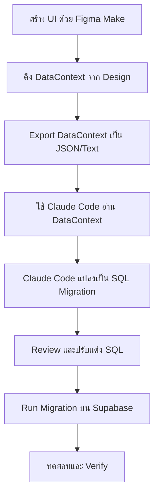

# 3.3 Database Migration from Figma DataContext

## ภาพรวม

เอกสารนี้อธิบายขั้นตอนการทำ Database Migration โดยใช้ **DataContext** ที่ Figma Make สร้างขึ้นมาพร้อมกับ UI Design จากนั้นใช้ **Claude Code** อ่าน DataContext และแปลงเป็น SQL Migration สำหรับนำไปสร้างฐานข้อมูลบน **Supabase**

---

## DataContext คืออะไร?

เมื่อใช้ Figma Make สร้าง UI Design ระบบจะสร้าง **DataContext** ขึ้นมาโดยอัตโนมัติ ซึ่งเป็นโครงสร้างข้อมูลที่ UI ใช้ในการแสดงผล เช่น:

- ชื่อ Fields ในฟอร์ม
- ข้อมูลในตาราง (columns, rows)
- ข้อมูลใน Cards
- ค่าใน Dropdown/Select
- ข้อมูลใน Lists

**ประโยชน์ของ DataContext:**
1. เห็นโครงสร้างข้อมูลที่ UI ต้องการใช้งาน
2. สามารถนำมาออกแบบ Database Schema ได้ตรงกับ UI
3. ลดข้อผิดพลาดในการ mapping ระหว่าง Frontend และ Database

---

## Workflow ภาพรวม



---

## ขั้นตอนที่ 1: การดึง DataContext จาก Figma Make

### 1.1 เปิด Design ที่สร้างจาก Figma Make

1. เปิด Figma Project ที่มี UI ที่สร้างจาก Make
2. เลือก Frame ที่ต้องการดึง DataContext
3. ดู Layer panel ด้านซ้าย จะเห็นโครงสร้าง components

### 1.2 วิธีดู DataContext

**วิธีที่ 1: ดูจาก Layer Names และ Text Content**

```
Frame: User Management Page
├── Header
│   └── Title: "User Management"
├── Filter Section
│   ├── Search Input (placeholder: "Search users...")
│   ├── Role Dropdown (options: Admin, User, Guest)
│   └── Status Dropdown (options: Active, Inactive, Pending)
├── Data Table
│   ├── Column: ID
│   ├── Column: Name
│   ├── Column: Email
│   ├── Column: Role
│   ├── Column: Status
│   ├── Column: Created At
│   └── Column: Actions
└── Pagination
```

**วิธีที่ 2: ใช้ Figma Dev Mode**

1. เปิด **Dev Mode** (มุมขวาบน)
2. เลือก Component ที่ต้องการ
3. ดู Properties และ Data ที่ถูกกำหนดไว้

**วิธีที่ 3: Export Component Properties**

1. เลือก Component
2. คลิกขวา > **Copy as CSS** หรือ **Copy as Code**
3. จะได้ข้อมูล properties ที่กำหนดไว้

### 1.3 ตัวอย่าง DataContext ที่ได้จาก UI

**จากหน้า User Management:**

```json
{
  "page": "User Management",
  "components": {
    "filters": {
      "search": {
        "type": "text",
        "placeholder": "Search users..."
      },
      "role": {
        "type": "select",
        "options": ["Admin", "User", "Guest"]
      },
      "status": {
        "type": "select",
        "options": ["Active", "Inactive", "Pending"]
      }
    },
    "table": {
      "columns": [
        { "key": "id", "label": "ID", "type": "number" },
        { "key": "avatar", "label": "Avatar", "type": "image" },
        { "key": "name", "label": "Name", "type": "text" },
        { "key": "email", "label": "Email", "type": "email" },
        { "key": "role", "label": "Role", "type": "enum", "values": ["Admin", "User", "Guest"] },
        { "key": "status", "label": "Status", "type": "enum", "values": ["Active", "Inactive", "Pending"] },
        { "key": "created_at", "label": "Created At", "type": "datetime" },
        { "key": "actions", "label": "Actions", "type": "actions" }
      ]
    },
    "form": {
      "fields": [
        { "name": "first_name", "label": "First Name", "type": "text", "required": true },
        { "name": "last_name", "label": "Last Name", "type": "text", "required": true },
        { "name": "email", "label": "Email", "type": "email", "required": true },
        { "name": "phone", "label": "Phone", "type": "tel", "required": false },
        { "name": "role", "label": "Role", "type": "select", "options": ["Admin", "User", "Guest"], "required": true },
        { "name": "department", "label": "Department", "type": "select", "required": false },
        { "name": "avatar", "label": "Profile Picture", "type": "file", "accept": "image/*" }
      ]
    }
  }
}
```

---

## ขั้นตอนที่ 2: เตรียม DataContext สำหรับ Claude Code

### 2.1 สร้างไฟล์ DataContext

สร้างไฟล์ `datacontext.json` หรือ `datacontext.md` ในโปรเจกต์:

**ตัวอย่าง datacontext.json:**

```json
{
  "project": "E-Commerce Admin Panel",
  "pages": [
    {
      "name": "User Management",
      "description": "จัดการผู้ใช้งานระบบ",
      "data": {
        "entity": "users",
        "fields": [
          { "name": "id", "type": "serial", "primary": true },
          { "name": "email", "type": "varchar(255)", "unique": true, "required": true },
          { "name": "first_name", "type": "varchar(100)", "required": true },
          { "name": "last_name", "type": "varchar(100)", "required": true },
          { "name": "phone", "type": "varchar(20)" },
          { "name": "avatar_url", "type": "text" },
          { "name": "role", "type": "enum", "values": ["admin", "user", "guest"], "default": "user" },
          { "name": "status", "type": "enum", "values": ["active", "inactive", "pending"], "default": "pending" },
          { "name": "created_at", "type": "timestamp", "default": "now()" },
          { "name": "updated_at", "type": "timestamp", "default": "now()" }
        ]
      }
    },
    {
      "name": "Product Management",
      "description": "จัดการสินค้า",
      "data": {
        "entity": "products",
        "fields": [
          { "name": "id", "type": "serial", "primary": true },
          { "name": "name", "type": "varchar(255)", "required": true },
          { "name": "slug", "type": "varchar(255)", "unique": true, "required": true },
          { "name": "description", "type": "text" },
          { "name": "price", "type": "decimal(10,2)", "required": true, "check": ">= 0" },
          { "name": "stock_quantity", "type": "integer", "default": 0, "check": ">= 0" },
          { "name": "category_id", "type": "integer", "foreignKey": "categories.id" },
          { "name": "image_url", "type": "text" },
          { "name": "is_active", "type": "boolean", "default": true },
          { "name": "created_at", "type": "timestamp", "default": "now()" },
          { "name": "updated_at", "type": "timestamp", "default": "now()" }
        ]
      }
    },
    {
      "name": "Category Management",
      "description": "จัดการหมวดหมู่สินค้า",
      "data": {
        "entity": "categories",
        "fields": [
          { "name": "id", "type": "serial", "primary": true },
          { "name": "name", "type": "varchar(100)", "required": true },
          { "name": "slug", "type": "varchar(100)", "unique": true, "required": true },
          { "name": "description", "type": "text" },
          { "name": "parent_id", "type": "integer", "foreignKey": "categories.id", "comment": "Self-referencing for subcategories" },
          { "name": "icon", "type": "varchar(50)" },
          { "name": "is_active", "type": "boolean", "default": true },
          { "name": "created_at", "type": "timestamp", "default": "now()" }
        ]
      }
    },
    {
      "name": "Order Management",
      "description": "จัดการออเดอร์",
      "data": {
        "entity": "orders",
        "fields": [
          { "name": "id", "type": "serial", "primary": true },
          { "name": "order_number", "type": "varchar(50)", "unique": true, "required": true },
          { "name": "user_id", "type": "integer", "foreignKey": "users.id", "required": true },
          { "name": "status", "type": "enum", "values": ["pending", "confirmed", "processing", "shipped", "delivered", "cancelled"], "default": "pending" },
          { "name": "payment_status", "type": "enum", "values": ["unpaid", "paid", "refunded"], "default": "unpaid" },
          { "name": "subtotal", "type": "decimal(10,2)", "required": true },
          { "name": "tax", "type": "decimal(10,2)", "default": 0 },
          { "name": "shipping_fee", "type": "decimal(10,2)", "default": 0 },
          { "name": "discount", "type": "decimal(10,2)", "default": 0 },
          { "name": "total", "type": "decimal(10,2)", "required": true },
          { "name": "shipping_address", "type": "text", "required": true },
          { "name": "notes", "type": "text" },
          { "name": "created_at", "type": "timestamp", "default": "now()" },
          { "name": "updated_at", "type": "timestamp", "default": "now()" }
        ]
      }
    }
  ],
  "relationships": [
    { "from": "products.category_id", "to": "categories.id", "type": "many-to-one" },
    { "from": "orders.user_id", "to": "users.id", "type": "many-to-one" },
    { "from": "categories.parent_id", "to": "categories.id", "type": "self-referencing" }
  ]
}
```

### 2.2 สร้างไฟล์ Markdown (ทางเลือก)

**ตัวอย่าง datacontext.md:**

```markdown
# DataContext จาก Figma UI Design

## 1. Users Table (จากหน้า User Management)

| Field | Type | Constraints | UI Component |
|-------|------|-------------|--------------|
| id | SERIAL | PRIMARY KEY | Hidden |
| email | VARCHAR(255) | UNIQUE, NOT NULL | Text Input |
| first_name | VARCHAR(100) | NOT NULL | Text Input |
| last_name | VARCHAR(100) | NOT NULL | Text Input |
| phone | VARCHAR(20) | - | Text Input |
| avatar_url | TEXT | - | File Upload |
| role | ENUM | ('admin', 'user', 'guest') DEFAULT 'user' | Dropdown |
| status | ENUM | ('active', 'inactive', 'pending') DEFAULT 'pending' | Status Badge |
| created_at | TIMESTAMP | DEFAULT NOW() | Date Display |
| updated_at | TIMESTAMP | DEFAULT NOW() | Date Display |

## 2. Products Table (จากหน้า Product Management)

| Field | Type | Constraints | UI Component |
|-------|------|-------------|--------------|
| id | SERIAL | PRIMARY KEY | Hidden |
| name | VARCHAR(255) | NOT NULL | Text Input |
| slug | VARCHAR(255) | UNIQUE, NOT NULL | Auto-generate |
| description | TEXT | - | Textarea |
| price | DECIMAL(10,2) | NOT NULL, >= 0 | Number Input |
| stock_quantity | INTEGER | DEFAULT 0, >= 0 | Number Input |
| category_id | INTEGER | FK → categories.id | Dropdown |
| image_url | TEXT | - | Image Upload |
| is_active | BOOLEAN | DEFAULT TRUE | Toggle |
| created_at | TIMESTAMP | DEFAULT NOW() | Date Display |
| updated_at | TIMESTAMP | DEFAULT NOW() | Date Display |

## Relationships
- products.category_id → categories.id (Many-to-One)
- orders.user_id → users.id (Many-to-One)
```

---

## ขั้นตอนที่ 3: ใช้ Claude Code แปลง DataContext เป็น SQL

### 3.1 เปิด Claude Code และอ่าน DataContext

เปิด Terminal หรือ IDE ที่มี Claude Code แล้วใช้คำสั่ง:

```
Claude, ช่วยอ่านไฟล์ datacontext.json และสร้าง SQL Migration สำหรับ Supabase (PostgreSQL)
```

### 3.2 ตัวอย่าง Prompt สำหรับ Claude Code

**Prompt แบบละเอียด:**

```
อ่านไฟล์ datacontext.json ที่เก็บโครงสร้างข้อมูลจาก Figma UI Design แล้วสร้าง:

1. SQL CREATE TABLE statements สำหรับทุก entities
2. สร้าง Indexes ที่เหมาะสม (FK columns, columns ที่ใช้ search/filter)
3. สร้าง Foreign Key constraints
4. สร้าง Trigger สำหรับ updated_at
5. เพิ่ม Row Level Security (RLS) policies สำหรับ Supabase
6. สร้าง Seed data ตัวอย่าง

Target: Supabase (PostgreSQL)
Output: แยกเป็นไฟล์ migration แต่ละ table
```

### 3.3 ตัวอย่าง Output จาก Claude Code

**ไฟล์: migrations/001_create_users_table.sql**

```sql
-- Migration: Create users table
-- Source: DataContext from Figma UI (User Management Page)
-- Created: 2025-01-28

-- Enable UUID extension (ถ้าต้องการใช้ UUID)
-- CREATE EXTENSION IF NOT EXISTS "uuid-ossp";

-- Create ENUM types
CREATE TYPE user_role AS ENUM ('admin', 'user', 'guest');
CREATE TYPE user_status AS ENUM ('active', 'inactive', 'pending');

-- Create users table
CREATE TABLE IF NOT EXISTS users (
    id SERIAL PRIMARY KEY,
    email VARCHAR(255) UNIQUE NOT NULL,
    first_name VARCHAR(100) NOT NULL,
    last_name VARCHAR(100) NOT NULL,
    phone VARCHAR(20),
    avatar_url TEXT,
    role user_role DEFAULT 'user',
    status user_status DEFAULT 'pending',
    created_at TIMESTAMP WITH TIME ZONE DEFAULT TIMEZONE('utc', NOW()),
    updated_at TIMESTAMP WITH TIME ZONE DEFAULT TIMEZONE('utc', NOW())
);

-- Create indexes
CREATE INDEX idx_users_email ON users(email);
CREATE INDEX idx_users_role ON users(role);
CREATE INDEX idx_users_status ON users(status);
CREATE INDEX idx_users_created_at ON users(created_at DESC);

-- Create updated_at trigger function
CREATE OR REPLACE FUNCTION update_updated_at_column()
RETURNS TRIGGER AS $$
BEGIN
    NEW.updated_at = TIMEZONE('utc', NOW());
    RETURN NEW;
END;
$$ LANGUAGE plpgsql;

-- Apply trigger to users table
CREATE TRIGGER update_users_updated_at
    BEFORE UPDATE ON users
    FOR EACH ROW
    EXECUTE FUNCTION update_updated_at_column();

-- Enable Row Level Security
ALTER TABLE users ENABLE ROW LEVEL SECURITY;

-- RLS Policies
-- Policy: Users can read all users (adjust based on requirements)
CREATE POLICY "Users can view all users" ON users
    FOR SELECT
    USING (true);

-- Policy: Users can update their own profile
CREATE POLICY "Users can update own profile" ON users
    FOR UPDATE
    USING (auth.uid()::text = id::text);

-- Policy: Only admins can insert new users
CREATE POLICY "Admins can insert users" ON users
    FOR INSERT
    WITH CHECK (
        EXISTS (
            SELECT 1 FROM users
            WHERE id::text = auth.uid()::text
            AND role = 'admin'
        )
    );

COMMENT ON TABLE users IS 'ตารางเก็บข้อมูลผู้ใช้งานระบบ - สร้างจาก DataContext หน้า User Management';
```

**ไฟล์: migrations/002_create_categories_table.sql**

```sql
-- Migration: Create categories table
-- Source: DataContext from Figma UI (Category Management Page)
-- Created: 2025-01-28

CREATE TABLE IF NOT EXISTS categories (
    id SERIAL PRIMARY KEY,
    name VARCHAR(100) NOT NULL,
    slug VARCHAR(100) UNIQUE NOT NULL,
    description TEXT,
    parent_id INTEGER REFERENCES categories(id) ON DELETE SET NULL,
    icon VARCHAR(50),
    is_active BOOLEAN DEFAULT TRUE,
    created_at TIMESTAMP WITH TIME ZONE DEFAULT TIMEZONE('utc', NOW())
);

-- Create indexes
CREATE INDEX idx_categories_slug ON categories(slug);
CREATE INDEX idx_categories_parent_id ON categories(parent_id);
CREATE INDEX idx_categories_is_active ON categories(is_active);

-- Enable RLS
ALTER TABLE categories ENABLE ROW LEVEL SECURITY;

-- RLS Policy: Everyone can read active categories
CREATE POLICY "Anyone can view active categories" ON categories
    FOR SELECT
    USING (is_active = TRUE);

COMMENT ON TABLE categories IS 'ตารางหมวดหมู่สินค้า - รองรับ subcategories ผ่าน parent_id';
```

**ไฟล์: migrations/003_create_products_table.sql**

```sql
-- Migration: Create products table
-- Source: DataContext from Figma UI (Product Management Page)
-- Created: 2025-01-28

CREATE TABLE IF NOT EXISTS products (
    id SERIAL PRIMARY KEY,
    name VARCHAR(255) NOT NULL,
    slug VARCHAR(255) UNIQUE NOT NULL,
    description TEXT,
    price DECIMAL(10, 2) NOT NULL CHECK (price >= 0),
    stock_quantity INTEGER DEFAULT 0 CHECK (stock_quantity >= 0),
    category_id INTEGER REFERENCES categories(id) ON DELETE SET NULL,
    image_url TEXT,
    is_active BOOLEAN DEFAULT TRUE,
    created_at TIMESTAMP WITH TIME ZONE DEFAULT TIMEZONE('utc', NOW()),
    updated_at TIMESTAMP WITH TIME ZONE DEFAULT TIMEZONE('utc', NOW())
);

-- Create indexes
CREATE INDEX idx_products_slug ON products(slug);
CREATE INDEX idx_products_category_id ON products(category_id);
CREATE INDEX idx_products_price ON products(price);
CREATE INDEX idx_products_is_active ON products(is_active);
CREATE INDEX idx_products_created_at ON products(created_at DESC);

-- Full-text search index on name
CREATE INDEX idx_products_name_search ON products
    USING gin(to_tsvector('english', name));

-- Apply updated_at trigger
CREATE TRIGGER update_products_updated_at
    BEFORE UPDATE ON products
    FOR EACH ROW
    EXECUTE FUNCTION update_updated_at_column();

-- Enable RLS
ALTER TABLE products ENABLE ROW LEVEL SECURITY;

-- RLS Policy: Everyone can view active products
CREATE POLICY "Anyone can view active products" ON products
    FOR SELECT
    USING (is_active = TRUE);

COMMENT ON TABLE products IS 'ตารางสินค้า - สร้างจาก DataContext หน้า Product Management';
```

**ไฟล์: migrations/004_create_orders_table.sql**

```sql
-- Migration: Create orders and order_items tables
-- Source: DataContext from Figma UI (Order Management Page)
-- Created: 2025-01-28

-- Create ENUM types for orders
CREATE TYPE order_status AS ENUM ('pending', 'confirmed', 'processing', 'shipped', 'delivered', 'cancelled');
CREATE TYPE payment_status AS ENUM ('unpaid', 'paid', 'refunded');

-- Create orders table
CREATE TABLE IF NOT EXISTS orders (
    id SERIAL PRIMARY KEY,
    order_number VARCHAR(50) UNIQUE NOT NULL,
    user_id INTEGER NOT NULL REFERENCES users(id) ON DELETE CASCADE,
    status order_status DEFAULT 'pending',
    payment_status payment_status DEFAULT 'unpaid',
    subtotal DECIMAL(10, 2) NOT NULL,
    tax DECIMAL(10, 2) DEFAULT 0,
    shipping_fee DECIMAL(10, 2) DEFAULT 0,
    discount DECIMAL(10, 2) DEFAULT 0,
    total DECIMAL(10, 2) NOT NULL,
    shipping_address TEXT NOT NULL,
    notes TEXT,
    created_at TIMESTAMP WITH TIME ZONE DEFAULT TIMEZONE('utc', NOW()),
    updated_at TIMESTAMP WITH TIME ZONE DEFAULT TIMEZONE('utc', NOW())
);

-- Create order_items table
CREATE TABLE IF NOT EXISTS order_items (
    id SERIAL PRIMARY KEY,
    order_id INTEGER NOT NULL REFERENCES orders(id) ON DELETE CASCADE,
    product_id INTEGER NOT NULL REFERENCES products(id) ON DELETE RESTRICT,
    quantity INTEGER NOT NULL CHECK (quantity > 0),
    price DECIMAL(10, 2) NOT NULL,
    subtotal DECIMAL(10, 2) NOT NULL,
    created_at TIMESTAMP WITH TIME ZONE DEFAULT TIMEZONE('utc', NOW())
);

-- Indexes for orders
CREATE INDEX idx_orders_order_number ON orders(order_number);
CREATE INDEX idx_orders_user_id ON orders(user_id);
CREATE INDEX idx_orders_status ON orders(status);
CREATE INDEX idx_orders_payment_status ON orders(payment_status);
CREATE INDEX idx_orders_created_at ON orders(created_at DESC);

-- Indexes for order_items
CREATE INDEX idx_order_items_order_id ON order_items(order_id);
CREATE INDEX idx_order_items_product_id ON order_items(product_id);

-- Apply updated_at trigger to orders
CREATE TRIGGER update_orders_updated_at
    BEFORE UPDATE ON orders
    FOR EACH ROW
    EXECUTE FUNCTION update_updated_at_column();

-- Enable RLS
ALTER TABLE orders ENABLE ROW LEVEL SECURITY;
ALTER TABLE order_items ENABLE ROW LEVEL SECURITY;

-- RLS Policies for orders
CREATE POLICY "Users can view own orders" ON orders
    FOR SELECT
    USING (user_id::text = auth.uid()::text);

CREATE POLICY "Users can insert own orders" ON orders
    FOR INSERT
    WITH CHECK (user_id::text = auth.uid()::text);

-- RLS Policies for order_items
CREATE POLICY "Users can view own order items" ON order_items
    FOR SELECT
    USING (
        EXISTS (
            SELECT 1 FROM orders
            WHERE orders.id = order_items.order_id
            AND orders.user_id::text = auth.uid()::text
        )
    );

-- Function to auto-generate order number
CREATE OR REPLACE FUNCTION generate_order_number()
RETURNS TRIGGER AS $$
BEGIN
    NEW.order_number = 'ORD-' || TO_CHAR(CURRENT_DATE, 'YYYYMMDD') || '-' || LPAD(NEW.id::TEXT, 6, '0');
    RETURN NEW;
END;
$$ LANGUAGE plpgsql;

CREATE TRIGGER set_order_number
    BEFORE INSERT ON orders
    FOR EACH ROW
    EXECUTE FUNCTION generate_order_number();

COMMENT ON TABLE orders IS 'ตารางออเดอร์ - สร้างจาก DataContext หน้า Order Management';
COMMENT ON TABLE order_items IS 'รายการสินค้าในแต่ละออเดอร์';
```

---

## ขั้นตอนที่ 4: Run Migration บน Supabase

### 4.1 วิธีที่ 1: ใช้ Supabase Dashboard (SQL Editor)

1. เข้า [Supabase Dashboard](https://supabase.com/dashboard)
2. เลือก Project ที่ต้องการ
3. ไปที่ **SQL Editor** (เมนูด้านซ้าย)
4. สร้าง **New Query**
5. Copy SQL Migration และ Paste ลงไป
6. กด **Run** (หรือ `Ctrl + Enter`)

**ลำดับการ Run Migration:**
```
1. 001_create_users_table.sql
2. 002_create_categories_table.sql
3. 003_create_products_table.sql
4. 004_create_orders_table.sql
```

> ⚠️ **สำคัญ**: Run ตามลำดับเพราะมี Foreign Key dependencies

### 4.2 วิธีที่ 2: ใช้ Supabase CLI

**ติดตั้ง Supabase CLI:**

```bash
# macOS
brew install supabase/tap/supabase

# Windows (Scoop)
scoop bucket add supabase https://github.com/supabase/scoop-bucket.git
scoop install supabase

# npm
npm install -g supabase
```

**เชื่อมต่อกับ Project:**

```bash
# Login
supabase login

# Link project
supabase link --project-ref <your-project-ref>
```

**สร้างและ Run Migration:**

```bash
# สร้าง migration file ใหม่
supabase migration new create_users_table

# Migration file จะถูกสร้างที่ supabase/migrations/

# Run migrations
supabase db push
```

### 4.3 วิธีที่ 3: ใช้ Database Client (TablePlus, DBeaver)

1. เปิด Database Client (เช่น TablePlus)
2. เชื่อมต่อกับ Supabase Database:
   - Host: `db.<project-ref>.supabase.co`
   - Port: `5432`
   - Database: `postgres`
   - User: `postgres`
   - Password: (จาก Project Settings > Database)
3. เปิด SQL Query
4. Run Migration Files ตามลำดับ

---

## ขั้นตอนที่ 5: Verify Migration

### 5.1 ตรวจสอบ Tables ที่สร้าง

**ใน SQL Editor:**

```sql
-- ดู tables ทั้งหมด
SELECT table_name
FROM information_schema.tables
WHERE table_schema = 'public';

-- ดู columns ของ table
SELECT column_name, data_type, is_nullable, column_default
FROM information_schema.columns
WHERE table_name = 'users';

-- ดู indexes
SELECT indexname, indexdef
FROM pg_indexes
WHERE tablename = 'users';

-- ดู foreign keys
SELECT
    tc.constraint_name,
    tc.table_name,
    kcu.column_name,
    ccu.table_name AS foreign_table_name,
    ccu.column_name AS foreign_column_name
FROM information_schema.table_constraints AS tc
JOIN information_schema.key_column_usage AS kcu
    ON tc.constraint_name = kcu.constraint_name
JOIN information_schema.constraint_column_usage AS ccu
    ON ccu.constraint_name = tc.constraint_name
WHERE tc.constraint_type = 'FOREIGN KEY';
```

### 5.2 ทดสอบ Insert ข้อมูล

```sql
-- Insert test user
INSERT INTO users (email, first_name, last_name, role, status)
VALUES ('test@example.com', 'ทดสอบ', 'ระบบ', 'user', 'active')
RETURNING *;

-- Insert test category
INSERT INTO categories (name, slug, description)
VALUES ('Electronics', 'electronics', 'อุปกรณ์อิเล็กทรอนิกส์')
RETURNING *;

-- Insert test product
INSERT INTO products (name, slug, price, category_id)
VALUES ('iPhone 15', 'iphone-15', 45900.00, 1)
RETURNING *;

-- Verify relationships
SELECT
    p.name as product_name,
    p.price,
    c.name as category_name
FROM products p
LEFT JOIN categories c ON p.category_id = c.id;
```

### 5.3 ตรวจสอบ RLS Policies

```sql
-- ดู RLS policies
SELECT * FROM pg_policies WHERE tablename = 'users';

-- ทดสอบ RLS (ใน Supabase)
-- ใช้ service_role key จะ bypass RLS
-- ใช้ anon key จะถูก RLS บังคับใช้
```

---

## ขั้นตอนที่ 6: สร้าง Seed Data

### 6.1 ตัวอย่าง Seed File

**ไฟล์: seeds/001_seed_initial_data.sql**

```sql
-- Seed Data: Initial data for development
-- Created: 2025-01-28

-- Seed Categories
INSERT INTO categories (name, slug, description, icon) VALUES
('Electronics', 'electronics', 'อุปกรณ์อิเล็กทรอนิกส์', 'laptop'),
('Smartphones', 'smartphones', 'โทรศัพท์มือถือ', 'smartphone'),
('Laptops', 'laptops', 'คอมพิวเตอร์โน้ตบุ๊ค', 'laptop'),
('Fashion', 'fashion', 'เสื้อผ้าแฟชั่น', 'shirt'),
('Home & Living', 'home-living', 'ของใช้ในบ้าน', 'home');

-- Update parent_id for subcategories
UPDATE categories SET parent_id = 1 WHERE slug IN ('smartphones', 'laptops');

-- Seed Admin User (password should be hashed in real scenario)
INSERT INTO users (email, first_name, last_name, phone, role, status)
VALUES
('admin@company.com', 'Admin', 'System', '0812345678', 'admin', 'active'),
('user@company.com', 'ทดสอบ', 'ระบบ', '0823456789', 'user', 'active');

-- Seed Products
INSERT INTO products (name, slug, description, price, stock_quantity, category_id) VALUES
('iPhone 15 Pro Max', 'iphone-15-pro-max', 'สมาร์ทโฟนรุ่นท็อปจาก Apple', 48900.00, 50, 2),
('Samsung Galaxy S24 Ultra', 'samsung-s24-ultra', 'สมาร์ทโฟนรุ่นท็อปจาก Samsung', 44900.00, 30, 2),
('MacBook Pro M3', 'macbook-pro-m3', 'แล็ปท็อปสำหรับ Professional', 69900.00, 20, 3),
('iPad Pro 12.9', 'ipad-pro-12-9', 'แท็บเล็ตสำหรับงาน Creative', 45900.00, 25, 1);

-- Verify seed data
SELECT 'Categories' as table_name, COUNT(*) as count FROM categories
UNION ALL
SELECT 'Users', COUNT(*) FROM users
UNION ALL
SELECT 'Products', COUNT(*) FROM products;
```

### 6.2 Run Seed Data

```bash
# ผ่าน Supabase CLI
supabase db seed

# หรือ Run ผ่าน SQL Editor
```

---

## Best Practices

### 1. Version Control Migration Files

```
/supabase
  /migrations
    20250128000001_create_users_table.sql
    20250128000002_create_categories_table.sql
    20250128000003_create_products_table.sql
    20250128000004_create_orders_table.sql
  /seeds
    001_seed_initial_data.sql
```

### 2. ตั้งชื่อ Migration File

```
[timestamp]_[action]_[table_name].sql

ตัวอย่าง:
20250128000001_create_users_table.sql
20250128000002_add_phone_to_users.sql
20250128000003_create_index_on_products.sql
```

### 3. เขียน Rollback Script

```sql
-- UP Migration
CREATE TABLE users (...);

-- DOWN Migration (comment ไว้ สำหรับ rollback)
-- DROP TABLE IF EXISTS users;
```

### 4. Test ก่อน Production

```bash
# สร้าง local Supabase instance สำหรับ test
supabase start

# Run migrations locally
supabase db push

# Test thoroughly before pushing to production
```

---

## Troubleshooting

### ปัญหาที่พบบ่อย

| ปัญหา | สาเหตุ | วิธีแก้ไข |
|-------|-------|----------|
| `relation does not exist` | Foreign Key table ยังไม่ถูกสร้าง | Run migration ตามลำดับ |
| `duplicate key value` | ข้อมูลซ้ำใน UNIQUE column | ลบข้อมูลเดิมหรือใช้ UPSERT |
| `permission denied` | RLS block การเข้าถึง | ตรวจสอบ policy หรือใช้ service_role |
| `type does not exist` | ENUM type ยังไม่ถูกสร้าง | สร้าง ENUM ก่อน CREATE TABLE |

### Debug Commands

```sql
-- ดู error details
SHOW client_min_messages;
SET client_min_messages TO debug;

-- ดู table structure
\d+ users

-- ดู constraints
SELECT * FROM information_schema.table_constraints
WHERE table_name = 'users';
```

---

## Checklist

### ก่อน Migration:
- [ ] ดึง DataContext จาก Figma Design ครบทุกหน้า
- [ ] สร้างไฟล์ datacontext.json/md
- [ ] ใช้ Claude Code แปลงเป็น SQL
- [ ] Review SQL ก่อน run (ตรวจ data types, constraints)
- [ ] Backup database (ถ้าเป็น production)

### ระหว่าง Migration:
- [ ] Run migration ตามลำดับ (FK dependencies)
- [ ] ตรวจสอบ error messages
- [ ] Verify tables ถูกสร้างครบ

### หลัง Migration:
- [ ] ตรวจสอบ indexes ถูกสร้าง
- [ ] ตรวจสอบ FK constraints
- [ ] ตรวจสอบ RLS policies
- [ ] Run seed data (ถ้ามี)
- [ ] ทดสอบ CRUD operations
- [ ] Update documentation

---

## Resources

- [Supabase Documentation](https://supabase.com/docs)
- [PostgreSQL Documentation](https://www.postgresql.org/docs/)
- [Supabase CLI Reference](https://supabase.com/docs/reference/cli)
- [Row Level Security Guide](https://supabase.com/docs/guides/auth/row-level-security)

---

## Related Documents

- [3.1 ERD Diagram](./3.1_ERD_Diagram.md)
- [3.2 Database Schema Document](./3.2_Database_Schema_Document.md)
- [2.6 UI Design with Figma Make](../02_DESIGN/2.6_UI_Design_with_Figma_Make.md)
