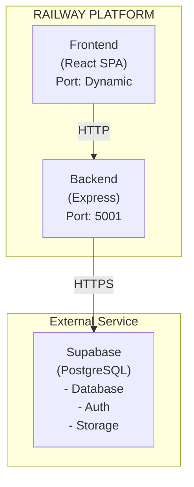
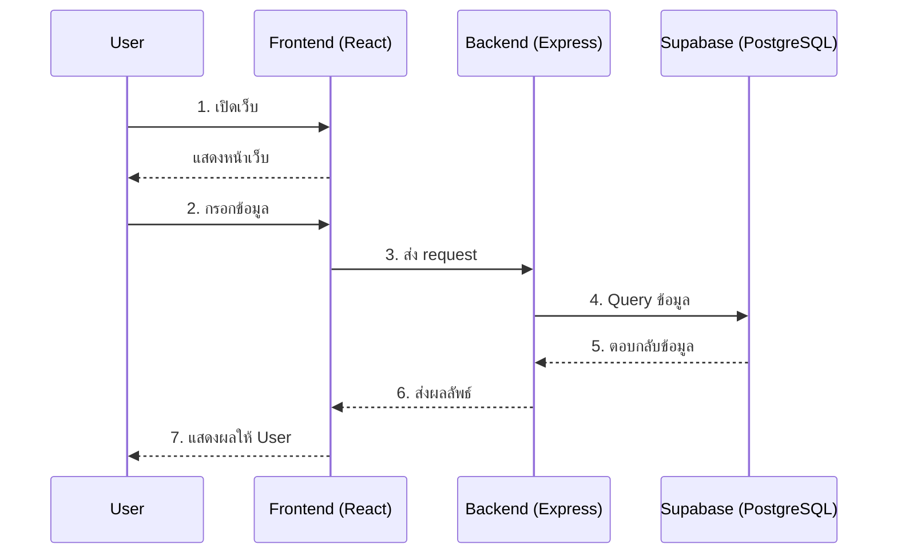
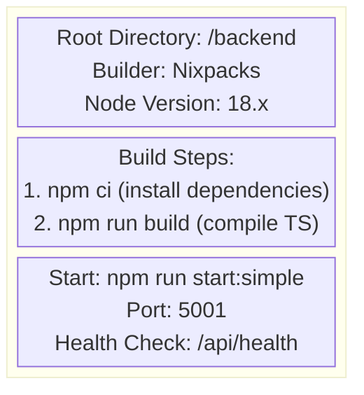
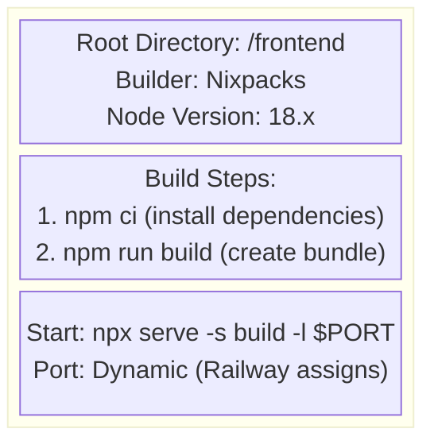

# 5.1 ภาพรวมการ Deploy — Overview

## วัตถุประสงค์

เอกสารนี้อธิบายภาพรวมของการ Deploy โปรเจกต์ Kaizen Web Application บน Railway.app รวมถึงสถาปัตยกรรมระบบและโครงสร้าง Services

---

## สารบัญเอกสาร Deploy ทั้งหมด

| ลำดับ | เอกสาร | เนื้อหา |
|-------|--------|---------|
| 5.1 | [Deploy Overview](5.1_Deploy_Overview.md) | ภาพรวมและสถาปัตยกรรมระบบ |
| 5.2 | [Pre-Deploy Checklist](5.2_Pre_Deploy_Checklist.md) | เตรียมตัวก่อน Deploy |
| 5.3 | [Environment Variables](5.3_Environment_Variables.md) | ตัวแปรที่ต้องตั้งค่า |
| 5.4 | [Deploy Steps](5.4_Deploy_Steps.md) | ขั้นตอนการ Deploy |
| 5.5 | [Post-Deploy Verification](5.5_Post_Deploy_Verification.md) | การตรวจสอบหลัง Deploy |
| 5.6 | [Troubleshooting](5.6_Troubleshooting.md) | การแก้ไขปัญหาที่พบบ่อย |
| 5.7 | [AWS Deploy Guide](5.7_AWS_Deploy_Guide.md) | คู่มือ Deploy บน AWS (EC2 + RDS + S3 + CloudFront + WAF) |

---

## 1. ภาพรวมของโปรเจกต์

| รายการ | รายละเอียด |
|--------|------------|
| ชื่อโปรเจกต์ | Kaizen Web Application |
| ประเภท | Full-Stack Web Application |
| Frontend | React 18 + Tailwind CSS |
| Backend | Node.js/Express + TypeScript |
| Database | Supabase (PostgreSQL) |
| File Storage | Supabase Storage |
| Real-time | Socket.io (WebSocket) |
| Platform | Railway.app |

---

## 2. Railway คืออะไร?

Railway เป็น Platform-as-a-Service (PaaS) ที่ช่วยให้คุณ Deploy แอปพลิเคชันได้ง่ายดาย โดยไม่ต้องจัดการ Server เอง

### ข้อดีของ Railway

| ข้อดี | คำอธิบาย |
|-------|----------|
| **ใช้งานง่าย** | เชื่อมต่อ GitHub แล้ว Deploy อัตโนมัติ |
| **ราคาถูก** | เริ่มต้นที่ $5/เดือน |
| **รองรับหลายภาษา** | Node.js, Python, Go, Rust และอื่นๆ |
| **Auto-scaling** | ปรับขนาดอัตโนมัติตามการใช้งาน |
| **Zero Downtime** | Deploy ใหม่โดยไม่มี downtime |

### เปรียบเทียบกับ Platform อื่น

| Platform | ราคาเริ่มต้น | ความยากง่าย | Free Tier |
|----------|-------------|-------------|-----------|
| **Railway** | $5/เดือน | ง่ายมาก | ไม่มี |
| Vercel | ฟรี | ง่าย | มี (Frontend) |
| Heroku | $5/เดือน | ง่าย | ไม่มี |
| AWS | Pay-as-you-go | ยาก | มี (จำกัด) |
| DigitalOcean | $5/เดือน | ปานกลาง | ไม่มี |

> **💡 Tip:** Railway เหมาะสำหรับโปรเจกต์ที่ต้องการ Full-Stack (Frontend + Backend) ในที่เดียว

---

## 3. สถาปัตยกรรมระบบ

### 3.1 แผนภาพระบบ



### 3.2 อธิบายแต่ละส่วน

| ส่วน | หน้าที่ | รายละเอียด |
|------|--------|------------|
| **Frontend** | แสดงผลหน้าเว็บ | React SPA, รับ input จากผู้ใช้, เรียก API |
| **Backend** | ประมวลผล | Express API, Business Logic, Authentication |
| **Supabase** | เก็บข้อมูล | PostgreSQL Database, File Storage, Real-time |

### 3.3 การสื่อสารระหว่างส่วนต่างๆ



---

## 4. โครงสร้าง Services บน Railway

### 4.1 ตาราง Services

| Service | Root Directory | Build Command | Start Command | Port |
|---------|----------------|---------------|---------------|------|
| Backend | `/backend` | `npm run build` | `npm run start:simple` | 5001 |
| Frontend | `/frontend` | `npm run build` | `npx serve -s build -l $PORT` | Dynamic |

### 4.2 อธิบายแต่ละ Service

#### Backend Service



| Configuration | Value |
|--------------|-------|
| Root Directory | `/backend` |
| Builder | Nixpacks |
| Node Version | 18.x |
| Build Command | `npm ci && npm run build` |
| Start Command | `npm run start:simple` |
| Port | 5001 |
| Health Check | `/api/health` |

#### Frontend Service



| Configuration | Value |
|--------------|-------|
| Root Directory | `/frontend` |
| Builder | Nixpacks |
| Node Version | 18.x |
| Build Command | `npm ci && npm run build` |
| Start Command | `npx serve -s build -l $PORT` |
| Port | Dynamic (Railway assigns) |

> **💡 Tip:** Railway จะกำหนด Port ให้ Frontend โดยอัตโนมัติผ่านตัวแปร `$PORT`

---

## 5. ค่าใช้จ่ายโดยประมาณ

### 5.1 Railway Pricing

| รายการ | ราคา |
|--------|------|
| Starter Plan | $5/เดือน (รวม $5 credit) |
| Execution Hours | $0.000231/vCPU-minute |
| Memory | $0.000231/GB-minute |
| Network Egress | $0.10/GB |

### 5.2 ประมาณการค่าใช้จ่าย

| ขนาดแอป | Users/เดือน | ค่าใช้จ่ายประมาณ |
|---------|-------------|-----------------|
| เล็ก | < 100 | $5-10/เดือน |
| กลาง | 100-1,000 | $10-30/เดือน |
| ใหญ่ | > 1,000 | $30-100/เดือน |

### 5.3 วิธีประหยัดค่าใช้จ่าย

1. **ใช้ Sleep Mode** — Service จะ sleep เมื่อไม่มีการใช้งาน
2. **Optimize Code** — ลด Memory usage, Cache ข้อมูล
3. **ใช้ CDN** — Static files ควรใช้ CDN ลด Network egress

> **💡 Tip:** ดู Usage ได้ที่ Railway Dashboard → Usage เพื่อติดตามค่าใช้จ่าย

---

## 6. Release Cadence — จังหวะการ Release

### กำหนดการ Release

| ประเภท | ความถี่ | เงื่อนไข | ใครอนุมัติ |
|:-------|:-------|:---------|:----------|
| **Regular Release** | ทุก 2 สัปดาห์ (biweekly) | ผ่าน Quality Gates ทั้งหมด | Sr. Engineer |
| **Hotfix** | ทันทีเมื่อจำเป็น | ผ่าน Senior Review + Smoke Test | Sr. Engineer + PM |
| **Major Release** | ตาม Roadmap | ผ่าน UAT + Stakeholder Sign-off | PM + Stakeholder |

### Release Checklist Template

ทุกครั้งที่ release ต้องมี:

- [ ] **Tag version** ตาม Semantic Versioning (`v1.2.3`)
- [ ] **Release Notes** สรุปสิ่งที่เปลี่ยนแปลง (features, fixes, breaking changes)
- [ ] **Rollback Note** ระบุวิธี rollback ถ้ามีปัญหา
- [ ] **Asana Tasks** ทุก task ที่รวมอยู่ใน release ถูก mark "Done"

### Release Notes Template

```markdown
## Release v1.X.X — [วันที่]

### Features
- feat(auth): เพิ่ม Google OAuth login (#PR-123)

### Bug Fixes
- fix(payment): แก้ null response (#PR-456)

### Rollback
หาก release มีปัญหา:
1. Railway Dashboard → Deployments → Previous Deploy → Rollback
2. แจ้ง #deployment channel ทันที
```

---

## 7. Monitoring & KPI หลัง Deploy

### Metrics ที่ต้องติดตาม

| Metric | Target | วิธีดู |
|:-------|:-------|:-------|
| **Uptime** | >= 99.5% | Railway Dashboard |
| **API Response Time (P95)** | < 2 วินาที | Railway Metrics / Logs |
| **Error Rate** | < 1% | Application Logs |
| **Deploy Frequency** | >= 2 ครั้ง/เดือน (biweekly target) | นับจาก Release Tags |
| **Change Failure Rate** | track & ลดลงทุก Q | นับ hotfix / total releases |
| **Time to Recover (MTTR)** | < 4 ชม. | นับจาก incident → resolved |

### Post-Deploy Verification (Smoke Test)

หลังทุกครั้งที่ Deploy ต้องตรวจสอบ:

- [ ] หน้าเว็บโหลดได้ปกติ
- [ ] Login/Logout ทำงานได้
- [ ] API Health Check ผ่าน (`/api/health`)
- [ ] Critical features ทำงานได้ (ทดสอบ manual)
- [ ] ไม่มี error ใหม่ใน logs (ดูใน 15 นาทีแรก)

---

## 8. Runbooks — คู่มือปฏิบัติงาน

### Deploy Runbook

| ขั้นตอน | คำสั่ง/การกระทำ | หมายเหตุ |
|:--------|:---------------|:---------|
| 1. Pre-check | ดู [5.2 Pre-Deploy Checklist](5.2_Pre_Deploy_Checklist.md) | ตรวจสอบ Quality Gates |
| 2. Deploy | Merge PR to main → Railway auto-deploy | ดู [5.4 Deploy Steps](5.4_Deploy_Steps.md) |
| 3. Verify | รัน Smoke Test checklist ด้านบน | ภายใน 15 นาที |
| 4. Announce | แจ้ง `#deployment` channel | ระบุ version + changes |

### Rollback Runbook

| ขั้นตอน | คำสั่ง/การกระทำ | หมายเหตุ |
|:--------|:---------------|:---------|
| 1. ระบุปัญหา | ดู error logs ใน Railway | จับ pattern ของ error |
| 2. ตัดสินใจ | ถ้า impact สูง → rollback ทันที | Sr. Engineer ตัดสินใจ |
| 3. Rollback | Railway Dashboard → Deployments → Rollback | กลับไป version ก่อนหน้า |
| 4. Verify | รัน Smoke Test อีกครั้ง | ยืนยันว่ากลับมาปกติ |
| 5. Post-mortem | สร้าง Incident Note | บันทึกสาเหตุ + วิธีป้องกัน |

### Incident Note Template

```markdown
## Incident: [ชื่อปัญหา] — [วันที่]

### สรุป
- **ผลกระทบ:** [ใครได้รับผลกระทบ / ขอบเขต]
- **ระยะเวลา:** [เริ่ม - จบ]
- **Root Cause:** [สาเหตุหลัก]

### Timeline
- HH:MM — ตรวจพบปัญหา
- HH:MM — เริ่มแก้ไข
- HH:MM — Rollback / Fix deployed
- HH:MM — ยืนยันแก้ไขเสร็จ

### Action Items
- [ ] [สิ่งที่ต้องทำเพื่อป้องกันไม่ให้เกิดซ้ำ]
```

> **KPI Target:** 100% incidents มี Incident Note + >= 80% action items closed ภายใน sprint ถัดไป

---

## 9. ขั้นตอนถัดไป

เมื่อเข้าใจภาพรวมแล้ว ให้ไปที่:

➡️ **[5.2 Pre-Deploy Checklist](5.2_Pre_Deploy_Checklist.md)** — เตรียมตัวก่อน Deploy

---

## แหล่งข้อมูลเพิ่มเติม

- [Railway Documentation](https://docs.railway.app/)
- [Railway Pricing](https://railway.app/pricing)
- [Supabase Documentation](https://supabase.com/docs)

---

**จัดทำโดย:** ทีมพัฒนา Kaizen Web Application
**วันที่อัปเดต:** 15 ธันวาคม 2025
