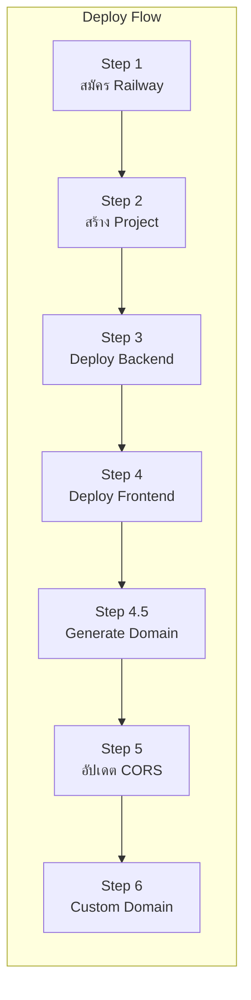
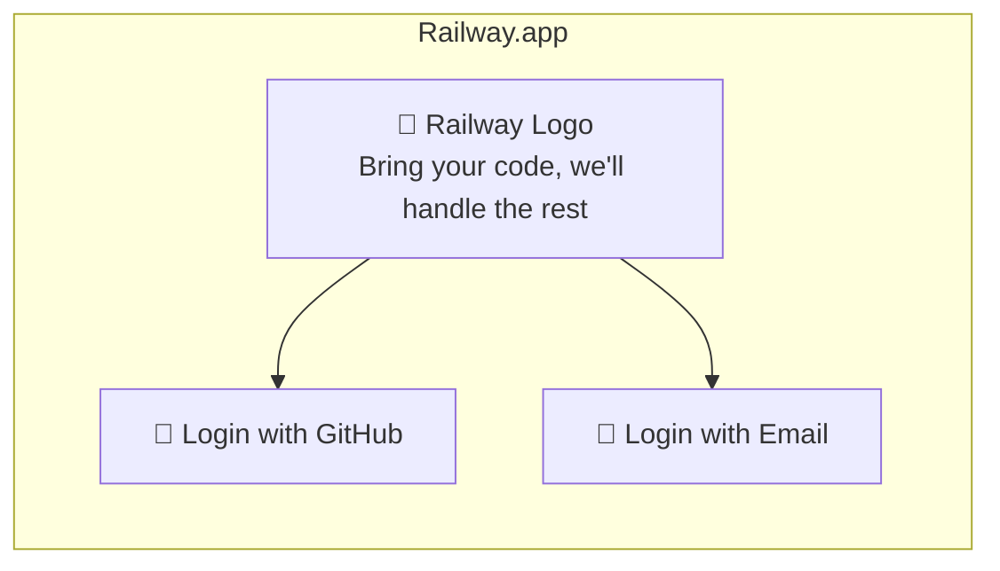
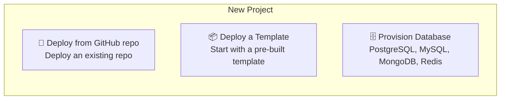
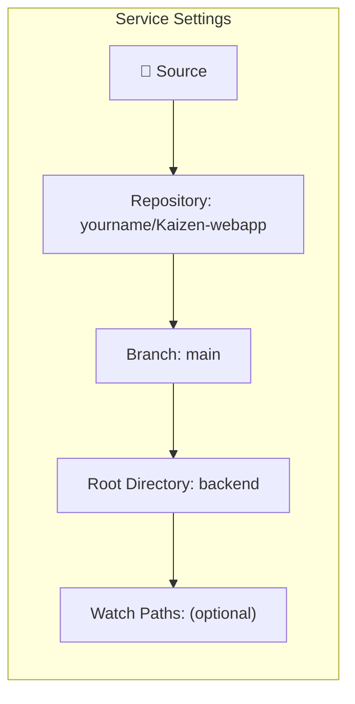
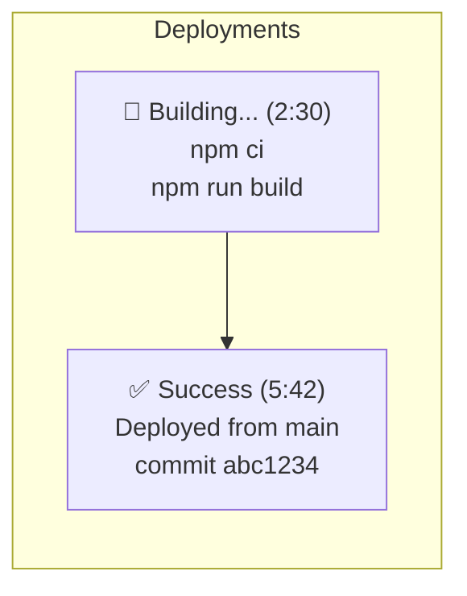
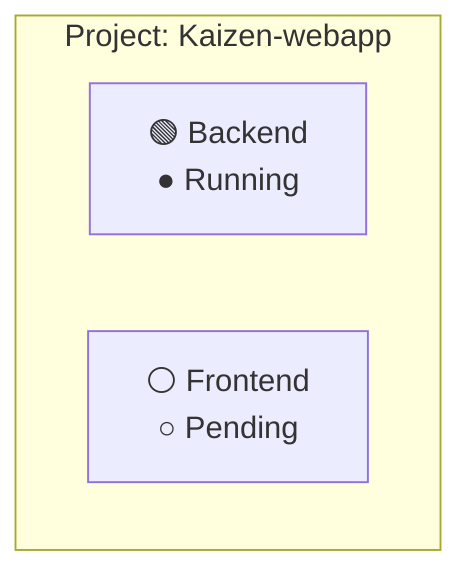
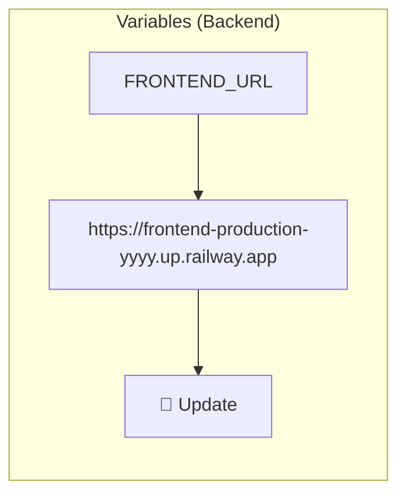
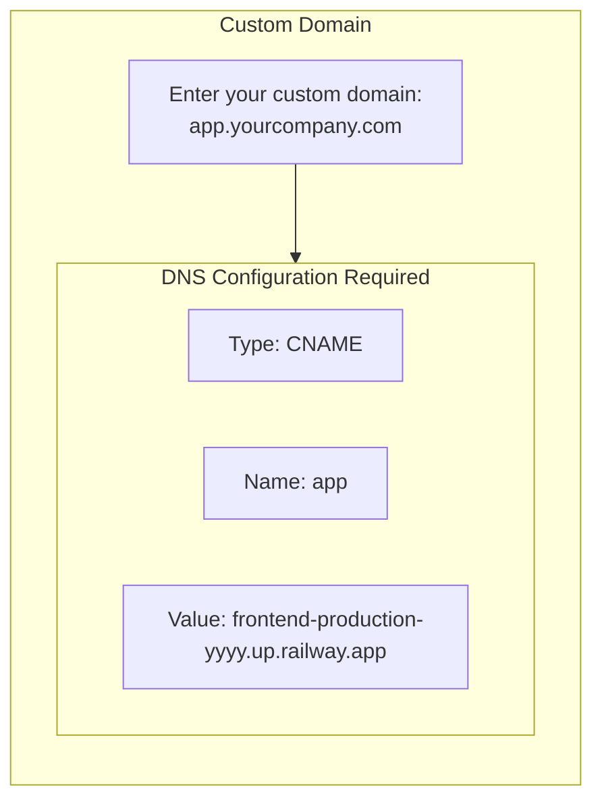
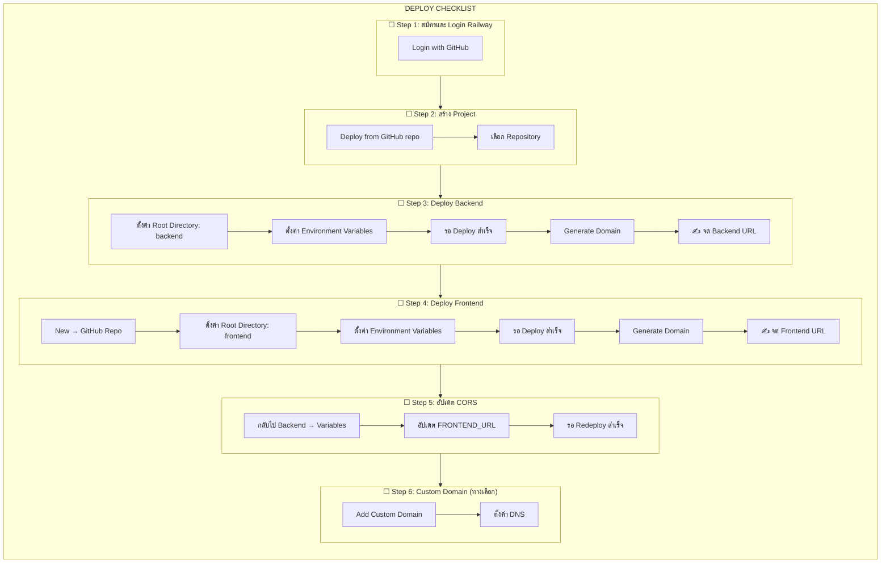

# 5.4 ขั้นตอนการ Deploy — Step-by-Step Guide

## วัตถุประสงค์

เอกสารนี้อธิบายขั้นตอนการ Deploy โปรเจกต์บน Railway ทีละขั้นตอนอย่างละเอียด เหมาะสำหรับผู้ที่ไม่เคย Deploy มาก่อน

---

## ภาพรวมขั้นตอน



---

## ขั้นตอนที่ 1: สมัครและเข้าสู่ระบบ Railway

### 1.1 สมัคร Railway Account

1. เปิด Browser ไปที่ [railway.app](https://railway.app)
2. คลิก **"Login"** หรือ **"Start a New Project"**
3. เลือก **"Login with GitHub"**



### 1.2 อนุญาต Railway เข้าถึง GitHub

1. GitHub จะถามสิทธิ์การเข้าถึง
2. คลิก **"Authorize Railway"**
3. กลับมาที่ Railway Dashboard

> **💡 Tip:** การ Login ด้วย GitHub จะทำให้เชื่อมต่อ Repository ได้ง่ายขึ้น

---

## ขั้นตอนที่ 2: สร้าง Project ใหม่

### 2.1 สร้าง Project

1. ที่ Railway Dashboard คลิก **"New Project"** (มุมขวาบน)
2. เลือก **"Deploy from GitHub repo"**



### 2.2 เชื่อมต่อ GitHub Repository

1. ถ้ายังไม่เคยเชื่อมต่อ GitHub:
   - คลิก **"Configure GitHub App"**
   - เลือก Account หรือ Organization
   - เลือก Repository ที่ต้องการให้ Railway เข้าถึง
   - คลิก **"Install & Authorize"**

2. เลือก Repository **Kaizen-webapp** จากรายการ

> **⚠️ ข้อควรระวัง:** ถ้าไม่เห็น Repository:
> - ตรวจสอบว่า Repository เป็น Public หรือได้ให้สิทธิ์แล้ว
> - ไปที่ GitHub → Settings → Applications → Railway → Configure
> - เพิ่ม Repository ที่ต้องการ

---

## ขั้นตอนที่ 3: Deploy Backend Service

### 3.1 สร้าง Backend Service

หลังจากเลือก Repository แล้ว Railway จะสร้าง Service แรกให้อัตโนมัติ แต่เราต้องแก้ไขให้เป็น Backend:

1. คลิกที่ Service ที่สร้างขึ้นมา
2. ไปที่แท็บ **"Settings"**

### 3.2 ตั้งค่า Root Directory



- ตั้งค่า **Root Directory**: `backend`
- Railway จะตรวจจับไฟล์ `railway.toml` และ `nixpacks.toml` โดยอัตโนมัติ

### 3.3 ตั้งค่า Environment Variables

1. ไปที่แท็บ **"Variables"**
2. คลิก **"Raw Editor"** (มุมขวาบน)
3. Paste ตัวแปรทั้งหมด:

```env
PORT=5001
NODE_ENV=production
SUPABASE_URL=https://nmdklroldxfdodnvfbls.supabase.co
SUPABASE_ANON_KEY=<your-anon-key>
SUPABASE_SERVICE_KEY=<your-service-key>
JWT_SECRET=<your-jwt-secret>
JWT_EXPIRES_IN=2h
FRONTEND_URL=<frontend-url-after-deploy>
SESSION_DURATION=1800000
SESSION_WARNING_TIME=300000
SESSION_MAX_EXTENSIONS=3
MAX_FILE_SIZE=5242880
ALLOWED_FILE_TYPES=image/jpeg,image/png,image/gif,application/pdf
RATE_LIMIT_WINDOW_MS=900000
RATE_LIMIT_MAX_REQUESTS=100
```

4. คลิก **"Update Variables"**

> **💡 Tip:** `FRONTEND_URL` ให้ใส่ค่าชั่วคราวก่อน เช่น `https://temp.railway.app` แล้วค่อยมาแก้ไขทีหลัง

### 3.4 Deploy Backend

1. Railway จะ Deploy อัตโนมัติเมื่อตั้งค่าเสร็จ
2. ดูความคืบหน้าที่แท็บ **"Deployments"**
3. รอจน Status เปลี่ยนเป็น **"Success"** (ประมาณ 2-5 นาที)



### 3.5 Generate Backend Domain

1. ไปที่แท็บ **"Settings"**
2. เลื่อนลงไปที่ส่วน **"Networking"**
3. คลิก **"Generate Domain"**
4. จด URL ไว้ เช่น `https://backend-production-xxxx.up.railway.app`

> **⚠️ สำคัญ:** จด Backend URL ไว้ จะต้องใช้ในขั้นตอนถัดไป!

---

## ขั้นตอนที่ 4: Deploy Frontend Service

### 4.1 เพิ่ม Service ใหม่

1. กลับไปที่หน้า Project (คลิกชื่อ Project ด้านบน)
2. คลิก **"New"** → **"GitHub Repo"**
3. เลือก Repository เดิม (Kaizen-webapp)



### 4.2 ตั้งค่า Root Directory

1. คลิกที่ Frontend Service
2. ไปที่แท็บ **"Settings"**
3. ตั้งค่า **Root Directory**: `frontend`

### 4.3 ตั้งค่า Environment Variables

1. ไปที่แท็บ **"Variables"**
2. คลิก **"Raw Editor"**
3. Paste ตัวแปร (แทนที่ `<backend-url>` ด้วย URL จริง):

```env
REACT_APP_API_BASE_URL=https://backend-production-xxxx.up.railway.app/api
REACT_APP_WEBSOCKET_URL=https://backend-production-xxxx.up.railway.app
REACT_APP_NODE_ENV=production
DISABLE_ESLINT_PLUGIN=true
```

4. คลิก **"Update Variables"**

> **⚠️ ข้อควรระวัง:**
> - `REACT_APP_API_BASE_URL` ต้องมี `/api` ต่อท้าย
> - `REACT_APP_WEBSOCKET_URL` ไม่มี `/api`

### 4.4 Deploy Frontend

1. Railway จะ Deploy อัตโนมัติ
2. รอจน Status เปลี่ยนเป็น **"Success"**

### 4.5 Generate Frontend Domain

1. ไปที่แท็บ **"Settings"** → **"Networking"**
2. คลิก **"Generate Domain"**
3. จด URL ไว้ เช่น `https://frontend-production-yyyy.up.railway.app`

---

## ขั้นตอนที่ 5: อัปเดต CORS Settings

### 5.1 ความสำคัญของขั้นตอนนี้

หลังจากได้ Frontend URL แล้ว **ต้องกลับไปอัปเดต Backend** เพื่อให้ CORS ทำงานถูกต้อง

> **⚠️ ถ้าไม่ทำขั้นตอนนี้:** Frontend จะเรียก API ไม่ได้ และจะเห็น CORS Error ใน Console

### 5.2 อัปเดต Backend Environment

1. กลับไปที่ **Backend Service**
2. ไปที่แท็บ **"Variables"**
3. หา `FRONTEND_URL` และแก้ไขค่า:

```
# เปลี่ยนจาก
FRONTEND_URL=https://temp.railway.app

# เป็น
FRONTEND_URL=https://frontend-production-yyyy.up.railway.app
```

4. คลิก **"Update Variables"**
5. Railway จะ Redeploy Backend อัตโนมัติ



---

## ขั้นตอนที่ 6: ตั้งค่า Custom Domain (ทางเลือก)

### 6.1 ใช้ Railway Domain (แนะนำสำหรับเริ่มต้น)

Railway สร้าง Domain ให้อัตโนมัติ เช่น:
- `xxx.up.railway.app`

ไม่ต้องตั้งค่าอะไรเพิ่ม สามารถใช้งานได้เลย

### 6.2 ใช้ Custom Domain

ถ้าต้องการใช้ Domain ของตัวเอง:

1. ไปที่ Service Settings → **"Networking"**
2. คลิก **"Add Custom Domain"**
3. กรอก Domain ที่ต้องการ เช่น `app.yourcompany.com`



4. ไปที่ DNS Provider (Cloudflare, GoDaddy, etc.) และเพิ่ม Record:
   - **Type**: `CNAME`
   - **Name**: `app` (หรือ subdomain ที่ต้องการ)
   - **Value**: `<your-service>.up.railway.app`

5. รอ DNS propagate (อาจใช้เวลา 1-48 ชั่วโมง)

> **💡 Tip:** ใช้ [dnschecker.org](https://dnschecker.org) เพื่อตรวจสอบว่า DNS propagate แล้วหรือยัง

---

## สรุปขั้นตอนทั้งหมด



---

## ขั้นตอนถัดไป

เมื่อ Deploy เสร็จแล้ว ให้ไปที่:

➡️ **[5.5 Post-Deploy Verification](5.5_Post_Deploy_Verification.md)** — การตรวจสอบหลัง Deploy

---

**จัดทำโดย:** ทีมพัฒนา Kaizen Web Application
**วันที่อัปเดต:** 15 ธันวาคม 2025
