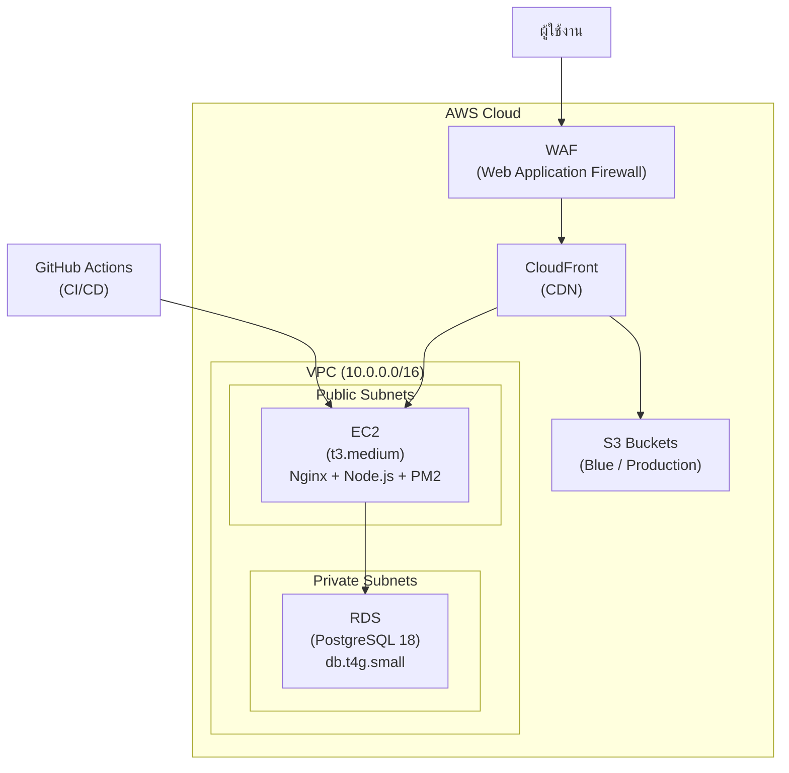
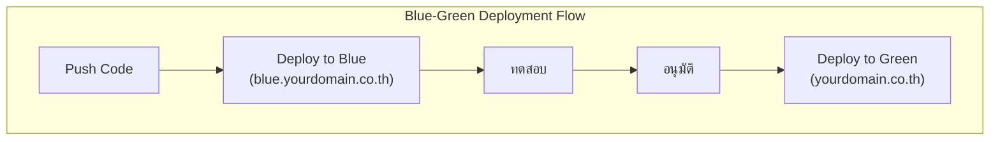

# 5.7 คู่มือ Deploy เว็บแอปพลิเคชันบน AWS — Step-by-Step Guide

## วัตถุประสงค์

เอกสารนี้อธิบายขั้นตอนการสร้างโครงสร้างพื้นฐาน AWS สำหรับเว็บแอปพลิเคชันใหม่ตั้งแต่เริ่มต้นจนถึงการ Deploy ขึ้น Production โดยใช้สถาปัตยกรรม **EC2 + RDS + S3 + CloudFront + WAF** (อ้างอิงจากโครงสร้าง KAIZEN App - Siam GS Battery)

---

## ภาพรวมสถาปัตยกรรม



### AWS Services ที่ใช้

| Service | วัตถุประสงค์ |
|---------|-------------|
| **EC2** (Elastic Compute Cloud) | เซิร์ฟเวอร์เสมือนสำหรับรันแอปพลิเคชัน |
| **RDS** (Relational Database Service) | ฐานข้อมูล PostgreSQL แบบ managed |
| **S3** (Simple Storage Service) | ที่เก็บไฟล์และรูปภาพ |
| **CloudFront** | CDN สำหรับส่งมอบเนื้อหาอย่างรวดเร็ว |
| **WAF** (Web Application Firewall) | ไฟร์วอลล์ปกป้องเว็บแอป |
| **GitHub Actions** | CI/CD pipeline สำหรับ deploy อัตโนมัติ |

---

## สิ่งที่ต้องเตรียมก่อนเริ่ม (Prerequisites)

1. บัญชี AWS ที่มีสิทธิ์ Administrator หรือสิทธิ์ที่เพียงพอในการสร้าง resources
2. บัญชี GitHub สำหรับเก็บ source code และตั้งค่า CI/CD
3. โดเมนเนม (เช่น yourdomain.co.th) ที่จดทะเบียนแล้ว
4. ความรู้พื้นฐานเรื่อง Linux command line
5. Source code ของเว็บแอปพลิเคชันที่พร้อม deploy

> **คำแนะนำสำหรับผู้เริ่มต้น:** หากยังไม่เคยใช้ AWS มาก่อน แนะนำให้สมัคร AWS Free Tier ก่อน ซึ่งจะให้ใช้งาน resources บางตัวฟรีเป็นเวลา 12 เดือน เช่น t2.micro EC2 instance และ RDS instance ขนาดเล็ก

---

## ขั้นตอนที่ 1: สร้าง VPC และตั้งค่าเครือข่าย

VPC (Virtual Private Cloud) คือเครือข่ายเสมือนส่วนตัวของคุณบน AWS เปรียบเสมือนการสร้างห้องเซิร์ฟเวอร์ส่วนตัวบนคลาวด์ ทุก resource ที่เราสร้างจะอยู่ภายใน VPC นี้

### 1.1 สร้าง VPC

1. เข้าไปที่ AWS Management Console แล้วค้นหา "VPC" ในช่องค้นหา
2. คลิก **"Create VPC"**
3. เลือก **"VPC and more"** เพื่อให้ AWS สร้าง Subnets, Route Tables, Internet Gateway ให้อัตโนมัติ
4. ตั้งค่าดังนี้:

| การตั้งค่า | ค่าที่แนะนำ |
|-----------|------------|
| Name tag | `p-[ชื่อโปรเจค]-vpc` (เช่น `p-siamgs-kaizen-vpc`) |
| IPv4 CIDR block | `10.0.0.0/16` |
| Number of AZs | 2 (สำหรับ High Availability) |
| Public subnets | 2 (สำหรับ EC2 และ Load Balancer) |
| Private subnets | 2 (สำหรับ RDS) |
| NAT gateways | 1 per AZ (หรือ None หากต้องการประหยัดค่าใช้จ่าย) |

> **ทำไมต้องมี 2 Availability Zones?**
> AWS แนะนำให้ใช้อย่างน้อย 2 AZs เพื่อ High Availability ถ้า AZ หนึ่งมีปัญหา อีก AZ จะยังทำงานได้ต่อ
> - **Public Subnet** — ใช้สำหรับ resources ที่ต้องเข้าถึงจากอินเทอร์เน็ต (เช่น EC2)
> - **Private Subnet** — ใช้สำหรับ resources ที่ไม่ควรเข้าถึงจากภายนอกโดยตรง (เช่น RDS)

### 1.2 สร้าง Security Groups

Security Group เปรียบเสมือนไฟร์วอลล์ระดับ instance ที่ควบคุมว่า traffic ไหนเข้าออกได้บ้าง

**Security Group สำหรับ EC2:**

| ประเภท | พอร์ต | แหล่งที่มา | คำอธิบาย |
|--------|-------|-----------|---------|
| HTTP | 80 | `0.0.0.0/0` | อนุญาต HTTP จากทุกที่ |
| HTTPS | 443 | `0.0.0.0/0` | อนุญาต HTTPS จากทุกที่ |
| SSH | 22 | `IP ของคุณ/32` | อนุญาต SSH เฉพาะ IP ของคุณ |

**Security Group สำหรับ RDS:**

| ประเภท | พอร์ต | แหล่งที่มา | คำอธิบาย |
|--------|-------|-----------|---------|
| PostgreSQL | 5432 | EC2 Security Group | อนุญาตเฉพาะจาก EC2 เท่านั้น |

> **ข้อควรระวังเรื่อง Security:** อย่าเปิด SSH (พอร์ต 22) ให้ `0.0.0.0/0` เด็ดขาด! ให้จำกัดเฉพาะ IP ของคุณเท่านั้น มิฉะนั้นใครก็ตามบนอินเทอร์เน็ตจะสามารถพยายามล็อกอินเข้าเซิร์ฟเวอร์ของคุณได้

---

## ขั้นตอนที่ 2: สร้าง EC2 Instance

EC2 instance คือเซิร์ฟเวอร์เสมือนที่จะรันเว็บแอปพลิเคชันของคุณ

### 2.1 เปิด EC2 Instance

1. ไปที่ EC2 Dashboard แล้วคลิก **"Launch Instance"**
2. ตั้งชื่อ instance เช่น `p-[ชื่อโปรเจค]-ec2`
3. ตั้งค่าดังตารางด้านล่าง:

| การตั้งค่า | ค่าที่แนะนำ (อ้างอิง KAIZEN) |
|-----------|---------------------------|
| AMI (OS) | Amazon Linux 2023 (x86_64) — เสถียรและได้รับการ optimize สำหรับ AWS |
| Instance Type | `t3.medium` (2 vCPU, 4 GiB RAM) — เหมาะสำหรับเว็บแอปขนาดเล็ก-กลาง |
| Key Pair | สร้าง Key Pair ใหม่ (.pem) แล้วดาวน์โหลดเก็บไว้อย่างปลอดภัย |
| Network | เลือก VPC ที่สร้างไว้ในขั้นตอนที่ 1, เลือก Public Subnet |
| Auto-assign Public IP | Enable |
| Security Group | เลือก EC2 Security Group ที่สร้างไว้ |
| Storage | 60 GiB gp3 (ปรับตามขนาดแอปพลิเคชัน) |

### 2.2 เชื่อมต่อเข้า EC2 ผ่าน SSH

หลังจาก instance เริ่มทำงานแล้ว ให้เชื่อมต่อเข้าไปด้วยคำสั่ง:

```bash
chmod 400 your-key.pem
ssh -i your-key.pem ec2-user@[Public-IP-ของ-EC2]
```

### 2.3 ติดตั้งซอฟต์แวร์ที่จำเป็น

เมื่อเข้าถึง EC2 ได้แล้ว ให้ติดตั้งซอฟต์แวร์พื้นฐาน:

```bash
# อัปเดตระบบ
sudo dnf update -y

# ติดตั้ง Node.js (สำหรับเว็บแอป Node)
sudo dnf install -y nodejs npm

# ติดตั้ง Git
sudo dnf install -y git

# ติดตั้ง Nginx (Web Server / Reverse Proxy)
sudo dnf install -y nginx
sudo systemctl enable nginx
sudo systemctl start nginx

# ติดตั้ง PM2 (Process Manager สำหรับ Node.js)
sudo npm install -g pm2
```

> **ทำไมต้องใช้ Nginx + PM2?**
> - **Nginx** ทำหน้าที่เป็น reverse proxy รับ request จากผู้ใช้แล้วส่งต่อไปยังแอป Node.js ช่วยจัดการ SSL, static files และ load balancing
> - **PM2** ช่วยให้แอป Node.js ทำงานต่อเนื่องแม้เกิด crash และรีสตาร์ทอัตโนมัติ

---

## ขั้นตอนที่ 3: สร้าง RDS Database

RDS จะเป็นฐานข้อมูลของแอปพลิเคชัน โดย AWS จะดูแลเรื่อง backup, patching และ monitoring ให้อัตโนมัติ

### 3.1 สร้าง RDS Instance

1. ไปที่ RDS Dashboard แล้วคลิก **"Create database"**
2. เลือก **"Standard create"** เพื่อกำหนดค่าเองทั้งหมด
3. ตั้งค่าดังตาราง:

| การตั้งค่า | ค่าที่แนะนำ (อ้างอิง KAIZEN) |
|-----------|---------------------------|
| Engine | PostgreSQL |
| Engine Version | PostgreSQL 18 (หรือเวอร์ชันล่าสุดที่รองรับ) |
| Templates | Production หรือ Free Tier (สำหรับทดสอบ) |
| DB Instance ID | `p-[ชื่อโปรเจค]-rds` |
| Master Username | `postgres` (หรือชื่อที่ต้องการ) |
| Master Password | ตั้ง password ที่แข็งแกร่ง (จะเก็บไว้ใน Secrets Manager) |
| Instance Type | `db.t4g.small` (2 vCPU, 2 GiB RAM) |
| Storage | 20 GiB gp3 (เปิด Auto Scaling ได้) |
| VPC | เลือก VPC เดียวกับ EC2 |
| Subnet Group | เลือก Private Subnets |
| Public Access | **No** (สำคัญมาก! ไม่ควรเปิดให้เข้าถึงจากภายนอก) |
| Security Group | เลือก RDS Security Group ที่สร้างไว้ |
| Backup | เปิด Automated Backups, retention 7 วัน |
| Encryption | เปิด (ใช้ AWS KMS key) |

> **สำคัญมาก: อย่าเปิด Public Access!** ฐานข้อมูลควรอยู่ใน Private Subnet เสมอ และเข้าถึงได้เฉพาะจาก EC2 เท่านั้น การเปิด Public Access จะทำให้ฐานข้อมูลเสี่ยงต่อการถูกโจมตีจากอินเทอร์เน็ต

### 3.2 จด Endpoint ของ RDS

หลังสร้างเสร็จ (รอประมาณ 5-10 นาที) ให้จด RDS Endpoint ไว้ จะมีรูปแบบประมาณ:

```
p-[ชื่อโปรเจค]-rds.xxxxxxxxxxxx.ap-southeast-1.rds.amazonaws.com
```

Endpoint นี้จะใช้ในการกำหนดค่าเชื่อมต่อฐานข้อมูลของแอปพลิเคชัน

---

## ขั้นตอนที่ 4: สร้าง S3 Buckets

S3 ใช้สำหรับเก็บไฟล์ที่ผู้ใช้อัปโหลด (เช่น รูปภาพ เอกสาร) ในสถาปัตยกรรม KAIZEN ใช้ 2 buckets สำหรับ Blue-Green deployment

### 4.1 สร้าง Bucket

1. ไปที่ S3 Dashboard แล้วคลิก **"Create bucket"**
2. สร้าง 2 buckets:

| ชื่อ Bucket | วัตถุประสงค์ |
|------------|------------|
| `p-[ชื่อโปรเจค]-s3-bucket-blue` | สำหรับ Blue environment (staging/testing) |
| `p-[ชื่อโปรเจค]-s3-bucket-prd` | สำหรับ Production environment |

> **ชื่อ S3 Bucket ต้องไม่ซ้ำกันทั่วโลก** — ชื่อ bucket เป็น globally unique คือไม่ซ้ำกับใครทั้งโลก ดังนั้นควรใส่ชื่อบริษัทหรือโปรเจคนำหน้าเพื่อลดโอกาสซ้ำ

### 4.2 ตั้งค่า Bucket

- **Region:** เลือก Region เดียวกับ EC2 และ RDS
- **Block Public Access:** เปิดทั้งหมด (Block all public access) เพราะจะเข้าถึงผ่าน CloudFront แทน
- **Versioning:** แนะนำให้เปิด เพื่อป้องกันการลบไฟล์โดยไม่ตั้งใจ
- **Encryption:** เปิด Server-side encryption ด้วย AWS KMS

### 4.3 ตั้งค่า Bucket Policy

เพิ่ม policy ให้ CloudFront เข้าถึง S3 ได้ (จะตั้งค่าในขั้นตอน CloudFront):

```json
{
  "Version": "2012-10-17",
  "Statement": [
    {
      "Sid": "AllowCloudFrontAccess",
      "Effect": "Allow",
      "Principal": {
        "Service": "cloudfront.amazonaws.com"
      },
      "Action": "s3:GetObject",
      "Resource": "arn:aws:s3:::p-[ชื่อโปรเจค]-s3-bucket-prd/*",
      "Condition": {
        "StringEquals": {
          "AWS:SourceArn": "arn:aws:cloudfront::[ACCOUNT-ID]:distribution/[DISTRIBUTION-ID]"
        }
      }
    }
  ]
}
```

---

## ขั้นตอนที่ 5: ตั้งค่า CloudFront และ WAF

### 5.1 สร้าง CloudFront Distribution

CloudFront จะทำหน้าที่เป็น CDN ที่อยู่หน้าแอปพลิเคชัน ช่วยให้ผู้ใช้เข้าถึงเว็บได้เร็วขึ้นและเพิ่มความปลอดภัย

1. ไปที่ CloudFront Dashboard แล้วคลิก **"Create distribution"**
2. สร้าง 2 distributions (Blue และ Production):

| การตั้งค่า | ค่าที่แนะนำ |
|-----------|------------|
| Origin domain | EC2 Public DNS หรือ Elastic IP ของ EC2 |
| Protocol | HTTPS only |
| Viewer protocol policy | Redirect HTTP to HTTPS |
| Alternate domain (CNAME) | `yourdomain.co.th` (Blue: `blue.yourdomain.co.th`) |
| SSL Certificate | ขอ certificate ฟรีจาก AWS Certificate Manager (ACM) |
| WAF | เปิดใช้งาน (จะตั้งค่าในขั้นตอนถัดไป) |

### 5.2 ตั้งค่า DNS

ไปที่ผู้ให้บริการโดเมนของคุณ แล้วชี้ CNAME record ไปยัง CloudFront distribution:

```
yourdomain.co.th       CNAME  d31kqw4t1kp02n.cloudfront.net
blue.yourdomain.co.th  CNAME  d1qwsdla1z7jyw.cloudfront.net
```

### 5.3 ตั้งค่า AWS WAF

WAF จะช่วยปกป้องแอปจากการโจมตีทั่วไป เช่น SQL Injection, XSS และ bad bots

**Managed Rules ที่แนะนำ (อ้างอิง KAIZEN):**

| ชุดกฎ (Rule Set) | คำอธิบาย |
|-----------------|---------|
| `AWSManagedRulesAmazonIpReputationList` | บล็อก IP ที่มีประวัติเป็นอันตราย เช่น botnet, spam |
| `AWSManagedRulesCommonRuleSet` | กฎความปลอดภัยทั่วไป ป้องกัน OWASP Top 10 เช่น XSS, file inclusion |
| `AWSManagedRulesKnownBadInputsRuleSet` | กรอง input ที่เป็นอันตราย เช่น Log4j exploit |
| Rate-Based Rule (300 req/5min) | จำกัดจำนวน request ต่อ IP เพื่อป้องกัน DDoS เบื้องต้น |

> **WAF ฟรีหรือเปล่า?** AWS WAF คิดค่าบริการตามจำนวน Web ACLs, Rules และ Requests ที่ถูกประมวลผล ค่าใช้จ่ายเริ่มต้นประมาณ $5/เดือนต่อ Web ACL + $1/เดือนต่อ Rule + $0.60 ต่อล้าน requests

---

## ขั้นตอนที่ 6: ตั้งค่าความปลอดภัย

### 6.1 AWS Secrets Manager

ใช้ Secrets Manager เก็บข้อมูลลับ เช่น database password, API keys แทนการ hardcode ไว้ใน source code

1. ไปที่ Secrets Manager แล้วคลิก **"Store a new secret"**
2. เลือก **"Credentials for Amazon RDS database"**
3. ใส่ username/password ของ RDS แล้วเลือก RDS instance
4. ตั้งชื่อ secret เช่น `p-[ชื่อโปรเจค]/db-credentials`

### 6.2 AWS KMS (Key Management Service)

KMS ใช้สำหรับจัดการ encryption keys เพื่อเข้ารหัสข้อมูลใน S3 และ RDS

- สร้าง KMS Key สำหรับ S3 encryption
- สร้าง KMS Key สำหรับ RDS encryption
- กำหนดสิทธิ์ให้เฉพาะ IAM roles ที่จำเป็นเท่านั้น

### 6.3 SSL/TLS Certificate

ขอ SSL certificate ฟรีจาก AWS Certificate Manager (ACM):

1. ไปที่ ACM แล้วคลิก **"Request a certificate"**
2. เลือก **"Request a public certificate"**
3. ใส่โดเมนเนม: `yourdomain.co.th` และ `*.yourdomain.co.th`
4. เลือก DNS validation แล้วเพิ่ม CNAME record ตามที่ ACM แนะนำ

> **สำหรับ CloudFront ต้องขอ certificate ที่ us-east-1:** CloudFront ใช้ได้เฉพาะ certificate จาก `us-east-1` (N. Virginia) region เท่านั้น แม้ว่า resources อื่นจะอยู่ที่ region อื่น ดังนั้นต้องสลับไปที่ `us-east-1` ก่อนขอ certificate

### 6.4 ตั้งค่า CloudWatch และ CloudTrail

- **CloudWatch:** ตั้งค่า monitoring dashboards สำหรับ EC2 CPU, Memory, RDS connections และตั้ง Alarms เมื่อค่าเกิน threshold
- **CloudTrail:** เปิดใช้งานเพื่อบันทึกทุก API call ที่เกิดขึ้นใน AWS account (สำหรับ audit logging)
- **Cost Explorer:** เปิดใช้งานและตั้ง Budget Alerts เมื่อค่าใช้จ่ายเกินงบที่กำหนด

---

## ขั้นตอนที่ 7: ตั้งค่า CI/CD Pipeline

ขั้นตอนนี้จะตั้งค่าระบบ deploy อัตโนมัติแบบ Blue-Green ผ่าน GitHub Actions เหมือนกับ KAIZEN App

### 7.1 สร้าง SSM Document

SSM Document คือชุดคำสั่งที่จะรันบน EC2 เพื่อ build และ deploy แอปพลิเคชัน

1. ไปที่ **Systems Manager > Documents > Create document**
2. ตั้งชื่อ เช่น `p-[ชื่อโปรเจค]-cd`
3. ประเภท: Command document, Platform: Linux
4. เขียนคำสั่ง build/deploy:

```bash
#!/bin/bash
cd /home/ec2-user/app
git pull origin main
npm install
npm run build
pm2 restart all
```

### 7.2 ตั้งค่า GitHub Actions Workflow

สร้างไฟล์ `.github/workflows/deploy.yml` ใน repository:

```yaml
name: Deploy to AWS

on:
  push:
    branches: [main]

jobs:
  deploy-blue:
    runs-on: ubuntu-latest
    steps:
      - name: Deploy to Blue
        uses: aws-actions/configure-aws-credentials@v4
        with:
          aws-access-key-id: ${{ secrets.AWS_ACCESS_KEY_ID }}
          aws-secret-access-key: ${{ secrets.AWS_SECRET_ACCESS_KEY }}
          aws-region: ap-southeast-1

      - name: Run SSM Command
        run: |
          aws ssm send-command \
            --document-name "p-[project]-cd" \
            --targets "Key=instanceids,Values=i-xxxxxxxxx" \
            --comment "Deploy from GitHub Actions"
```

### 7.3 ตั้งค่า Blue-Green Deployment



**หลักการ Blue-Green Deployment:**

- **Blue environment** (`blue.yourdomain.co.th`): ใช้สำหรับทดสอบก่อน deploy จริง
- **Green environment** (`yourdomain.co.th`): สภาพแวดล้อม production จริงที่ผู้ใช้เข้าถึง
- ทุกครั้งที่ push code จะ deploy ไป Blue ก่อน > ทดสอบ > อนุมัติ > deploy ไป Green

### 7.4 การอนุมัติ Deploy ผ่าน GitHub Issues

(ขั้นตอนเหมือน KAIZEN App)

- GitHub Actions จะสร้าง Issue อัตโนมัติเพื่อขออนุมัติ
- ผู้อนุมัติ (approver) คอมเมนต์ `approved`, `lgtm` หรือ `yes` เพื่ออนุมัติ
- คอมเมนต์ `denied`, `deny` หรือ `no` เพื่อปฏิเสธ
- หลังคอมเมนต์แล้ว Issue จะปิดอัตโนมัติและ deploy ไป production

---

## ขั้นตอนที่ 8: Checklist ก่อน Go-Live

ก่อนเปิดให้ผู้ใช้งานจริง ให้ตรวจสอบรายการต่อไปนี้:

### ด้านโครงสร้างพื้นฐาน

| สถานะ | รายการตรวจสอบ |
|-------|-------------|
| [ ] | VPC, Subnets, Security Groups สร้างและตั้งค่าถูกต้อง |
| [ ] | EC2 instance ทำงานปกติ สามารถ SSH เข้าได้ |
| [ ] | RDS instance ทำงานปกติ EC2 เชื่อมต่อฐานข้อมูลได้ |
| [ ] | S3 Buckets สร้างแล้ว ตั้งค่า policy ถูกต้อง |
| [ ] | CloudFront distributions ทำงานปกติ เข้าถึงผ่านโดเมนได้ |
| [ ] | WAF rules เปิดใช้งานและเชื่อมกับ CloudFront |

### ด้านความปลอดภัย

| สถานะ | รายการตรวจสอบ |
|-------|-------------|
| [ ] | HTTPS/SSL ทำงานถูกต้องบนทุกโดเมน |
| [ ] | SSH จำกัดเฉพาะ IP ที่อนุญาต |
| [ ] | RDS ไม่เปิด Public Access |
| [ ] | Secrets Manager เก็บ credentials ทั้งหมด (ไม่มี hardcode) |
| [ ] | KMS encryption เปิดใช้งานบน S3 และ RDS |
| [ ] | CloudTrail เปิดใช้งานสำหรับ audit logging |

### ด้าน CI/CD และ Deployment

| สถานะ | รายการตรวจสอบ |
|-------|-------------|
| [ ] | SSM Document สร้างและทดสอบแล้ว |
| [ ] | GitHub Actions workflow ทำงานถูกต้อง |
| [ ] | Blue-Green deployment ทดสอบผ่าน |
| [ ] | กระบวนการ approve/deny ทำงานปกติ |
| [ ] | CloudWatch Alarms ตั้งค่าแล้ว |
| [ ] | Cost Alerts ตั้งค่าแล้ว |

---

## สรุปค่าใช้จ่ายโดยประมาณ

| Service | วัตถุประสงค์ | ค่าใช้จ่ายโดยประมาณ/เดือน |
|---------|-------------|-------------------------|
| EC2 (t3.medium) | เซิร์ฟเวอร์รันแอปพลิเคชัน | ~$30-35 |
| RDS (db.t4g.small) | ฐานข้อมูล PostgreSQL | ~$25-30 |
| S3 | เก็บไฟล์/รูปภาพ | ~$1-5 (ขึ้นกับปริมาณ) |
| CloudFront | CDN | ~$1-10 (ขึ้นกับ traffic) |
| WAF | ไฟร์วอลล์ | ~$10-15 |
| อื่นๆ | KMS, Secrets Manager, CloudWatch | ~$5-10 |
| **รวมโดยประมาณ** | | **~$70-105/เดือน** |

> **วิธีประหยัดค่าใช้จ่าย:** สำหรับ development/testing สามารถใช้ EC2 `t3.micro`/`small` และ RDS `db.t4g.micro` ได้ หรือใช้ Reserved Instances สำหรับ production เพื่อลดค่าใช้จ่ายได้ถึง 30-40%

---

## ขั้นตอนถัดไป

เมื่อ Deploy เสร็จแล้ว ให้ไปที่:

- [5.5 Post-Deploy Verification](5.5_Post_Deploy_Verification.md) — การตรวจสอบหลัง Deploy
- [5.6 Troubleshooting](5.6_Troubleshooting.md) — การแก้ไขปัญหาที่พบบ่อย

---

**จัดทำโดย:** ทีมพัฒนา Kaizen Web Application
**อ้างอิง:** คู่มือ Deploy เว็บแอปพลิเคชันบน AWS (KAIZEN App - Siam GS Battery)
**วันที่อัปเดต:** 27 มีนาคม 2026
