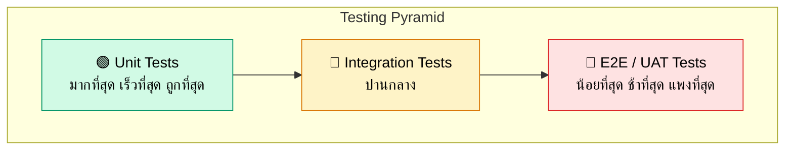
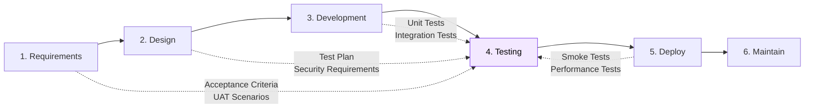
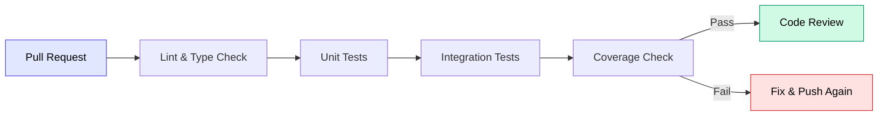

# 6.1 Testing Strategy Overview

> ภาพรวมกลยุทธ์การทดสอบซอฟต์แวร์ตลอดวงจร SDLC

---

## วัตถุประสงค์

กำหนดแนวทางการทดสอบที่ครอบคลุมเพื่อ:
1. **ตรวจจับ Bug ตั้งแต่เนิ่นๆ** — ลดต้นทุนการแก้ไข
2. **รับประกันคุณภาพ** — ระบบทำงานตรงตาม Requirements
3. **สร้างความมั่นใจ** — ทีมและ Stakeholders เชื่อมั่นในระบบ
4. **ป้องกัน Regression** — การแก้ไขจุดหนึ่งไม่ทำให้จุดอื่นพัง
5. **รองรับ Continuous Delivery** — Deploy ได้บ่อยและปลอดภัย

---

## Testing Pyramid



| ระดับ | สัดส่วน | ความเร็ว | ค่าใช้จ่าย | เป้าหมาย |
|:-----:|:-------:|:--------:|:----------:|:---------|
| Unit Tests | 70% | เร็วมาก (ms) | ต่ำ | ทดสอบ function/component แต่ละตัว |
| Integration Tests | 20% | ปานกลาง (s) | ปานกลาง | ทดสอบการทำงานร่วมกันระหว่าง modules |
| E2E / UAT | 10% | ช้า (min) | สูง | ทดสอบ flow ทั้งหมดจากมุม user |

---

## ประเภทการทดสอบที่ครอบคลุม

| ประเภท | เอกสาร | คำอธิบาย | ใครรับผิดชอบ |
|:-------|:-------|:---------|:------------|
| Unit Test | [6.2_Unit_Test_Guide.md](6.2_Unit_Test_Guide.md) | ทดสอบ functions, components, services แยกชิ้น | Developer |
| Integration Test | [6.3_Integration_Test_Guide.md](6.3_Integration_Test_Guide.md) | ทดสอบ API endpoints, database queries, service interactions | Developer |
| Performance Test | [6.4_Performance_Test_Guide.md](6.4_Performance_Test_Guide.md) | ทดสอบ load, stress, response time | Developer / DevOps |
| Security Test | [6.5_Security_Test_Guide.md](6.5_Security_Test_Guide.md) | ทดสอบช่องโหว่ OWASP Top 10, authentication, authorization | Developer / Security |
| UAT | [UAT_Scenario_Template.md](UAT_Scenario_Template.md) | ทดสอบจากมุมผู้ใช้งานจริง | QA / Business User |

---

## Tech Stack สำหรับ Testing

| เครื่องมือ | ใช้สำหรับ | ติดตั้ง |
|:----------|:---------|:--------|
| **Vitest** | Unit Test (Frontend + Backend) | `npm install -D vitest` |
| **React Testing Library** | Component Testing | `npm install -D @testing-library/react @testing-library/jest-dom` |
| **Supertest** | API Integration Test | `npm install -D supertest @types/supertest` |
| **k6** | Performance / Load Test | [k6.io](https://k6.io) |
| **OWASP ZAP** | Security Scanning | [zaproxy.org](https://www.zaproxy.org) |

---

## Testing ในแต่ละ Phase ของ SDLC



| Phase | กิจกรรม Testing |
|:------|:---------------|
| Requirements | เขียน Acceptance Criteria, วางแผน UAT Scenarios |
| Design | กำหนด Security Requirements, วาง Test Plan |
| Development | เขียน Unit Tests + Integration Tests ควบคู่กับ code |
| Testing | รัน Full Test Suite, Performance Test, Security Scan, UAT |
| Deploy | Smoke Test, Post-deploy Verification |
| Maintain | Regression Test, Monitoring & Alerting |

---

## Test Coverage เป้าหมาย

| ประเภท | เป้าหมาย Coverage | หมายเหตุ |
|:-------|:-----------------:|:---------|
| Unit Test (Frontend) | >= 70% | Components, Hooks, Utils |
| Unit Test (Backend) | >= 80% | Services, Controllers, Utils |
| Integration Test (API) | 100% endpoints | ทุก endpoint ต้องมี test อย่างน้อย happy path |
| E2E / UAT | Critical Paths | Login, Core Features, Payment (ถ้ามี) |

---

## Workflow การ Test ในทีม

### 1. ก่อน Push Code

```bash
# รัน unit tests
npm run test

# รัน tests พร้อม coverage
npm run test:coverage
```

### 2. ใน Pull Request (CI)



### 3. ก่อน Release

- รัน Performance Test
- รัน Security Scan
- ทำ UAT กับ Business Users

---

## โครงสร้างไฟล์ Test

```
project/
├── frontend/
│   └── src/
│       ├── components/
│       │   ├── Button.tsx
│       │   └── Button.test.tsx          # Unit test อยู่ข้างๆ component
│       ├── hooks/
│       │   ├── useAuth.ts
│       │   └── useAuth.test.ts
│       ├── services/
│       │   ├── api.ts
│       │   └── api.test.ts
│       └── __tests__/                   # Integration tests
│           └── pages/
│               └── LoginPage.test.tsx
├── backend/
│   └── src/
│       ├── services/
│       │   ├── product.service.ts
│       │   └── product.service.test.ts
│       ├── controllers/
│       │   ├── product.controller.ts
│       │   └── product.controller.test.ts
│       └── __tests__/                   # Integration tests
│           └── api/
│               ├── auth.api.test.ts
│               └── product.api.test.ts
├── tests/
│   ├── performance/                     # k6 scripts
│   │   └── load-test.js
│   └── security/                        # Security test configs
│       └── zap-config.yaml
```

---

## Quality Gates — เงื่อนไขที่ต้องผ่านก่อน Merge/Release

### Gate 1: PR Level (ทุก PR)

| เงื่อนไข | Threshold | ผ่าน CI อัตโนมัติ |
|:---------|:----------|:-----------------|
| Lint & Type-check | 0 errors | ใช่ |
| Unit Test | Pass ทั้งหมด | ใช่ |
| Test Coverage (new code) | >= 70% | ใช่ (ถ้าตั้งค่า) |
| No `console.log` / debug code | 0 | ใช่ (Lint rule) |

> ถ้า Gate 1 ไม่ผ่าน → ห้าม Request Review

### Gate 2: Release Level (ก่อน Deploy)

| เงื่อนไข | Threshold | ใครตรวจ |
|:---------|:----------|:--------|
| Integration Test | Pass ทั้งหมด | CI |
| Performance Test (critical paths) | Response < 2s (P95) | Sr. Engineer |
| Security Scan | 0 Critical findings | Sr. Engineer |
| UAT Sign-off | PM/Stakeholder approve | PM |

> ถ้า Gate 2 ไม่ผ่าน → ห้าม Deploy to Production

---

## KPI เป้าหมายด้าน Quality

| Metric | Target | ช่วงวัด |
|:-------|:-------|:--------|
| **Test Coverage (Frontend)** | >= 70% | ทุก Sprint |
| **Test Coverage (Backend)** | >= 80% | ทุก Sprint |
| **Escaped Defects** | ลดลงเทียบไตรมาสก่อน | รายไตรมาส |
| **CI Pass Rate** | >= 90% | รายสัปดาห์ |
| **Critical Bug Resolution Time** | < 24 ชม. | ต่อเนื่อง |

> **Escaped Defects** = Bug ที่หลุดไปถึง Production โดยไม่ถูกจับจาก Test
> เป้าหมาย: ลดจำนวนลงทุกไตรมาสโดยเพิ่ม Test Automation ใน critical paths

---

## Best Practices

### DO's
- เขียน test **ควบคู่กับ code** (ไม่ใช่เขียนทีหลัง)
- ใช้ **Arrange-Act-Assert** pattern
- ตั้งชื่อ test ให้ **อธิบายพฤติกรรมที่คาดหวัง**
- Mock เฉพาะ **external dependencies** (API, Database)
- รัน tests **ก่อนทุก commit** (ใช้ git hooks)
- ดู **coverage report** เป็นประจำ

### DON'Ts
- อย่าเขียน test ที่ **ขึ้นอยู่กับ test อื่น** (ต้อง independent)
- อย่า test **implementation details** (test behavior แทน)
- อย่า **ignore failing tests** — แก้ไขหรือลบออก
- อย่าเขียน test ที่ **ช้าเกินไป** ใน unit test suite
- อย่า **hardcode** test data ที่เปลี่ยนได้ (เช่น วันที่ปัจจุบัน)

---

## เอกสารที่เกี่ยวข้อง

- [Acceptance Criteria](../01_REQUIREMENTS/1.3_Acceptance_Criteria.md) — เกณฑ์การรับงาน
- [Code Standard Guide](../04_DEVELOPMENT/Code_Standard_Guide.md) — มาตรฐานโค้ด
- [Post-Deploy Verification](../05_DEPLOY/5.5_Post_Deploy_Verification.md) — ตรวจสอบหลัง Deploy

---

[กลับไปหน้า INDEX](INDEX.md) | [กลับไปหน้าหลัก](../../README.md)
