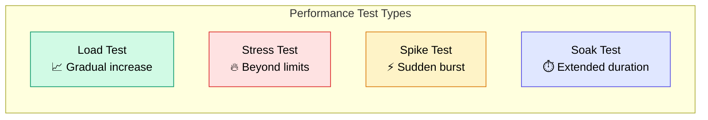

# 6.4 Performance Test Guide

> แนวทางการทดสอบประสิทธิภาพระบบด้วย k6

---

## วัตถุประสงค์

Performance Test คือการทดสอบว่าระบบ **รับโหลดได้ตามที่คาดหวัง** เพื่อ:
1. วัด **Response Time** ภายใต้โหลดจริง
2. หา **จุดแตกหัก** (Breaking Point) ของระบบ
3. ตรวจสอบว่าระบบ **scale** ได้ตามต้องการ
4. ระบุ **bottleneck** ก่อน deploy production

---

## ประเภทของ Performance Test

| ประเภท | เป้าหมาย | รูปแบบ |
|:-------|:---------|:-------|
| **Load Test** | ระบบรับ traffic ปกติได้ไหม | เพิ่ม users ขึ้นเรื่อยๆ จนถึงเป้าหมาย |
| **Stress Test** | ระบบรับ traffic เกินปกติได้ไหม | เพิ่ม users เกินเป้าหมาย 2-3 เท่า |
| **Spike Test** | ระบบรับ traffic กระชากได้ไหม | เพิ่ม users ขึ้นฉับพลัน |
| **Soak Test** | ระบบทำงานนานๆ มี memory leak ไหม | รัน load ปกติเป็นเวลานาน (1-8 ชม.) |



---

## เครื่องมือ: k6

| รายการ | รายละเอียด |
|:-------|:----------|
| **k6** | Open-source load testing tool จาก Grafana Labs |
| **ภาษา** | JavaScript (ES6) |
| **ติดตั้ง** | `brew install k6` (macOS) หรือ [k6.io/docs/get-started](https://k6.io/docs/get-started/installation/) |
| **ข้อดี** | เร็ว, ใช้ resource น้อย, เขียนเป็น code, รองรับ CI/CD |

### ทำไมเลือก k6

| เครื่องมือ | ภาษา | Open Source | CI/CD | เหมาะกับ |
|:----------|:-----|:----------:|:-----:|:---------|
| **k6** | JavaScript | ✅ | ✅ | Developer-first, API testing |
| JMeter | Java/XML | ✅ | ⚠️ | Enterprise, GUI-based |
| Locust | Python | ✅ | ✅ | Python teams |
| Artillery | JavaScript | ✅ | ✅ | Serverless, simple scenarios |
| Gatling | Scala | ✅ | ✅ | High-performance simulation |

---

## การตั้งค่า

### ติดตั้ง k6

```bash
# macOS
brew install k6

# Windows (chocolatey)
choco install k6

# Linux (Debian/Ubuntu)
sudo gpg -k
sudo gpg --no-default-keyring --keyring /usr/share/keyrings/k6-archive-keyring.gpg --keyserver hkp://keyserver.ubuntu.com:80 --recv-keys C5AD17C747E3415A3642D57D77C6C491D6AC1D69
echo "deb [signed-by=/usr/share/keyrings/k6-archive-keyring.gpg] https://dl.k6.io/deb stable main" | sudo tee /etc/apt/sources.list.d/k6.list
sudo apt-get update
sudo apt-get install k6

# Docker
docker run --rm -i grafana/k6 run - <script.js
```

### โครงสร้างไฟล์

```
tests/
└── performance/
    ├── load-test.js          # Load test หลัก
    ├── stress-test.js        # Stress test
    ├── spike-test.js         # Spike test
    ├── helpers/
    │   └── auth.js           # Helper สำหรับ login
    └── config/
        └── thresholds.js     # เกณฑ์ที่ยอมรับได้
```

---

## ตัวอย่าง: Load Test Scripts

### 1. Basic Load Test

**`tests/performance/load-test.js`**

```javascript
import http from 'k6/http';
import { check, sleep } from 'k6';

// ==============================
// Configuration
// ==============================
export const options = {
  stages: [
    { duration: '1m', target: 20 },   // Ramp up: 0 → 20 users ใน 1 นาที
    { duration: '3m', target: 20 },   // Stay: 20 users เป็นเวลา 3 นาที
    { duration: '1m', target: 0 },    // Ramp down: 20 → 0 users ใน 1 นาที
  ],
  thresholds: {
    http_req_duration: ['p(95)<500'],  // 95% ของ requests ต้อง < 500ms
    http_req_failed: ['rate<0.01'],    // Error rate ต้อง < 1%
    http_reqs: ['rate>10'],            // Throughput ต้อง > 10 req/s
  },
};

const BASE_URL = __ENV.BASE_URL || 'http://localhost:5001';

// ==============================
// Test Scenarios
// ==============================
export default function () {
  // 1. Health Check
  const healthRes = http.get(`${BASE_URL}/api/health`);
  check(healthRes, {
    'health check status is 200': (r) => r.status === 200,
  });

  // 2. List Products
  const productsRes = http.get(`${BASE_URL}/api/products`);
  check(productsRes, {
    'products status is 200': (r) => r.status === 200,
    'products returns array': (r) => JSON.parse(r.body).data.length > 0,
    'products response time < 300ms': (r) => r.timings.duration < 300,
  });

  // 3. Get Single Product
  const productRes = http.get(`${BASE_URL}/api/products/prod-1`);
  check(productRes, {
    'product status is 200': (r) => r.status === 200,
    'product has name': (r) => JSON.parse(r.body).data.name !== '',
  });

  sleep(1); // จำลอง think time ของ user จริง
}
```

### 2. Authentication Load Test

**`tests/performance/auth-load-test.js`**

```javascript
import http from 'k6/http';
import { check, sleep, group } from 'k6';

export const options = {
  stages: [
    { duration: '30s', target: 10 },
    { duration: '2m', target: 10 },
    { duration: '30s', target: 0 },
  ],
  thresholds: {
    'http_req_duration{name:login}': ['p(95)<1000'],
    'http_req_duration{name:get_products}': ['p(95)<500'],
    http_req_failed: ['rate<0.05'],
  },
};

const BASE_URL = __ENV.BASE_URL || 'http://localhost:5001';

export default function () {
  let token;

  group('Authentication Flow', () => {
    // Login
    const loginRes = http.post(
      `${BASE_URL}/api/auth/login`,
      JSON.stringify({
        email: 'test@example.com',
        password: 'TestP@ss123',
      }),
      {
        headers: { 'Content-Type': 'application/json' },
        tags: { name: 'login' },
      }
    );

    check(loginRes, {
      'login successful': (r) => r.status === 200,
      'login returns token': (r) => JSON.parse(r.body).token !== '',
    });

    token = JSON.parse(loginRes.body).token;
  });

  group('Authenticated API Calls', () => {
    // Get Products with Auth
    const productsRes = http.get(`${BASE_URL}/api/products`, {
      headers: { Authorization: `Bearer ${token}` },
      tags: { name: 'get_products' },
    });

    check(productsRes, {
      'products status 200': (r) => r.status === 200,
    });

    // Create Product
    const createRes = http.post(
      `${BASE_URL}/api/products`,
      JSON.stringify({
        name: `Perf Test Product ${Date.now()}`,
        price: Math.floor(Math.random() * 1000),
        category_id: 'cat-1',
      }),
      {
        headers: {
          'Content-Type': 'application/json',
          Authorization: `Bearer ${token}`,
        },
        tags: { name: 'create_product' },
      }
    );

    check(createRes, {
      'create product status 201': (r) => r.status === 201,
    });
  });

  sleep(1);
}
```

### 3. Stress Test

**`tests/performance/stress-test.js`**

```javascript
import http from 'k6/http';
import { check, sleep } from 'k6';

export const options = {
  stages: [
    { duration: '2m', target: 50 },    // Ramp up ไป 50 users
    { duration: '5m', target: 50 },    // Hold 50 users
    { duration: '2m', target: 100 },   // Ramp up ไป 100 users
    { duration: '5m', target: 100 },   // Hold 100 users
    { duration: '2m', target: 200 },   // Ramp up ไป 200 users (stress)
    { duration: '5m', target: 200 },   // Hold 200 users
    { duration: '5m', target: 0 },     // Ramp down
  ],
  thresholds: {
    http_req_duration: ['p(99)<2000'],  // 99% ต้อง < 2s
    http_req_failed: ['rate<0.10'],     // Error rate < 10%
  },
};

const BASE_URL = __ENV.BASE_URL || 'http://localhost:5001';

export default function () {
  const res = http.get(`${BASE_URL}/api/products`);

  check(res, {
    'status is 200': (r) => r.status === 200,
    'response time < 2s': (r) => r.timings.duration < 2000,
  });

  sleep(0.5);
}
```

### 4. Spike Test

**`tests/performance/spike-test.js`**

```javascript
import http from 'k6/http';
import { check, sleep } from 'k6';

export const options = {
  stages: [
    { duration: '30s', target: 10 },   // ปกติ
    { duration: '10s', target: 200 },   // Spike! กระชากขึ้น 200
    { duration: '1m', target: 200 },    // Hold spike
    { duration: '10s', target: 10 },    // กลับสู่ปกติ
    { duration: '1m', target: 10 },     // Recovery
    { duration: '30s', target: 0 },     // Ramp down
  ],
  thresholds: {
    http_req_duration: ['p(95)<3000'],
    http_req_failed: ['rate<0.15'],
  },
};

const BASE_URL = __ENV.BASE_URL || 'http://localhost:5001';

export default function () {
  const res = http.get(`${BASE_URL}/api/products`);

  check(res, {
    'status is 200 or 429': (r) => r.status === 200 || r.status === 429,
  });

  sleep(0.3);
}
```

---

## การรัน Tests

```bash
# รัน Load Test
k6 run tests/performance/load-test.js

# รันพร้อมกำหนด environment
k6 run --env BASE_URL=https://api.example.com tests/performance/load-test.js

# รันพร้อม output เป็น JSON
k6 run --out json=results.json tests/performance/load-test.js

# รันพร้อม HTML report (ใช้ k6-reporter)
k6 run --out json=results.json tests/performance/load-test.js
# แล้วใช้ k6-html-reporter แปลงเป็น HTML
```

---

## เกณฑ์ที่ยอมรับได้ (Thresholds)

### Web Application ทั่วไป

| Metric | เกณฑ์ | คำอธิบาย |
|:-------|:------|:---------|
| **p(95) Response Time** | < 500ms | 95% ของ requests ตอบกลับภายใน 500ms |
| **p(99) Response Time** | < 1000ms | 99% ของ requests ตอบกลับภายใน 1s |
| **Error Rate** | < 1% | Error ต้องน้อยกว่า 1% |
| **Throughput** | > 10 req/s | ระบบรับได้อย่างน้อย 10 requests ต่อวินาที |
| **Availability** | > 99.9% | ระบบพร้อมใช้งาน 99.9% |

### สำหรับ Kaizen Web Application

| Scenario | Concurrent Users | Expected Response Time |
|:---------|:----------------:|:----------------------|
| Normal Load | 20 | p(95) < 500ms |
| Peak Load | 50 | p(95) < 1000ms |
| Stress | 100 | p(95) < 2000ms |

---

## การอ่านผลลัพธ์

```
✓ status is 200 .......................... 99.85%
✓ response time < 300ms .................. 96.20%

     checks.........................: 98.02% ✓ 5892  ✗ 119
     data_received..................: 12 MB  156 kB/s
     data_sent......................: 1.2 MB 15 kB/s
     http_req_blocked...............: avg=1.2ms  p(95)=3.5ms
     http_req_connecting............: avg=0.8ms  p(95)=2.1ms
   ✓ http_req_duration..............: avg=125ms  p(95)=280ms  p(99)=450ms
   ✓ http_req_failed................: 0.15%  ✓ 5991  ✗ 9
     http_req_receiving.............: avg=0.5ms  p(95)=1.2ms
     http_req_sending...............: avg=0.1ms  p(95)=0.3ms
     http_req_waiting...............: avg=124ms  p(95)=279ms
     http_reqs......................: 6000   77.92/s
     vus............................: 1      min=1   max=20
     vus_max........................: 20     min=20  max=20
```

| Metric | ความหมาย |
|:-------|:---------|
| `http_req_duration` | เวลาทั้งหมดตั้งแต่ส่ง request ถึงได้ response |
| `p(95)` | 95th percentile — 95% ของ requests เร็วกว่าค่านี้ |
| `http_req_failed` | เปอร์เซ็นต์ของ requests ที่ล้มเหลว |
| `http_reqs` | จำนวน requests ทั้งหมด + throughput (/s) |
| `vus` | Virtual Users ที่กำลังรันอยู่ |

---

## Checklist

### ก่อนรัน Performance Test
- [ ] ระบบ deploy บน environment ที่ใกล้เคียง production
- [ ] Database มี seed data ที่สมจริง (ไม่ใช่แค่ 2-3 records)
- [ ] ปิด rate limiting ชั่วคราว (หรือตั้งค่าให้เหมาะกับ test)
- [ ] Monitoring tools พร้อม (CPU, Memory, DB connections)

### หลังรัน Performance Test
- [ ] Response time ผ่านเกณฑ์
- [ ] Error rate ผ่านเกณฑ์
- [ ] ไม่มี memory leak (สำหรับ soak test)
- [ ] บันทึกผลลัพธ์และเปรียบเทียบกับ baseline
- [ ] สร้าง issue สำหรับ bottleneck ที่พบ

---

## Best Practices

### DO's
- รัน performance test บน **environment ที่ใกล้เคียง production**
- ใช้ **realistic data** (seed data จำนวนมาก)
- เพิ่ม **think time** (`sleep`) เพื่อจำลอง user จริง
- บันทึก **baseline** ก่อนทำ optimization
- รัน test **ซ้ำหลายครั้ง** เพื่อดูความ consistent

### DON'Ts
- อย่ารันบน **localhost** แล้วอ้าง production performance
- อย่ารันจาก **network ที่ช้า** (ใช้ server ใกล้ target)
- อย่ารัน **stress test** บน shared staging ที่คนอื่นใช้อยู่
- อย่า **ข้ามข้อผิดพลาด** ที่เกิดขึ้นระหว่าง test
- อย่ารัน performance test บน **production** โดยไม่แจ้งทีม

---

## เอกสารที่เกี่ยวข้อง

- [6.1 Testing Strategy Overview](6.1_Testing_Strategy_Overview.md) — ภาพรวมกลยุทธ์การทดสอบ
- [5.1 Deploy Overview](../05_DEPLOY/5.1_Deploy_Overview.md) — สถาปัตยกรรมระบบ
- [5.6 Troubleshooting](../05_DEPLOY/5.6_Troubleshooting.md) — แก้ปัญหา

---

[กลับไปหน้า INDEX](INDEX.md) | [กลับไปหน้าหลัก](../../README.md)
