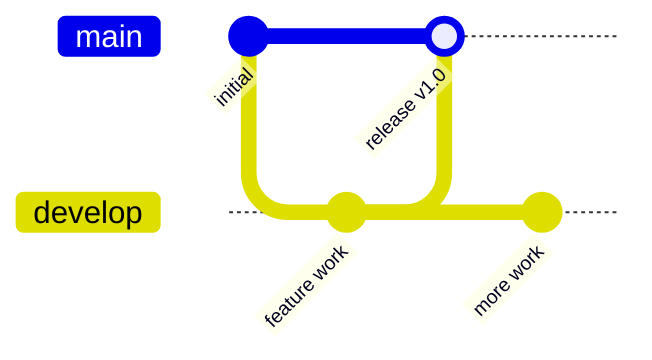
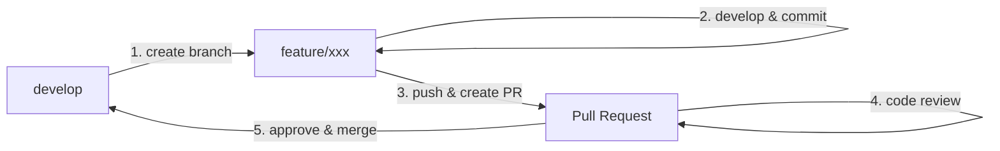
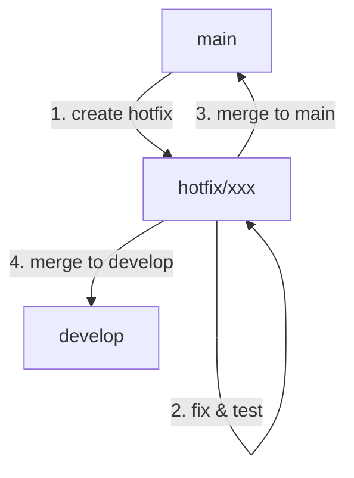

# 7.1 Branching Strategy - กลยุทธ์การจัดการ Branch

## ภาพรวม

เอกสารนี้อธิบายวิธีการจัดการ Branch ใน Git เพื่อให้ทีมทำงานร่วมกันได้อย่างมีประสิทธิภาพ

---

## 📋 สารบัญ

1. [Branch Types](#branch-types)
2. [Branch Naming Convention](#branch-naming-convention)
3. [Workflow](#workflow)
4. [Best Practices](#best-practices)

---

## Branch Types

### Main Branches (Protected)



| Branch | วัตถุประสงค์ | Protected |
|--------|-------------|-----------|
| `main` | Production-ready code | ✅ Yes |
| `develop` | Development integration | ✅ Yes |

### Supporting Branches

| Branch Type | Pattern | ใช้สำหรับ | Merge To |
|-------------|---------|----------|----------|
| **Feature** | `feature/*` | พัฒนา feature ใหม่ | `develop` |
| **Bugfix** | `bugfix/*` | แก้ bug ใน develop | `develop` |
| **Hotfix** | `hotfix/*` | แก้ bug ด่วนใน production | `main` → `develop` |
| **Release** | `release/*` | เตรียม release | `main` → `develop` |

---

## Branch Naming Convention

### รูปแบบ

```
<type>/<ticket-id>-<short-description>
```

### ตัวอย่าง

| Type | ตัวอย่าง |
|------|---------|
| Feature | `feature/KZN-123-user-authentication` |
| Bugfix | `bugfix/KZN-456-fix-login-error` |
| Hotfix | `hotfix/KZN-789-critical-security-patch` |
| Release | `release/v1.2.0` |

### กฎการตั้งชื่อ

- ✅ ใช้ **lowercase** ทั้งหมด
- ✅ ใช้ **hyphen (-)** แทน space
- ✅ ใส่ **ticket ID** (ถ้ามี)
- ✅ ชื่อสั้น กระชับ **2-5 คำ**
- ❌ ห้ามใช้ภาษาไทย
- ❌ ห้ามใช้ special characters

---

## Workflow

### Feature Development Flow



### ขั้นตอน

#### 1. สร้าง Feature Branch

```bash
# อัปเดต develop ล่าสุด
git checkout develop
git pull origin develop

# สร้าง feature branch
git checkout -b feature/KZN-123-user-login
```

#### 2. พัฒนาและ Commit

```bash
# ทำงานและ commit
git add .
git commit -m "feat(auth): add login form component"

# commit เพิ่มเติม
git commit -m "feat(auth): add form validation"
```

#### 3. Push และสร้าง PR

```bash
# push branch ขึ้น remote
git push -u origin feature/KZN-123-user-login

# สร้าง Pull Request บน GitHub
```

#### 4. Code Review & Merge

- รอ reviewer approve
- แก้ไขตาม feedback
- Merge เมื่อได้ approval

---

### Hotfix Flow



```bash
# สร้าง hotfix จาก main
git checkout main
git pull origin main
git checkout -b hotfix/KZN-999-fix-critical-bug

# แก้ไขและ commit
git commit -m "fix(auth): patch security vulnerability"

# Merge กลับ main และ develop
# (ผ่าน Pull Request)
```

---

## Branch Protection Rules

### main branch

| Rule | ค่า |
|------|-----|
| Require PR before merge | ✅ Yes |
| Require approvals | 1-2 คน |
| Require status checks | ✅ CI must pass |
| Include administrators | ✅ Yes |
| Allow force push | ❌ No |
| Allow deletions | ❌ No |

### develop branch

| Rule | ค่า |
|------|-----|
| Require PR before merge | ✅ Yes |
| Require approvals | 1 คน |
| Require status checks | ✅ CI must pass |

---

## Best Practices

### ✅ ควรทำ

1. **Pull ก่อนสร้าง branch ใหม่**
   ```bash
   git checkout develop
   git pull origin develop
   git checkout -b feature/xxx
   ```

2. **Commit บ่อยๆ** - เป็น checkpoint เล็กๆ

3. **Rebase เพื่ออัปเดต branch**
   ```bash
   git checkout feature/xxx
   git fetch origin
   git rebase origin/develop
   ```

4. **ลบ branch หลัง merge**
   ```bash
   git branch -d feature/xxx
   git push origin --delete feature/xxx
   ```

5. **ใช้ meaningful branch names**

### ❌ ไม่ควรทำ

1. **อย่า commit ลง main/develop โดยตรง**
2. **อย่า force push ไปที่ protected branches**
3. **อย่าสร้าง branch ยาวเกินไป** - merge บ่อยๆ
4. **อย่าลืม pull ก่อนเริ่มงาน**

---

## Quick Reference

### คำสั่งที่ใช้บ่อย

```bash
# ดู branches ทั้งหมด
git branch -a

# สร้าง branch ใหม่
git checkout -b <branch-name>

# สลับ branch
git checkout <branch-name>

# ลบ branch (local)
git branch -d <branch-name>

# ลบ branch (remote)
git push origin --delete <branch-name>

# อัปเดต branch list
git fetch --prune
```

---

## ดูเพิ่มเติม

- [7.2 Commit Message Convention](7.2_Commit_Message_Convention.md)
- [7.3 Pull Request Process](7.3_Pull_Request_Process.md)
- [7.4 Code Review Guidelines](7.4_Code_Review_Guidelines.md)

---

*อัปเดตล่าสุด: 29 มกราคม 2026*
