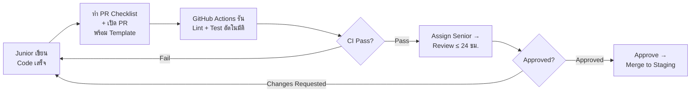
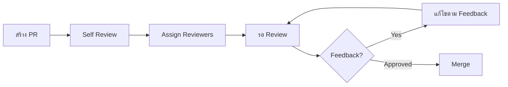

# 7.3 Pull Request Process - กระบวนการ Pull Request

## ภาพรวม

เอกสารนี้อธิบายขั้นตอนการสร้าง Pull Request (PR) ตั้งแต่เริ่มจนถึง merge เพื่อให้การทำงานร่วมกันเป็นระบบ

---

## 📋 สารบัญ

1. [PR Workflow](#pr-workflow)
2. [การสร้าง PR](#การสร้าง-pr)
3. [PR Template](#pr-template)
4. [Review Process](#review-process)
5. [Merge Strategy](#merge-strategy)

---

## Definition of Ready (DoR) — พร้อมก่อนเริ่ม Code

ก่อนที่ Junior จะเริ่มเขียน Code ต้องมั่นใจว่า Ticket มีข้อมูลครบ:

- [ ] มี **User Story** หรือ **Task Description** ที่ชัดเจน
- [ ] มี **Acceptance Criteria** ระบุผลลัพธ์ที่คาดหวัง
- [ ] มี **Figma/Wireframe** ลิงก์ (ถ้าเป็นงาน UI)
- [ ] มี **API Spec** หรือ **Schema** ที่เกี่ยวข้อง (ถ้ามี)
- [ ] Senior ได้ **Break down** task ให้ทำได้ใน 1-3 วันแล้ว
- [ ] ประเมิน **Story Points / Time Estimate** ร่วมกันแล้ว

> ถ้า Ticket ยังไม่ผ่าน DoR → ห้ามเริ่ม Code ให้แจ้ง PM หรือ Senior ก่อน

---

## Definition of Done (DoD) — เสร็จจริงก่อน Merge

PR จะถือว่า "Done" ได้ต้องผ่านทุกข้อ:

- [ ] Code ทำงานตาม **Acceptance Criteria** ครบทุกข้อ
- [ ] **Unit Test** เขียนแล้ว สำหรับ logic ใหม่
- [ ] **CI ผ่าน** (Lint + Type-check + Tests)
- [ ] **Senior Review** ผ่าน ไม่มี MUST comment ค้าง
- [ ] **Asana Task** ลิงก์อยู่ใน PR Description
- [ ] **Documentation** อัปเดตแล้ว (ถ้ามี API/Flow ใหม่)

---

## Traceability — ทุก Change ต้อง Trace ได้

ทุกการเปลี่ยนแปลงต้องติดตามกลับไปยังต้นทางได้:

```
Asana Task → Branch Name → Commit Messages → PR → Release
```

| จุดตรวจ | สิ่งที่ต้องทำ |
|---------|-------------|
| **Branch** | ตั้งชื่อตาม Asana Task ID: `feature/1234567890-add-login` |
| **Commit** | ใส่ scope ใน commit: `feat(auth): add login form` |
| **PR Description** | ใส่ลิงก์ Asana Task ทุกครั้ง |
| **Release Notes** | ระบุ PR numbers ที่รวมอยู่ใน release |

---

## PR Workflow



---

## PR Checklist ก่อนขอ Review

ก่อน Request Review ทุกครั้ง Junior ต้องตรวจสอบให้ครบ:

- [ ] Lint และ Type-check ผ่าน
- [ ] Test ผ่านทั้งหมด
- [ ] ไม่มี `console.log` ค้างไว้
- [ ] ไม่มี Hardcode (ใช้ Env Variable)
- [ ] เขียน Unit Test สำหรับ Logic ใหม่แล้ว
- [ ] กรอก PR Template ครบทุกหัวข้อ

---

## สิ่งที่ห้ามทำใน PR

| ❌ ห้ามทำ | เหตุผล |
|-----------|--------|
| เปิด PR ใหญ่เกิน 500 lines โดยไม่แจ้ง | ยากต่อการ review, เสี่ยงต่อ bug |
| Merge PR ตัวเอง แม้จะ Approve แล้ว | ต้องให้ Senior เป็นคน merge |
| Force push บน branch ที่มีคน Review อยู่ | จะทำให้ review context หายหมด |

---

## การสร้าง PR

### ขั้นตอน

#### 1. ตรวจสอบ Branch ก่อน Push

```bash
# ตรวจสอบว่าอยู่ branch ถูกต้อง
git branch

# ดู commits ที่จะ push
git log origin/develop..HEAD --oneline

# ตรวจสอบ changes
git diff origin/develop
```

#### 2. Push Branch

```bash
git push -u origin feature/KZN-123-user-login
```

#### 3. สร้าง PR บน GitHub

1. ไปที่ Repository บน GitHub
2. คลิก "Compare & pull request"
3. เลือก base branch (`develop`)
4. กรอกข้อมูลตาม Template
5. คลิก "Create pull request"

---

## PR Template

### Title Format

```
<type>(<scope>): <short description> [#ticket-id]
```

**ตัวอย่าง:**
- `feat(auth): add Google OAuth login [#KZN-123]`
- `fix(api): resolve null pointer exception [#KZN-456]`

### Description Template

```markdown
## Summary
<!-- สรุปสิ่งที่ทำใน PR นี้ 1-3 bullet points -->
- เพิ่ม feature X
- แก้ไข bug Y

## Changes
<!-- รายละเอียดการเปลี่ยนแปลง -->
- เพิ่มไฟล์ `src/components/Login.tsx`
- แก้ไข `src/services/auth.ts`

## Screenshots (ถ้ามี)
<!-- แนบภาพหน้าจอสำหรับ UI changes -->

## Testing
<!-- วิธีทดสอบ PR นี้ -->
- [ ] Unit tests pass
- [ ] Manual testing done
- [ ] Tested on mobile

## Checklist
- [ ] Code follows style guidelines
- [ ] Self-reviewed my code
- [ ] Added necessary comments
- [ ] Updated documentation
- [ ] No new warnings

## Asana Task
<!-- ใส่ลิงก์ Asana Task ไว้ใน PR Description ทุกครั้ง -->
- Asana Task: [ลิงก์ Asana Task]

## Related Issues
<!-- ลิงก์ไปยัง issues ที่เกี่ยวข้อง -->
Closes #123
Refs #456
```

---

## PR Size Guidelines

### ขนาด PR ที่เหมาะสม

| Size | Lines Changed | Review Time | แนะนำ |
|------|---------------|-------------|-------|
| 🟢 Small | < 200 | 15-30 นาที | ✅ ดีที่สุด |
| 🟡 Medium | 200-400 | 30-60 นาที | ✅ OK |
| 🟠 Large | 400-800 | 1-2 ชม. | ⚠️ ควรแยก |
| 🔴 X-Large | > 800 | 2+ ชม. | ❌ แยก PR |

### วิธีลดขนาด PR

1. **แยกตาม feature** - หนึ่ง PR = หนึ่ง feature
2. **แยก refactoring** - PR แยกสำหรับ refactor
3. **แยก tests** - อาจทำ PR สำหรับ tests ก่อน

---

## Review Process

### สำหรับ Author (ผู้สร้าง PR)



1. **Self-review** ก่อนขอ review
2. **Assign reviewers** - เลือก 1-2 คน
3. **Respond to feedback** - ตอบและแก้ไขอย่างรวดเร็ว
4. **Re-request review** หลังแก้ไข

### สำหรับ Reviewer

1. **Review ภายใน 24-48 ชม.**
2. **ให้ feedback ที่ constructive**
3. **Approve เมื่อพร้อม merge**

---

## Review Checklist

### Functionality
- [ ] Code ทำงานตาม requirements
- [ ] Edge cases ถูก handle
- [ ] Error handling เหมาะสม

### Code Quality
- [ ] อ่านง่าย เข้าใจง่าย
- [ ] ไม่มี duplicate code
- [ ] Naming ชัดเจน

### Performance
- [ ] ไม่มี performance issues
- [ ] Queries มีประสิทธิภาพ

### Security
- [ ] ไม่มี security vulnerabilities
- [ ] Input validation ครบ
- [ ] ไม่ expose sensitive data

### Testing
- [ ] มี tests ครอบคลุม
- [ ] Tests pass ทั้งหมด

---

## Merge Strategy

### Merge Options

| Strategy | ใช้เมื่อ | ผลลัพธ์ |
|----------|---------|---------|
| **Merge Commit** | Default | สร้าง merge commit |
| **Squash & Merge** | หลาย commits เล็กๆ | รวมเป็น 1 commit |
| **Rebase & Merge** | ต้องการ linear history | ไม่มี merge commit |

### แนะนำ: Squash & Merge

```
feature branch:  A - B - C - D
                              ↓ squash
develop:         X - Y - Z - ABCD
```

- รวม commits เป็น 1 commit ที่ clean
- History อ่านง่าย
- Revert ง่าย

---

## After Merge

### Cleanup

```bash
# ลบ local branch
git branch -d feature/KZN-123-user-login

# ลบ remote branch (ถ้าไม่ได้ตั้งค่า auto-delete)
git push origin --delete feature/KZN-123-user-login

# อัปเดต local
git checkout develop
git pull origin develop
```

### อัปเดต Ticket

- เปลี่ยนสถานะ ticket เป็น "Done" หรือ "Ready for QA"
- ใส่ลิงก์ PR ใน ticket

---

## Best Practices

### ✅ ควรทำ

1. **สร้าง Draft PR** ตั้งแต่เริ่มงาน (สำหรับ visibility)
2. **อัปเดต PR description** ให้ครบถ้วน
3. **Respond to reviews** อย่างรวดเร็ว
4. **Keep PRs small** - ง่ายต่อการ review
5. **Test ก่อน request review**

### ❌ ไม่ควรทำ

1. **Merge โดยไม่มี approval** (ยกเว้น hotfix ด่วนมาก)
2. **Ignore CI failures**
3. **Force push** หลังมีคน review แล้ว
4. **สร้าง PR ใหญ่เกินไป**

---

## Quick Commands

```bash
# สร้าง PR ด้วย gh CLI
gh pr create --title "feat: add login" --body "Description here"

# ดู PR list
gh pr list

# Checkout PR ของคนอื่น
gh pr checkout 123

# Merge PR
gh pr merge 123 --squash

# ดู PR status
gh pr status
```

---

## ดูเพิ่มเติม

- [7.1 Branching Strategy](7.1_Branching_Strategy.md)
- [7.2 Commit Message Convention](7.2_Commit_Message_Convention.md)
- [7.4 Code Review Guidelines](7.4_Code_Review_Guidelines.md)

---

*อัปเดตล่าสุด: 1 เมษายน 2026*
