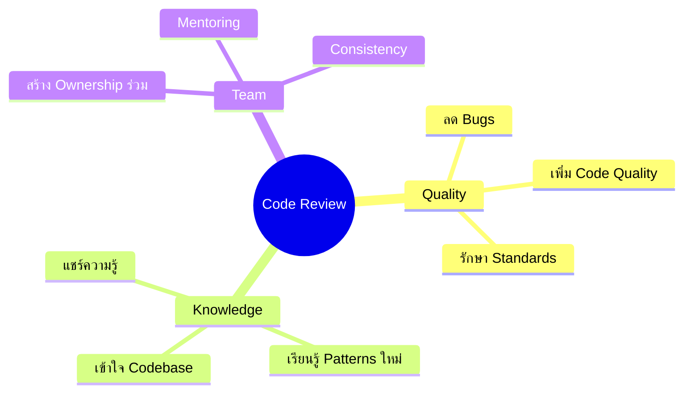
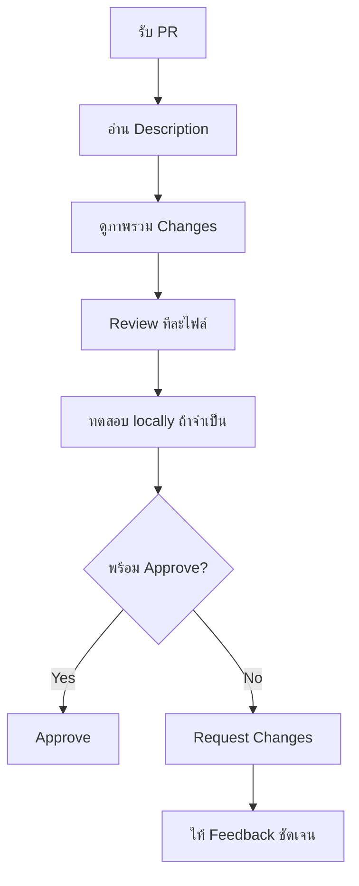

# 7.4 Code Review Guidelines - แนวทางการ Review Code

## ภาพรวม

เอกสารนี้กำหนดแนวทางการ Review Code เพื่อให้การ review มีประสิทธิภาพ สร้างสรรค์ และช่วยพัฒนาทีม

---

## 📋 สารบัญ

1. [หลักการ Code Review](#หลักการ-code-review)
2. [สำหรับ Reviewer](#สำหรับ-reviewer)
3. [สำหรับ Author](#สำหรับ-author)
4. [Review Checklist](#review-checklist)
5. [Communication Guidelines](#communication-guidelines)

---

## หลักการ Code Review

### ทำไมต้อง Code Review?



### Core Principles

> *"วิจารณ์ที่ code ไม่ใช่คน ให้ feedback พร้อมทางออกเสมอ"*

| หลักการ | คำอธิบาย |
|---------|----------|
| **Respectful** | ให้ความเคารพซึ่งกันและกัน |
| **Constructive** | ให้ feedback ที่สร้างสรรค์ |
| **Timely** | Review ภายใน 24 ชม. |
| **Thorough** | Review อย่างละเอียด แต่ไม่ nitpick |

---

## สำหรับ Reviewer

### Review Process



### ขั้นตอนการ Review

#### 1. เข้าใจ Context

- อ่าน PR description
- ดู related issues/tickets
- เข้าใจ "ทำไม" ก่อน "อะไร"

#### 2. Review ภาพรวม

- Architecture เหมาะสมหรือไม่
- แนวทางถูกต้องหรือไม่
- ขาดอะไรที่สำคัญหรือไม่

#### 3. Review รายละเอียด

- Logic ถูกต้อง
- Edge cases
- Error handling
- Code style

#### 4. ทดสอบ (ถ้าจำเป็น)

```bash
# Checkout PR
gh pr checkout 123

# ทดสอบ locally
npm run dev
npm test
```

---

### 4 ระดับของ Comment

| ระดับ | ความหมาย | การจัดการ |
|-------|---------|----------|
| **MUST** | bug, security issue, logic ผิด | ต้องแก้ก่อน merge |
| **SHOULD** | ควรแก้ แต่อธิบายเหตุผลได้ก็โอเค | พิจารณาแก้ |
| **NIT** | เรื่องเล็กน้อย naming, style | แล้วแต่ |
| **LEARN** | แชร์ความรู้ ไม่ต้องแก้อะไร | แล้วแต่ |

### สิ่งที่ Senior ต้อง Review ทุกครั้ง

- [ ] **Logic** ถูกต้อง ครบทุก edge case ไม่พังง่าย
- [ ] **Security issue** เช่น SQL injection, exposed secret
- [ ] **Readability** อ่านเข้าใจได้โดยไม่ต้องอธิบายเพิ่ม
- [ ] **Test Coverage** มี unit test เพียงพอและครอบคลุม
- [ ] **Standard** ตรงกับ coding standard ของทีม

### ตัวอย่าง Feedback

#### แบบที่ผิด ❌

```
"Code อ่านไม่รู้เรื่อง เขียนอะไรมาครับเนี่ย"
```

#### แบบที่ถูก ✅

```
"ถ้า user เป็น null บรรทัดนี้จะ crash ครับ"
```

### Feedback Types อื่นๆ ที่ใช้ได้

| Type | Icon | ใช้เมื่อ |
|------|------|---------|
| **Blocker** | 🚫 | ต้องแก้ก่อน merge |
| **Suggestion** | 💡 | แนะนำ แต่ไม่บังคับ |
| **Question** | ❓ | ต้องการความชัดเจน |
| **Praise** | 👍 | ชมเชย code ที่ดี |

---

## สำหรับ Author

### ก่อน Request Review

- [ ] Self-review code ของตัวเอง
- [ ] Tests pass ทั้งหมด
- [ ] PR description ครบถ้วน
- [ ] ไม่มี console.log หรือ debug code
- [ ] ไม่มี commented code ที่ไม่จำเป็น

### การ Respond to Feedback

#### ✅ ดี

```markdown
> Consider using early return here

Good point! Updated in commit abc1234.
```

```markdown
> Why not use the existing helper function?

I considered it, but the existing function doesn't handle
the edge case where X is null. I can extract this to a
new helper if you prefer?
```

#### ❌ ไม่ดี

```markdown
> Consider using early return here

No.
```

```markdown
> This could cause a bug

It works on my machine.
```

---

## Review Checklist

### 🔍 Functionality

- [ ] Code ทำงานตาม requirements
- [ ] Edge cases ถูก handle
- [ ] Error cases ถูกจัดการ
- [ ] ไม่มี regression

### 📐 Code Quality

- [ ] อ่านง่าย เข้าใจง่าย
- [ ] DRY - ไม่มี duplicate code
- [ ] Single Responsibility
- [ ] Naming ชัดเจน meaningful
- [ ] Functions ไม่ยาวเกินไป

### 🔒 Security

- [ ] Input validation
- [ ] No SQL injection
- [ ] No XSS vulnerabilities
- [ ] Sensitive data protected
- [ ] Auth/Authz ถูกต้อง

### ⚡ Performance

- [ ] ไม่มี N+1 queries
- [ ] ไม่มี memory leaks
- [ ] Efficient algorithms
- [ ] Proper caching (ถ้าจำเป็น)

### 🧪 Testing

- [ ] Unit tests ครอบคลุม
- [ ] Edge cases tested
- [ ] Tests อ่านง่าย
- [ ] No flaky tests

### 📝 Documentation

- [ ] Code comments (ถ้าจำเป็น)
- [ ] README updated (ถ้าจำเป็น)
- [ ] API docs updated (ถ้ามี)

---

## Communication Guidelines

### Tone & Language

#### ✅ ใช้

| แบบนี้ | แทนที่ |
|--------|--------|
| "Consider..." | "You should..." |
| "What do you think about..." | "This is wrong" |
| "I suggest..." | "Change this to..." |
| "Could we..." | "You need to..." |

#### ❌ หลีกเลี่ยง

- คำพูดที่ตัดสิน: "This is stupid", "Why would you..."
- คำสั่ง: "Fix this", "Change this"
- Passive aggressive: "Obviously...", "As everyone knows..."

### ตัวอย่างการให้ Feedback

#### Good Feedback ✅

```markdown
💡 This function is doing a lot of things. Would it help
to split it into smaller functions? For example:
- `validateInput()`
- `processData()`
- `saveResult()`

This would make it easier to test and maintain.
```

#### Bad Feedback ❌

```markdown
This function is too long. Split it up.
```

---

## Review Timeline

| Priority | Response Time | ตัวอย่าง |
|----------|---------------|---------|
| 🔴 Hotfix | < 2 ชม. | Production bug |
| 🟠 Urgent | < 4 ชม. | Blocking others |
| 🟢 Normal | < 24 ชม. | Regular PR |
| 🔵 Low | < 48 ชม. | Documentation, refactor |

### ถ้า Review ไม่ทัน

แจ้ง author:
```
I won't be able to review this today. @otherreviewer
could you take a look?
```

---

## Approval Guidelines

### เมื่อไหร่ควร Approve

- ✅ Code ทำงานถูกต้อง
- ✅ ไม่มี blocker issues
- ✅ Tests pass
- ✅ พร้อม deploy

### เมื่อไหร่ควร Request Changes

- ❌ มี bugs หรือ logic errors
- ❌ Security vulnerabilities
- ❌ ขาด tests ที่จำเป็น
- ❌ ไม่ตรงตาม requirements

### เมื่อไหร่ควร Comment Only

- 💬 มีคำถาม แต่ไม่ blocking
- 💬 Suggestions ที่ไม่บังคับ
- 💬 ต้องการ clarification

---

## Best Practices

### สำหรับ Reviewer

1. **Be timely** - Review ภายใน 24 ชม.
2. **Be thorough** - แต่ไม่ nitpick ทุกอย่าง
3. **Be constructive** - ให้ทางออก ไม่ใช่แค่บอกปัญหา
4. **Be kind** - Code ≠ ตัวตน คน
5. **Learn** - ทุก review คือโอกาสเรียนรู้

### สำหรับ Author

1. **Keep PRs small** - ง่ายต่อการ review
2. **Provide context** - เขียน description ดี
3. **Self-review first** - ก่อน request review
4. **Be responsive** - ตอบ feedback เร็ว
5. **Be open** - รับฟัง feedback

---

## Common Review Comments

### ที่ใช้บ่อย

```markdown
# Security
⚠️ User input should be sanitized here to prevent XSS.

# Performance
💡 Consider memoizing this calculation with useMemo.

# Readability
🔍 This variable name could be more descriptive.
   `data` → `userProfileData`?

# Testing
❓ Could you add a test case for when the input is empty?

# Logic
🚫 This condition will always be true because X.
```

---

## ดูเพิ่มเติม

- [7.1 Branching Strategy](7.1_Branching_Strategy.md)
- [7.2 Commit Message Convention](7.2_Commit_Message_Convention.md)
- [7.3 Pull Request Process](7.3_Pull_Request_Process.md)
- [Code Standard Guide](../04_DEVELOPMENT/Code_Standard_Guide.md)

---

*อัปเดตล่าสุด: 1 เมษายน 2026*
