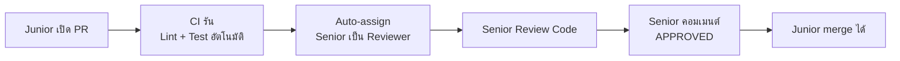

# 7.5 GitHub Actions CI Template

## ภาพรวม

เอกสารนี้เป็น **Template** สำหรับตั้งค่า GitHub Actions CI ที่ทำงานตาม PR Workflow ของทีม สามารถ copy ไปใส่โปรเจกต์ของตัวเองได้เลย

### Flow ที่ Template นี้ทำ



---

## ไฟล์ที่ต้องสร้าง

```
your-project/
└── .github/
    └── workflows/
        ├── ci.yml                  ← รัน Lint + Test ทุก PR
        └── pr-approval-gate.yml    ← ตรวจว่า Senior APPROVED แล้วหรือยัง
```

---

## ไฟล์ที่ 1: `ci.yml` — รัน CI + Auto-assign Reviewer

Copy ไฟล์นี้ไปวางที่ `.github/workflows/ci.yml`

```yaml
# =============================================================
# CI Pipeline — รัน Lint + Test ทุก Pull Request
# =============================================================
# วิธีใช้:
#   1. Copy ไฟล์นี้ไปวางที่ .github/workflows/ci.yml
#   2. แก้ SENIOR_REVIEWER เป็น GitHub username ของ Senior
#   3. แก้ working-directory ถ้าโครงสร้างโปรเจกต์ต่างออกไป
# =============================================================

name: CI

on:
  pull_request:
    branches: [main, develop, staging]

env:
  # ==============================
  # แก้ตรงนี้: ใส่ GitHub username ของ Senior
  # ==============================
  SENIOR_REVIEWER: "senior-github-username"

jobs:
  # -----------------------------------------------------------
  # Job 1: Lint & Type Check
  # -----------------------------------------------------------
  lint:
    name: Lint & Type Check
    runs-on: ubuntu-latest
    steps:
      - uses: actions/checkout@v4

      - uses: actions/setup-node@v4
        with:
          node-version: "18"
          cache: "npm"

      # แก้ working-directory ถ้า package.json ไม่ได้อยู่ root
      - name: Install dependencies
        run: npm ci

      - name: Run Lint
        run: npm run lint

      # ถ้าโปรเจกต์ใช้ TypeScript ให้เปิด step นี้
      # - name: Type Check
      #   run: npm run type-check

  # -----------------------------------------------------------
  # Job 2: Test
  # -----------------------------------------------------------
  test:
    name: Run Tests
    runs-on: ubuntu-latest
    needs: lint
    steps:
      - uses: actions/checkout@v4

      - uses: actions/setup-node@v4
        with:
          node-version: "18"
          cache: "npm"

      - name: Install dependencies
        run: npm ci

      - name: Run Tests
        run: npm test

      # ถ้าต้องการ coverage report ให้เปิด step นี้
      # - name: Run Tests with Coverage
      #   run: npm run test:coverage

  # -----------------------------------------------------------
  # Job 3: Auto-assign Senior เป็น Reviewer
  # -----------------------------------------------------------
  assign-reviewer:
    name: Assign Senior Reviewer
    runs-on: ubuntu-latest
    if: github.event.action == 'opened'
    permissions:
      pull-requests: write
    steps:
      - name: Request review from Senior
        uses: actions/github-script@v7
        with:
          script: |
            const reviewer = process.env.SENIOR_REVIEWER;
            const prAuthor = context.payload.pull_request.user.login;

            // ไม่ assign ตัวเอง (กรณี Senior เปิด PR เอง)
            if (prAuthor === reviewer) {
              console.log('PR author is the reviewer, skipping auto-assign');
              return;
            }

            await github.rest.pulls.requestReviewers({
              owner: context.repo.owner,
              repo: context.repo.repo,
              pull_number: context.issue.number,
              reviewers: [reviewer]
            });

            console.log(`Assigned ${reviewer} as reviewer`);
```

---

## ไฟล์ที่ 2: `pr-approval-gate.yml` — ตรวจว่า Senior APPROVED

Copy ไฟล์นี้ไปวางที่ `.github/workflows/pr-approval-gate.yml`

```yaml
# =============================================================
# PR Approval Gate — ตรวจว่า Senior คอมเมนต์ APPROVED แล้ว
# =============================================================
# วิธีใช้:
#   1. Copy ไฟล์นี้ไปวางที่ .github/workflows/pr-approval-gate.yml
#   2. แก้ SENIOR_REVIEWER เป็น GitHub username ของ Senior
#   3. ตั้ง Branch Protection Rule ให้ require status check นี้ผ่าน
# =============================================================

name: PR Approval Gate

on:
  # รันทุกครั้งที่มีคอมเมนต์ใหม่ใน PR
  issue_comment:
    types: [created]

env:
  SENIOR_REVIEWER: "senior-github-username"

jobs:
  check-approval:
    name: Check Senior Approval
    # รันเฉพาะเมื่อ comment อยู่ใน PR (ไม่ใช่ Issue)
    if: github.event.issue.pull_request
    runs-on: ubuntu-latest
    permissions:
      pull-requests: write
      statuses: write
    steps:
      - name: Check if Senior commented APPROVED
        uses: actions/github-script@v7
        with:
          script: |
            const seniorUser = process.env.SENIOR_REVIEWER;
            const comment = context.payload.comment;
            const prNumber = context.issue.number;

            // ตรวจว่าคนคอมเมนต์คือ Senior และข้อความมีคำว่า APPROVED
            const isFromSenior = comment.user.login === seniorUser;
            const isApproved = comment.body.toUpperCase().includes('APPROVED');

            if (isFromSenior && isApproved) {
              // ดึง SHA ล่าสุดของ PR
              const pr = await github.rest.pulls.get({
                owner: context.repo.owner,
                repo: context.repo.repo,
                pull_number: prNumber
              });

              // ตั้ง commit status เป็น success
              await github.rest.repos.createCommitStatus({
                owner: context.repo.owner,
                repo: context.repo.repo,
                sha: pr.data.head.sha,
                state: 'success',
                context: 'Senior Approval',
                description: `Approved by @${seniorUser}`
              });

              // คอมเมนต์ยืนยัน
              await github.rest.issues.createComment({
                owner: context.repo.owner,
                repo: context.repo.repo,
                issue_number: prNumber,
                body: `✅ **Senior Approved** — PR นี้ได้รับอนุมัติจาก @${seniorUser} แล้ว สามารถ merge ได้`
              });

              console.log('PR approved by Senior');
            } else if (!isFromSenior && isApproved) {
              // กรณีคนอื่น (ไม่ใช่ Senior) พิมพ์ APPROVED
              await github.rest.issues.createComment({
                owner: context.repo.owner,
                repo: context.repo.repo,
                issue_number: prNumber,
                body: `⚠️ เฉพาะ @${seniorUser} (Senior) เท่านั้นที่สามารถ approve PR ได้`
              });

              console.log('APPROVED from non-senior user, ignored');
            }
```

---

## ตั้งค่า Branch Protection Rules

หลังจากเพิ่ม workflow แล้ว ต้องตั้ง **Branch Protection Rules** ใน GitHub เพื่อบังคับให้ต้องผ่าน CI + Senior Approval ก่อน merge:

### วิธีตั้งค่า

1. ไปที่ **Settings → Branches → Add branch protection rule**
2. Branch name pattern: `main` (หรือ `staging`)
3. เปิดตัวเลือกเหล่านี้:

| Setting | ค่า | เหตุผล |
|:--------|:----|:-------|
| **Require a pull request before merging** | ✅ เปิด | ห้าม push ตรงเข้า main |
| **Require approvals** | 1 | ต้องมีคน approve อย่างน้อย 1 คน |
| **Require status checks to pass** | ✅ เปิด | CI ต้องผ่านก่อน merge |
| Status checks required | `Lint & Type Check`, `Run Tests`, `Senior Approval` | เลือก 3 checks |
| **Do not allow bypassing** | ✅ เปิด | แม้ admin ก็ต้องผ่าน rules |

---

## วิธีใช้งานจริง

### สำหรับ Junior

```
1. เขียน code เสร็จ → Push → เปิด PR
2. รอ CI รัน (Lint + Test)
   - ถ้า CI ❌ fail → แก้ code แล้ว push ใหม่
   - ถ้า CI ✅ pass → รอ Senior review
3. Senior จะถูก assign อัตโนมัติ
4. แก้ตาม feedback ของ Senior
5. เมื่อ Senior คอมเมนต์ "APPROVED" → merge ได้
```

### สำหรับ Senior

```
1. ได้รับ notification ว่ามี PR ใหม่ (auto-assigned)
2. ตรวจ CI ผ่านหรือไม่
   - ถ้า CI fail → แจ้ง Junior แก้ก่อน ไม่ต้อง review
3. Review code ตาม 4 ระดับ (MUST / SHOULD / NIT / LEARN)
4. ถ้าต้องแก้ → Request Changes
5. ถ้าผ่าน → คอมเมนต์ "APPROVED" ใน PR
6. Bot จะยืนยัน ✅ Senior Approved
7. Junior merge ได้
```

---

## ปรับแต่งเพิ่มเติม

### โปรเจกต์ที่มี Frontend + Backend แยกโฟลเดอร์

ถ้าโปรเจกต์มีโครงสร้างแบบนี้:

```
project/
├── frontend/
│   └── package.json
└── backend/
    └── package.json
```

แก้ `ci.yml` ให้รัน CI แยกกัน:

```yaml
jobs:
  lint-frontend:
    name: Lint Frontend
    runs-on: ubuntu-latest
    defaults:
      run:
        working-directory: ./frontend
    steps:
      - uses: actions/checkout@v4
      - uses: actions/setup-node@v4
        with:
          node-version: "18"
      - run: npm ci
      - run: npm run lint

  lint-backend:
    name: Lint Backend
    runs-on: ubuntu-latest
    defaults:
      run:
        working-directory: ./backend
    steps:
      - uses: actions/checkout@v4
      - uses: actions/setup-node@v4
        with:
          node-version: "18"
      - run: npm ci
      - run: npm run lint

  test-frontend:
    name: Test Frontend
    runs-on: ubuntu-latest
    needs: lint-frontend
    defaults:
      run:
        working-directory: ./frontend
    steps:
      - uses: actions/checkout@v4
      - uses: actions/setup-node@v4
        with:
          node-version: "18"
      - run: npm ci
      - run: npm test

  test-backend:
    name: Test Backend
    runs-on: ubuntu-latest
    needs: lint-backend
    defaults:
      run:
        working-directory: ./backend
    steps:
      - uses: actions/checkout@v4
      - uses: actions/setup-node@v4
        with:
          node-version: "18"
      - run: npm ci
      - run: npm test
```

### เพิ่ม Senior หลายคน

ถ้ามี Senior มากกว่า 1 คน แก้ `pr-approval-gate.yml`:

```yaml
env:
  # คั่นด้วย comma
  SENIOR_REVIEWERS: "senior1-username,senior2-username"
```

แล้วแก้ script ให้ตรวจหลายคน:

```javascript
const seniors = process.env.SENIOR_REVIEWERS.split(',');
const isFromSenior = seniors.includes(comment.user.login);
```

---

## Checklist การติดตั้ง

- [ ] Copy `ci.yml` ไปวางที่ `.github/workflows/ci.yml`
- [ ] Copy `pr-approval-gate.yml` ไปวางที่ `.github/workflows/pr-approval-gate.yml`
- [ ] แก้ `SENIOR_REVIEWER` เป็น GitHub username จริง
- [ ] แก้ `working-directory` ตามโครงสร้างโปรเจกต์ (ถ้าจำเป็น)
- [ ] ตั้ง Branch Protection Rules ใน GitHub Settings
- [ ] ทดสอบโดยเปิด PR ทดลอง
- [ ] ตรวจว่า CI รัน + Senior ถูก assign อัตโนมัติ

---

## เอกสารที่เกี่ยวข้อง

- [7.3 Pull Request Process](7.3_Pull_Request_Process.md) — PR Workflow ที่ CI นี้รองรับ
- [7.4 Code Review Guidelines](7.4_Code_Review_Guidelines.md) — วิธี Review Code (4 ระดับ Comment)
- [5.1 Deploy Overview](../05_DEPLOY/5.1_Deploy_Overview.md) — Release Cadence + Runbooks

---

*อัปเดตล่าสุด: 1 เมษายน 2026*
