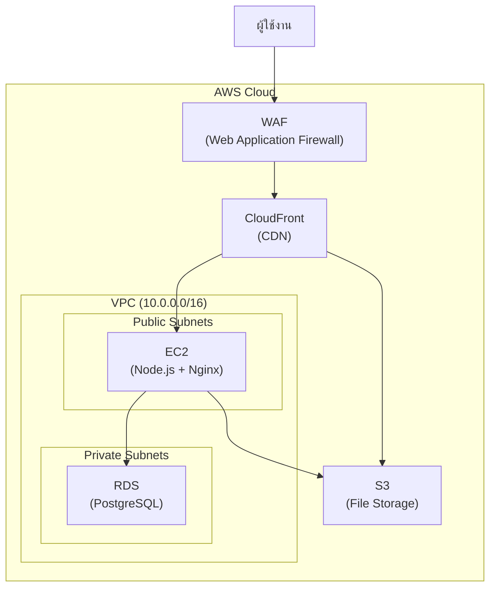

# 8.0 ภาพรวมและ Prerequisites

> คู่มือ Deploy เว็บแอปพลิเคชันบน AWS — สำหรับผู้เริ่มต้น | ฉบับอธิบายละเอียดทุกขั้นตอน

---

## ภาพรวมสถาปัตยกรรม



## AWS Services ที่ใช้

| Service | คำอธิบาย | ทำหน้าที่อะไร |
|:--------|:---------|:-------------|
| **EC2** (Elastic Compute Cloud) | เซิร์ฟเวอร์เสมือน | รันแอปพลิเคชัน Node.js |
| **RDS** (Relational Database Service) | ฐานข้อมูลแบบ managed | PostgreSQL สำหรับเก็บข้อมูล |
| **S3** (Simple Storage Service) | ที่เก็บไฟล์ | เก็บไฟล์/รูปภาพที่ผู้ใช้อัปโหลด |
| **CloudFront** | CDN | ส่งมอบเนื้อหาอย่างรวดเร็ว + SSL |
| **WAF** (Web Application Firewall) | ไฟร์วอลล์ | ปกป้องจาก SQL Injection, XSS, DDoS |
| **GitHub Actions** | CI/CD pipeline | Deploy อัตโนมัติ |

---

## สิ่งที่ต้องเตรียมก่อนเริ่ม (Prerequisites)

| # | สิ่งที่ต้องมี | หมายเหตุ |
|---|:------------|:---------|
| 1 | **บัญชี AWS** ที่มีสิทธิ์ Administrator | หากยังไม่มี สมัคร AWS Free Tier ก่อน |
| 2 | **บัญชี GitHub** | สำหรับเก็บ source code และตั้งค่า CI/CD |
| 3 | **โดเมนเนม** (เช่น yourdomain.co.th) | จดทะเบียนแล้ว |
| 4 | **ความรู้พื้นฐาน Linux command line** | SSH, cd, ls, nano/vim |
| 5 | **Source code** ของเว็บแอปพลิเคชัน | พร้อม deploy |

> **สำหรับผู้เริ่มต้น:** แนะนำสมัคร AWS Free Tier ก่อน ซึ่งให้ใช้งาน t2.micro EC2 instance และ RDS instance ขนาดเล็กฟรีเป็นเวลา 12 เดือน

---

## ค่าใช้จ่ายโดยประมาณ

| Service | วัตถุประสงค์ | ค่าใช้จ่าย/เดือน |
|:--------|:-----------|:----------------|
| EC2 (t3.medium) | เซิร์ฟเวอร์รันแอป | ~$30-35 |
| RDS (db.t4g.small) | ฐานข้อมูล PostgreSQL | ~$25-30 |
| S3 | เก็บไฟล์/รูปภาพ | ~$1-5 |
| CloudFront | CDN | ~$1-10 |
| WAF | ไฟร์วอลล์ | ~$10-15 |
| อื่นๆ | KMS, Secrets Manager, CloudWatch | ~$5-10 |
| **รวมโดยประมาณ** | | **~$70-105/เดือน** |

> **วิธีประหยัด:** สำหรับ dev/testing ใช้ EC2 t3.micro/small + RDS db.t4g.micro ได้ หรือใช้ Reserved Instances สำหรับ production เพื่อลด 30-40%

---

## Naming Convention

ทุก resource ใน AWS ให้ตั้งชื่อตามรูปแบบ:

```
p-[ชื่อโปรเจค]-[resource-type]
```

**ตัวอย่าง (โปรเจค Kaizen):**

| Resource | ชื่อ |
|:---------|:----|
| VPC | `p-siamgs-kaizen-vpc` |
| EC2 | `p-siamgs-kaizen-ec2` |
| RDS | `p-siamgs-kaizen-rds` |
| S3 (Blue) | `p-siamgs-kaizen-s3-bucket-blue` |
| S3 (Prod) | `p-siamgs-kaizen-s3-bucket-prd` |

---

## ขั้นตอนถัดไป

➡️ [8.1 VPC และเครือข่าย](8.1_VPC_and_Networking.md)

---

*อัปเดตล่าสุด: มีนาคม 2026*
