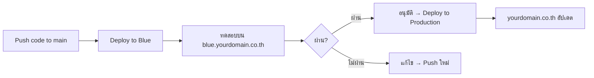

# 8.7 CI/CD Pipeline

ตั้งค่าระบบ deploy อัตโนมัติแบบ Blue-Green ผ่าน GitHub Actions (เหมือน KAIZEN App)

---

## 7.1 สร้าง SSM Document

SSM Document คือชุดคำสั่งที่จะรันบน EC2 เพื่อ build และ deploy แอปพลิเคชัน

1. ไปที่ **Systems Manager > Documents > Create document**
2. ตั้งชื่อ เช่น `p-[ชื่อโปรเจค]-cd`
3. ประเภท: Command document, Platform: Linux
4. เขียนคำสั่ง build/deploy:

```bash
#!/bin/bash
cd /home/ec2-user/app
git pull origin main
npm install
npm run build
pm2 restart all
```

---

## 7.2 ตั้งค่า GitHub Actions Workflow

สร้างไฟล์ `.github/workflows/deploy.yml`:

```yaml
name: Deploy to AWS

on:
  push:
    branches: [main]

jobs:
  deploy-blue:
    runs-on: ubuntu-latest
    steps:
      - name: Configure AWS Credentials
        uses: aws-actions/configure-aws-credentials@v4
        with:
          aws-access-key-id: ${{ secrets.AWS_ACCESS_KEY_ID }}
          aws-secret-access-key: ${{ secrets.AWS_SECRET_ACCESS_KEY }}
          aws-region: ap-southeast-1

      - name: Deploy to Blue via SSM
        run: |
          aws ssm send-command \
            --document-name "p-[project]-cd" \
            --targets "Key=instanceids,Values=i-xxxxxxxxx" \
            --comment "Deploy from GitHub Actions"
```

### ตั้งค่า GitHub Secrets

ไปที่ **GitHub repo > Settings > Secrets and variables > Actions** แล้วเพิ่ม:

| Secret Name | ค่า |
|:-----------|:----|
| `AWS_ACCESS_KEY_ID` | Access Key ของ IAM user |
| `AWS_SECRET_ACCESS_KEY` | Secret Key ของ IAM user |

---

## 7.3 Blue-Green Deployment

### หลักการ



| Environment | URL | ใช้สำหรับ |
|:-----------|:----|:---------|
| **Blue** | `blue.yourdomain.co.th` | ทดสอบก่อน deploy จริง |
| **Green (Production)** | `yourdomain.co.th` | ผู้ใช้งานจริง |

### ขั้นตอน

1. ทุกครั้งที่ push code → deploy ไป **Blue** อัตโนมัติ
2. ทดสอบบน Blue environment
3. ผู้อนุมัติ (Sr. Engineer) อนุมัติ
4. Deploy ไป **Production**

---

## 7.4 การอนุมัติ Deploy

ใช้ **GitHub Actions Environment Protection Rules**:

1. ไปที่ **GitHub repo > Settings > Environments**
2. สร้าง Environment ชื่อ `production`
3. เปิด **Required reviewers** → เพิ่ม Sr. Engineer
4. เมื่อ deploy ถึงขั้น production จะรอ approval ก่อน

```yaml
  deploy-production:
    runs-on: ubuntu-latest
    needs: deploy-blue
    environment: production    # ← รอ approval ก่อนรัน
    steps:
      - name: Configure AWS Credentials
        uses: aws-actions/configure-aws-credentials@v4
        with:
          aws-access-key-id: ${{ secrets.AWS_ACCESS_KEY_ID }}
          aws-secret-access-key: ${{ secrets.AWS_SECRET_ACCESS_KEY }}
          aws-region: ap-southeast-1

      - name: Deploy to Production via SSM
        run: |
          aws ssm send-command \
            --document-name "p-[project]-cd" \
            --targets "Key=instanceids,Values=i-xxxxxxxxx" \
            --comment "Production deploy approved"
```

---

## ขั้นตอนถัดไป

➡️ [8.8 Go-Live Checklist](8.8_Go_Live_Checklist.md)
